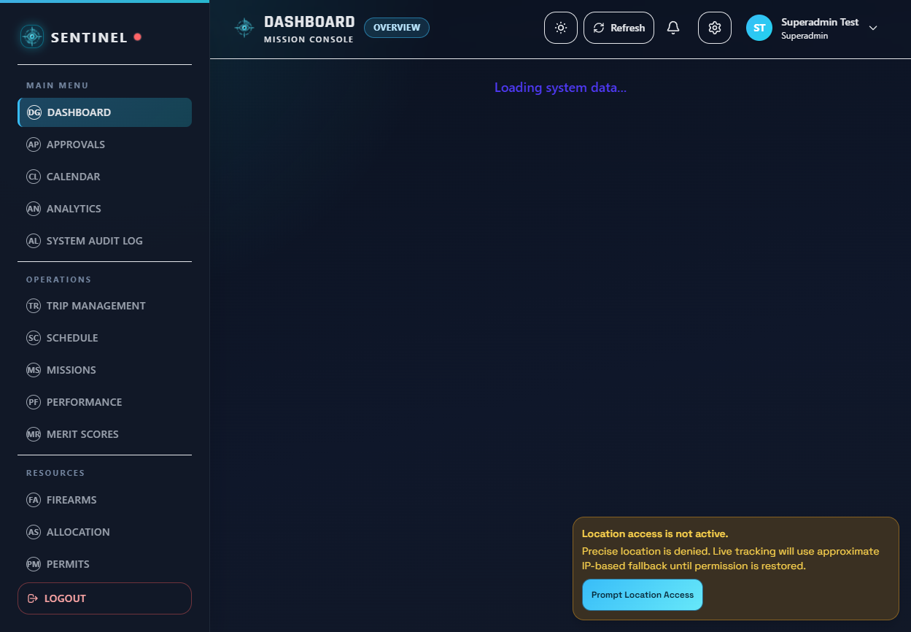
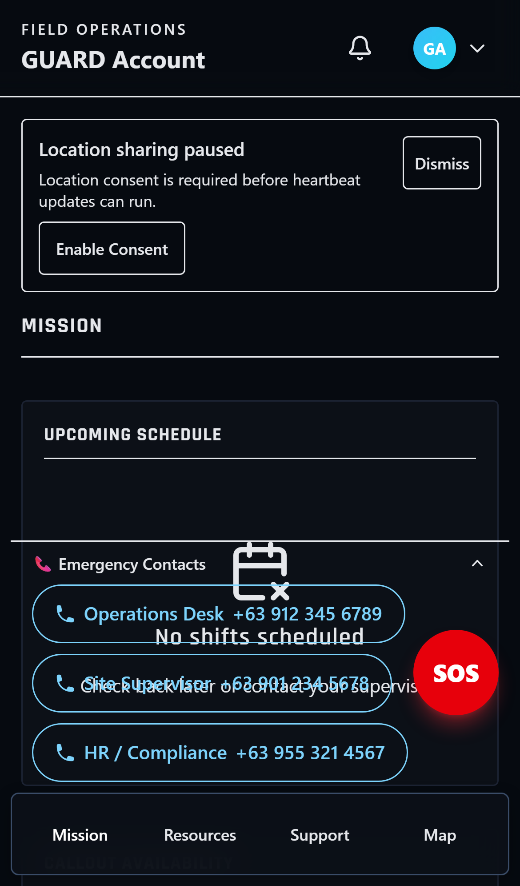
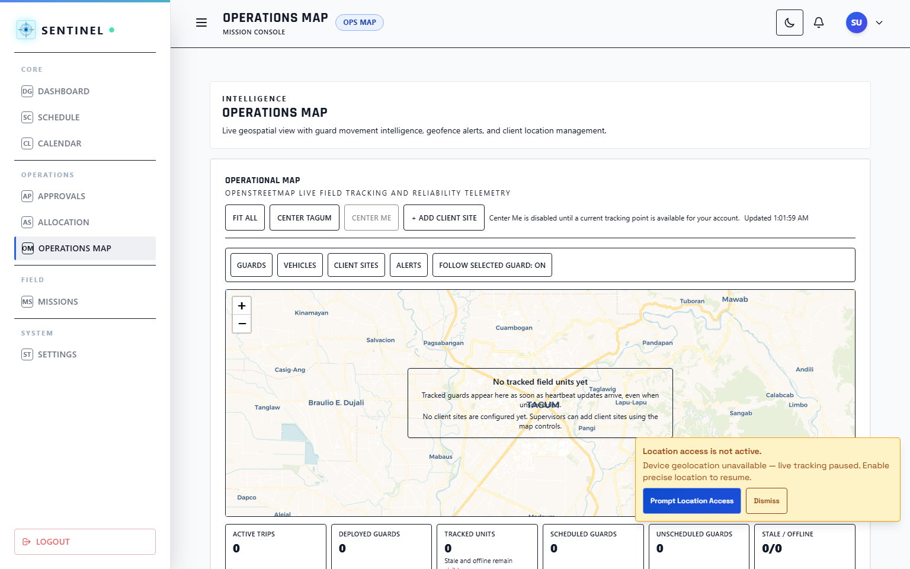
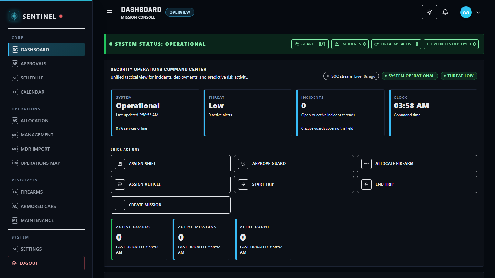

<p align="center">
  
</p>

<h1 align="center">SENTINEL Security Operations Platform</h1>
<p align="center"><strong>Capstone Main Governance Repository</strong></p>

<p align="center">
  <a href="https://dwaytu.github.io/Capstone-Main/"></a>
  <a href="https://github.com/dwaytu/Capstone-Main/releases"></a>
  <a href="https://github.com/dwaytu/Capstone-Main/actions/workflows/release.yml"></a>
  <a href="https://github.com/dwaytu/Capstone-Main/actions/workflows/deploy-docs.yml"></a>
</p>

---

## Live Access

- Web App: `https://dasiasentinel.xyz`
- Documentation: `https://dwaytu.github.io/Capstone-Main/`
- Latest Release: `https://github.com/dwaytu/Capstone-Main/releases/latest`

## What This Repository Is

This is the **root governance and release repository** for SENTINEL.  
It coordinates product documentation, multi-platform release flows, capstone-readiness evidence, and workspace-level orchestration.

## Repository Topology

```text
Capstone Main/
  DasiaAIO-Frontend/        React + TypeScript + Vite
  DasiaAIO-Backend/         Rust + Axum + PostgreSQL
  apps/desktop-tauri/       Desktop wrapper (Tauri)
  apps/android-capacitor/   Android wrapper (Capacitor)
  docs/                     GitHub Pages and technical docs
```

## Platform Visuals

<table>
  <tr>
    <td align="center"><strong>Superadmin Desktop</strong></td>
    <td align="center"><strong>Guard Mobile</strong></td>
  </tr>
  <tr>
    <td></td>
    <td></td>
  </tr>
  <tr>
    <td align="center"><strong>Supervisor Desktop</strong></td>
    <td align="center"><strong>Admin Desktop</strong></td>
  </tr>
  <tr>
    <td></td>
    <td></td>
  </tr>
</table>

## Tech Stack

- Frontend: React 18, TypeScript, Vite, Tailwind CSS
- Backend: Rust, Axum, SQLx, PostgreSQL
- Test: Jest, Playwright, Cargo test
- Runtime Targets: Web, Desktop (Tauri), Android (Capacitor)
- Delivery: GitHub Actions, GitHub Pages, Railway

## Quick Start

### Prerequisites

- Node.js 20+
- npm 10+
- Rust stable
- PostgreSQL 14+

### Install

```bash
npm install
npm install --prefix DasiaAIO-Frontend
```

### Run

```bash
npm run dev --prefix DasiaAIO-Frontend
```

```bash
cd DasiaAIO-Backend
cargo run --bin server
```

## Build and Verification

```bash
npm run build:web
npm run build:desktop
npm run build:android
```

```bash
npm run verify:all
npm run verify:capstone:quick
npm run verify:capstone:full
```

## Release and Deployment

- Railway production deployment is managed per-service in Railway.
- Root CI handles docs deployment and governed release pipeline.
- Pages workflow: `.github/workflows/deploy-docs.yml`
- Release workflow: `.github/workflows/release.yml`

## Documentation Index

- Product and architecture docs: `docs/`
- Workspace navigation: `docs/WORKSPACE_NAVIGATION.md`
- Railway runbook: `docs/RAILWAY_AUTODEPLOY.md`
- Capstone readiness pack: `docs/plan/capstone-readiness-20260502/`
- Project memory for Codex sessions: `PROJECT_MEMORY.md`

## License

UNLICENSED (internal academic and organizational use).
