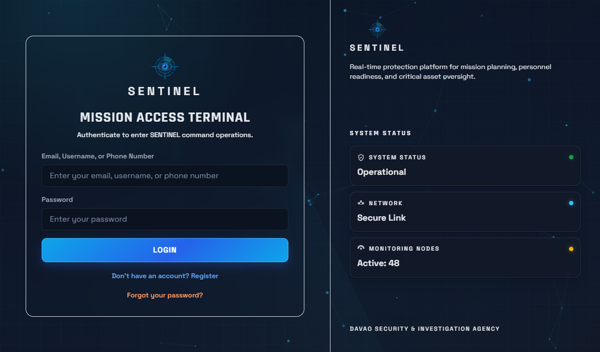
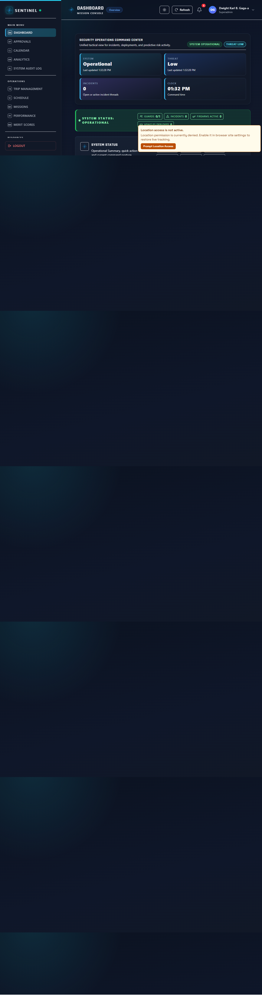
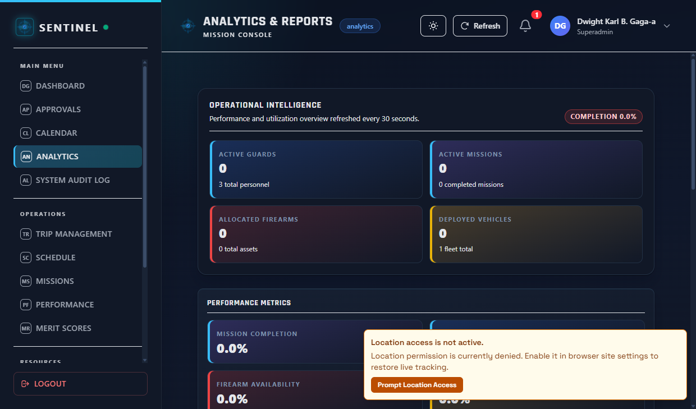

# SENTINEL Capstone Main

SENTINEL is a full-stack security operations and asset management platform with a shared React frontend and platform wrappers for web, desktop, and Android.

## Downloads

- Web (latest): https://dasiaaio.up.railway.app
- Desktop installer (MSI/EXE): https://github.com/Cloudyrowdyyy/Capstone-Main/releases/latest
- Android APK: https://github.com/Cloudyrowdyyy/Capstone-Main/releases/latest

## Installation Guide

1. Web
- Open https://dasiaaio.up.railway.app
- Sign in with your provisioned SENTINEL account

2. Desktop (Tauri)
- Go to https://github.com/Cloudyrowdyyy/Capstone-Main/releases/latest
- Download either the `.msi` or `.exe` installer
- Run installer and launch SENTINEL

3. Android (Capacitor)
- Go to https://github.com/Cloudyrowdyyy/Capstone-Main/releases/latest
- Download the latest release APK
- Install on device (enable sideloading if required)

## Repository Layout

- `DasiaAIO-Frontend/`: React + TypeScript + Vite application.
- `DasiaAIO-Backend/`: Rust + Axum + PostgreSQL API.
- `apps/desktop-tauri/`: Tauri desktop wrapper.
- `apps/android-capacitor/`: Capacitor Android wrapper.
- `.github/`: custom Copilot agents, instructions, and skills.

## Quick Start

### 1. Install dependencies

```bash
npm install
npm install --prefix DasiaAIO-Frontend
```

### 2. Run frontend locally

```bash
npm run dev --prefix DasiaAIO-Frontend
```

### 3. Run backend locally

```bash
cd DasiaAIO-Backend
cargo run
```

## Build and Release Commands

Run from repository root:

```bash
npm run build:web
npm run build:desktop
npm run build:android
```

Release wrappers and web build:

```bash
npm run release:web
npm run release:desktop
npm run release:android
npm run release:all
```

Release tags follow semantic versioning: `vMAJOR.MINOR.PATCH` (for example `v1.0.0`).

## Production Runtime Configuration

- Frontend builds require `VITE_API_BASE_URL` and enforce HTTPS in production mode.
- Backend startup in production requires strong `JWT_SECRET`, non-default `ADMIN_CODE`, and explicit CORS origin configuration.
- Desktop updater uses Tauri updater endpoints and signed update metadata.
- Mobile and desktop share the same API origin contract as the web client.

## Screenshots





## Copilot Customization Notes

Desktop and mobile development support includes:

- Agent: `.github/agents/playwright-tester.agent.md`
- Skill: `.github/skills/winapp-cli/SKILL.md`
- Skill: `.github/skills/msstore-cli/SKILL.md`
- Skill: `.github/skills/scoutqa-test/SKILL.md`

## Documentation

- Main docs: https://cloudyrowdyyy.github.io/capstone-1.0
- System guide: `CHATGPT_SYSTEM_GUIDE.md`
- Capstone paper: `SENTINEL - Group 8.md`
