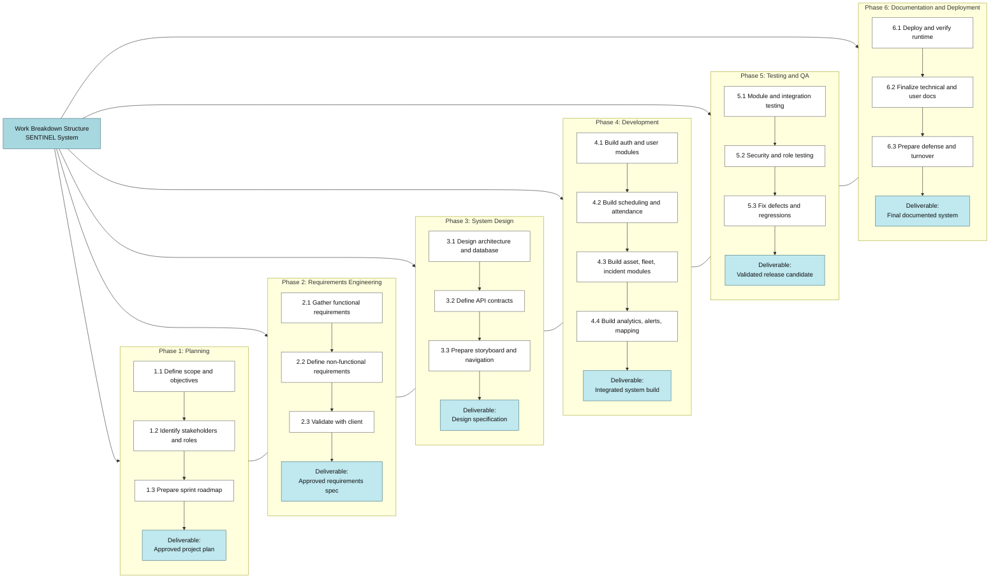
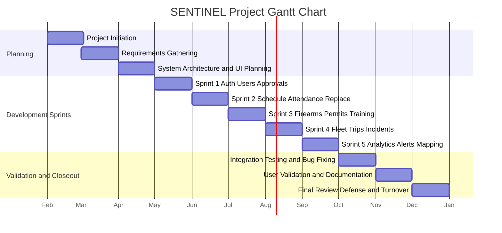
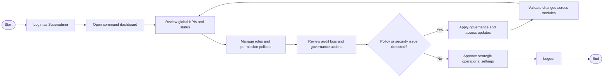

SENTINEL: AN INTEGRATED SECURITY
OPERATIONS MANAGEMENT SYSTEM FOR
DAVAO SECURITY & INVESTIGATION AGENCY,
INC.

A Capstone Project
Proposal Presented to the Faculty of the
Information and Communications Technology
Program STI College Tagum

In Partial Fulfillment
of the Requirements for the Degree
Bachelor of Science in Information Systems

DWIGHT KARL B. GAGA-A
GAD ABRAHAM M. JOSE
APPLE JOHN D. LUMINGKIT
 HECTOR PHILLIP P. LACIERDA
HANZ LOURENZ FRANK J. RIBU

March 2026

---

ENDORSEMENT FORM FOR PROPOSAL DEFENSE

TITLE OF RESEARCH:

SENTINEL: An Integrated Security Operations
Management System

NAME OF PROPONENTS:

Dwight Karl B. Gaga-a
Gad Abraham M. Jose
Apple John D. Lumingkit
Hector Phillip P. Lacierda
Hanz Lourenz Frank J. Ribu

In Partial Fulfilment of the Requirements
for the degree of Bachelor of Science in Information
System
has been examined and is recommended for Outline Defense.

ENDORSED BY:

<Capstone Project Adviser's Given Name MI. Family
Name>
Capstone Project Adviser

APPROVED FOR PROPOSAL DEFENSE:

<Capstone Project Coordinator's Given Name MI. Family Name>
Capstone Project Coordinator

NOTED BY:

<Program Head's Given Name MI. Family Name>
Program Head

<DATE OF PROPOSAL DEFENSE>

---

APPROVAL SHEET

This capstone project proposal titled: <Research Title> prepared and submitted by
<Researcher's  Given  Name  MI.  Family  Name>,  <Researcher's  Given  Name  MI.
Family Name>, <Researcher's Given Name MI. Family Name>, and <Researcher's
Given  Name  MI.  Family  Name>,  in  partial  fulfillment  of  the  requirements  for  the
degree of Bachelor of Science in <Program>, has been examined and is recommended
for acceptance and approval.

<Capstone Project Adviser's Given Name MI. Family Name>
Capstone Project Adviser

Accepted and approved by the Capstone Project Review
Panel in partial fulfillment of the requirements for the degree
of Bachelor of Science in <Program>

<Panelist's Given Name MI. Family Name>  <Panelist's Given Name MI. Family Name>

Panel Member

Panel Member

<Panelist's Given Name MI. Family Name>
Lead Panelist

Noted:

<Capstone Project Coordinator's Given
Name MI. Family Name>
Capstone Project Coordinator

<Program Head's Given Name MI. Family
Name>
Program Head

<Date of Proposal Defense>

---

INTRODUCTION

Project Context

The  private  security  global  industry  is  transitioning  toward  automated,  high-

integrity digital ecosystems to address the discovery lag inherent in human-led monitoring.

Global  research  in  workforce  capacity  indicates  that  manual,  reactive  responses  to

personnel  gaps  significantly  increase  vacancy  time,  which  remains  a  primary  driver  of

security  breaches  in  critical  infrastructure  (Shiyanbola  et  al.,  2023).  This  movement  is

supported  by  modern  performance  management  theories  which  emphasize  that

transparent, data-driven tracking is essential to maintaining accountability and preventing

social  loafing,  a  phenomenon  where  individual  reliability  decreases  in  the  absence  of

structured, real-time monitoring (Aguinis, 2022).

The necessity for these technological advancements is echoed in recent Philippine

legislation through the Private Security Services Industry Act, also known as Republic Act

No. 11917 (2022). This law introduced a regime of professionalized accountability where

agencies face strict liability for administrative negligence. Under the law’s Implementing

Rules and Regulations, agencies can be fined up to P5,000,000 or face license revocation

for  deploying  personnel  with  expired  licenses  or  unauthorized  firearms  (Jur.ph,  2025).

Furthermore, national studies on the effectiveness of Philippine security guards identify

that absenteeism and the abandonment of posts are most prevalent in agencies that lack

advanced patrol monitoring and digital reporting systems (Abad, 2025).

---

In the specific context of the Davao Region, the Davao Security and Investigation

Agency, Inc. operates in a landscape that has prioritized a culture of security to sustain its

position as a leading safe haven in Southeast Asia (PIA, 2025). According to the Davao

Regional  Development  Plan  2023  to  2028,  the  region's  rapid  economic  growth  has

increased  the  demand  for  advanced  technology  and  innovation  to  ensure  peace  and

security in high-traffic logistics and commercial hubs like Tagum City (NEDA XI, 2024).

Recent  local  research  conducted  in  the  Davao  Region  specifically  highlights  that

compensation,  punctuality,  and  alertness  are  the  primary  determinants  of  guard

performance,  yet  many  regional  agencies  still  struggle  with  inattentiveness  and

abandonment of posts due to inconsistent manual oversight (Ondos and Origines, 2025).

For DASIA Tagum, this represents a critical vulnerability where site vacancies may go

undetected for hours, directly compromising the safety of local clients.

SENTINEL is an integrated digital ecosystem designed to resolve these cumulative

vulnerabilities by centralizing personnel profiles, firearm telemetry, and shift logs into a

high-performance  single  source  of  truth.  The  system  works  by  embedding  real-time

compliance checks into the daily operational workflow. Before a guard can be deployed,

the system automatically verifies their license validity and firearm authorization against

central  records.  To  manage  high-concurrency  requests  from  hundreds  of  guards,

SENTINEL utilizes the Rust programming language and the Axum framework, providing

native memory safety and asynchronous performance that prevents the data races typical

of legacy systems (Scofield, 2025). When an operational gap such as a missed check-in is

detected,  the  system  immediately  flags  the  vacancy  and  identifies  the  nearest  qualified

replacement, ensuring that the agency moves from a reactive stance to a proactive, legally

defensible model of security management.

---

Purpose and Description

The primary purpose of this capstone project is to deliver a fully functional, production-

ready  Integrated  Security  Operations  Management  Platform  that  consolidates  guard

personnel management, equipment allocation, vehicle operations, and access control into

a unified system for Davao Security & Investigation Agency, Inc.

SENTINEL is a web-based system that integrates operational data and workflows using

a  Rust/Axum  backend  API,  a  PostgreSQL  relational  database,  and  a  React/TypeScript

frontend  deployed  through  Docker.  The  system  is  designed  as  an  integrated  operations

platform  that  aligns  with  ERP  and  WFM  principles  by  centralizing  data,  enforcing

consistent workflows, and providing real-time operational visibility.

The  platform  implements  four  core  modules.  Guard  Management  covers  personnel

profiles,  scheduling,  attendance  tracking,  performance  analytics,  and  replacement

coordination  to  ensure  uninterrupted  site  coverage.  Equipment  Management  maintains

firearm  inventory,  allocation  workflows,  permit  records,  and  maintenance  history  to

support regulatory compliance and accountability. Vehicle Operations manages armored

vehicle  assets,  driver  assignments,  and  trip  tracking  to  improve  deployment  oversight.

Access  Control  enforces  role-based  permissions,  authentication,  and  audit  logging  to

ensure that only authorized roles can access sensitive operations and data. The system has

been  validated  through  a  24-day  operational  simulation  covering  24  distinct  business

scenarios and resolving 15 or more production issues.

---

Objectives

General Objectives

Deliver  a  fully  implemented,  tested,  and  production-ready  Integrated  Security

Operations  Management  Platform  that  unifies  personnel  management,  equipment

allocation, vehicle operations, and access control into a single robust system with proven

reliability through comprehensive operational simulation.

Specific Objectives

1.  Implement a complete account and identity lifecycle module for all users.

a.  Provide  user  registration,  email  verification,  resend  verification,  and  secure

login.

b.  Implement  forgot  password,  reset  code  verification,  and  password  reset

workflows.

c.  Support profile management, profile photo update/delete, and role-based user

creation.

2.  Implement centralized personnel administration and approval workflows.

a.  Manage users by role: superadmin, administrator, supervisor, and guard.

b.  Provide pending guard approval queues and approval status updates.

c.  Support user update, deactivation/delete, role/status filtering, and guard-specific

listings.

3.  Implement scheduling, attendance, and workforce continuity automation.

a.  Create, update, delete, and list shifts with conflict-aware assignment.

b.  Enable guard check-in/check-out with attendance history tracking.

c.  Detect no-shows, request replacements, accept replacements, and manage guard

availability.

---

4.  Implement firearm inventory, issuance, and custody control.

a.  Provide full firearm CRUD with serial/model/caliber/status tracking.

b.  Implement firearm issuance, return, active allocations, and overdue allocation

monitoring.

c.  Maintain firearm maintenance schedules, pending maintenance, and completion

records.

5.  Implement permit and training compliance management.

a.  Create and retrieve guard permits, including expiring and revoked permits.

b.  Support auto-expire permit processing for compliance enforcement.

c.  Manage training records, guard training history, and expiring training alerts.

6.  Implement armored vehicle fleet and trip operations.

a.  Provide armored car CRUD, issuance/return, and active allocation monitoring.

b.  Manage driver assignment/unassignment and driver-vehicle linkage.

c.  Support trip creation, trip status updates, trip completion, and trip detail/history

views.

d.  Manage vehicle maintenance scheduling, completion, and maintenance records.

7.  Implement mission operations and merit-based performance evaluation.

a.  Enable mission assignment and mission retrieval for operational deployment.

b.  Calculate guard merit scores and provide ranked guard outputs.

c.  Support client evaluation submission, guard evaluation retrieval, and overtime

candidate identification.

8.  Implement support, communication, and notification services.

a.  Enable support ticket creation and guard ticket retrieval workflows.

b.  Provide user notifications, unread counts, mark-read/mark-all-read, and delete

actions.

---

c.  Support alerting for operational events and decision-critical updates.

9.  Implement incident management and real-time tracking intelligence.

a.  Provide incident creation, active incident retrieval, and incident status updates.

b.  Implement guard heartbeat, tracking point capture, and map data endpoints.

c.  Provide client site CRUD and shift proximity alert checks.

d.  Enable real-time websocket tracking stream for live operational visibility.

10. Implement analytics, predictive intelligence, and decision support.

a.  Provide analytics overview, trends, and guard reliability endpoints.

b.  Implement  predictive  alerts  for  permit  expiry,  maintenance  risk,  no-show

patterns, and guard capacity risk.

c.  Provide  AI  (deterministic)  services  for  guard  absence  risk,  replacement

suggestions,  vehicle  maintenance  risk,  incident  classification,  and  incident

summarization.

11. Implement real-time location monitoring and map-based operations.

a.  Provide OpenStreetMap-based visualization of guards, routes, and client sites.

b.  Implement live tracking updates through websocket streaming.

c.  Support map data retrieval and proximity-based operational alerts.

12. Implement governance, security, and auditability mechanisms.

a.  Maintain write-request audit logs for critical actions.

b.  Support  session/token-based  authenticated  API  access  and  presence/last-seen

tracking.

c.  Provide  health-check  endpoints  for  service  monitoring  and  operational

readiness.

---

Scope and Limitations

Scope

The SENTINEL system is a web-based platform intended to strengthen

operational control and compliance for a private security agency. The system is scoped

to security agency operations and the regulatory environment set by the Private Security

Services Industry Act (Republic Act No. 11917, 2022).

Data

●  Personnel profiles, role/approval data, licensing and permit records,

training records, schedules, attendance logs, availability status, and

performance/merit metrics

●  Firearm inventory, firearm allocations, firearm maintenance records, and

firearm permit compliance data

●  Armored vehicle assets, car allocations, driver assignments, trip records,

and vehicle maintenance history

●  Missions, incidents, support tickets, notifications, predictive alerts,

tracking/map points, and audit/access logs

●  Account lifecycle workflows including registration, email verification,

authentication, password reset, and profile management

●  Shift scheduling, attendance validation, no-show detection, replacement

request/acceptance, and supervisor oversight

●  Firearm issuance/return workflows with permit validation, maintenance

scheduling, and custody traceability

●  Vehicle allocation, driver assignment, trip lifecycle management, and

Process

---

preventive/corrective maintenance tracking

●  Incident reporting, support ticket handling, notification delivery, and real-

time operations tracking

People

●  Superadmin, Administrator, Supervisor, and Guard roles with distinct

permissions and dashboard views

Technology

●  Web-based application accessible on desktop and mobile browsers

●  React + TypeScript frontend and Rust + Axum backend services

●  Centralized PostgreSQL database with relational integrity, auditability,

and role-based data control

●  Dockerized deployment and API-driven architecture with real-time

websocket support for tracking views

Limitation of the Study

●  The system does not integrate with external payroll, HR, or government

licensing systems.

●  Dedicated  hardware-grade  vehicle  telematics  integration  is  not  yet

implemented;  current  tracking  relies  on  application-provided  location

updates and available device/network conditions.

●  AI/predictive outputs are decision-support recommendations and do not

autonomously execute final operational actions.

●  Direct  integration  with  third-party  hardware  ecosystems  (CCTV,  IoT

sensors, access control turnstiles) is not included.

●  Offline-first  field  operation  is  limited;  core  workflows  depend  on

network/API availability.

---

Review of Related Literature/Studies/Systems

Related Literature

The Philippine private security sector is currently navigating its most significant legal

transition  in  over  fifty  years.  The  enactment  of  the  Private  Security  Services  Industry  Act

(Republic  Act  No.  11917,  2022)  effectively  repealed  the  outdated  RA  5487,  shifting  the

industry toward a regime of "Professionalized Accountability." According to Jur.ph (2025),

the law’s Implementing Rules and Regulations (IRR) mandate that Private Security Agencies

(PSAs) maintain highly accurate, digitized records of License to Exercise Security Profession

(LESP)  and  firearm  permits.  The  act  introduces  a  "strict  liability"  framework  where

administrative negligence, such as deploying an unlicensed guard, can result in fines ranging

from ₱50,000 to ₱100,000 per violation, or up to ₱5,000,000 for agency-wide license failures.

This  regulatory  pressure  has  necessitated  a  move  toward  Automated  Regulatory

Compliance Tracking (ARCT). Research by Khinvasara, T., Shankar, A., & Wong, C. (2024)

suggests  that  for  organizations  managing  complex,  shifting  rules,  the  use  of  automated

monitoring  is  a  "significant  advancement"  that  eliminates  the  "discovery  lag"  inherent  in

manual  audits.  By  leveraging  system-driven  triggers  for  license  expirations,  PSAs  can

transition from reactive compliance to a proactive stance, ensuring that no personnel or asset

is deployed without valid legal authorization.

Operational continuity in the private security sector is heavily dependent on reliable

guard presence. As identified in the operational risks of DASIA Tagum, "No-Show" incidents

represent a critical vulnerability where manual processes relying on phone calls and delayed

human  intervention  fail  to  address  "discovery  lag."  Research  in  workforce  capacity

---

optimization  emphasizes  that  manual,  reactive  responses  to  workforce  gaps  significantly

increase  "vacancy  time,"  directly  correlating  with  higher  security  breach  probabilities

(Shiyanbola et al., 2023).

Modern  systems  mitigate  this  by  automating  the  identification  and  deployment  of

replacements based on real-time availability, shifting the organizational stance from reactive

crisis  management  to  proactive  risk  mitigation  (Al-Khafajiy  et  al.,  2022).  Furthermore,

advanced algorithms now enable "predictive scheduling," which analyzes historical No-Show

data  to  alert  administrators  of  potential  gaps  before  they  occur,  drastically  reducing  the

operational vacancy time (TrackTik, 2025).

The  transition  from  inconsistent,  manual  tracking  to  a  structured,  data-driven

framework  is  essential  for  maintaining  Distributive  Justice,  the  perceived  fairness  of  how

shifts,  rewards,  and  responsibilities  are  allocated  within  an  organization.  Aguinis  (2022)

posits that the absence of a structured performance management framework leads to "Social

Loafing," a psychological phenomenon where employees decrease effort due to a perceived

lack of individual accountability.

For  security  agencies  like  DASIA  Tagum,  implementing  centralized  performance

metrics such as punctuality and client feedback logs ensures that shift allocation is based on

objective data rather than subjective selection. This transparency not only increases overall

guard reliability but also fosters a culture of accountability, as guards understand that their

performance is directly linked to future opportunities (Tan et al., 2024).

---

The systematic allocation of firearms is a matter of both Chain of Custody (CoC) and

legal necessity under the Private Security Services Industry Act (Republic Act No. 11917,

2022). The law mandates  strict accountability  for firearms,  requiring that  only  authorized,

trained, and compliant guards carry weapons. Manual processes often suffer from "data drift,"

where the status of a weapon and the permit validity of the assigned guard are not reconciled

in  real-time,  leading  to  potential  administrative  negligence.  Centralized  digital  tracking  is

identified as the primary defense against the misallocation of high-risk equipment and is a

prerequisite  for  generating  the  legally  defensible  audit  logs  required  by  the  National

Cybersecurity Plan 2022-2028 (DICT, 2024; PNP-SOSIA, 2022).

The selection of the backend technical stack is a core security decision for mission-

critical systems. Scofield, M. B. (2025) argues that Rust’s "ownership and borrowing" model

provides a fundamental architectural advantage: Memory Safety without a Garbage Collector.

This  ensures  that  SENTINEL  is  natively  resistant  to  buffer  overflows  and  data  races,

vulnerabilities  that  often  plague  systems  handling  high-concurrency  data  like  real-time

firearm tracking.

Complementing  the language is  the  Axum framework, which is  built  on  the Tokio

asynchronous  runtime.  As  highlighted  by  NashTech  (2025),  Axum  is  designed  for  high-

performance  web  services  where  scalability  and  raw  speed  are  non-negotiable.  For

SENTINEL, this means the Attendance Tracking and No-Show Detection modules can handle

hundreds  of  simultaneous  "check-in"  requests  during  shift  rotations  without  performance

degradation. This "asynchronous-first" design allows the system to remain responsive even

when processing complex relational logic across personnel, vehicle, and firearm databases.

---

In  an  Integrated  Operations  Platform,  the  database  must  serve  as  the  immutable

"Single  Source  of  Truth."  PostgreSQL  (2025)  is  recognized  as  the  premier  open-source

RDBMS for enterprise planning due to its strict adherence to ACID (Atomicity, Consistency,

Isolation,  Durability)  properties.  Nguyen,  R.  (2025)  emphasizes  that  PostgreSQL’s

implementation of Foreign Key Constraints and Unique Exclusion Constraints is the primary

defense against "data drift."

In  the  SENTINEL  ecosystem,  these  constraints  ensure  that  a  firearm  or  armored

vehicle cannot be logically "double-booked" or assigned to a guard who does not exist in the

personnel  table.  This  high  level  of  relational  integrity  is  a  prerequisite  for  generating  the

legally defensible Audit Logs required by the National Cybersecurity Plan 2023-2028 (DICT,

2024), ensuring that every asset movement is tied to a verifiable digital identity.

---

Related Studies and/or Systems

Empirical  research  confirms  that  automated  oversight  is  a  primary  driver  of

operational integrity. A study by Atlam, H. F., & Yang, Y. (2025) found that organizations

utilizing unified Access Control and Resource Planning (ERP) systems saw a 27% drop in

unauthorized  access  violations  and  reclaimed  36%  of  staff  time  previously  lost  to  manual

verification. These findings suggest that hardwiring compliance into the system architecture,

rather than treating it as an afterthought,  tightens process  integrity  and  reduces the  risk of

internal data tampering.

Furthermore,  research  by  Shiyanbola,  J.  O.,  et  al.  (2023)  on  "Workforce  Capacity

Optimization"  highlights  a  flaw  in  traditional  security:  "discovery  lag."  This  occurs  when

supervisors only identify a personnel gap after a shift has failed. Their study demonstrates

that real-time, asynchronous detection models allow for a proactive 11.8% improvement in

site coverage reliability. Locally, ResearchGate (2025) cites a study by Respicio (2023) which

found  that  Philippine  security  guards  operating  under  digital  monitoring  exhibited

significantly  higher  levels  of  alertness  and  punctuality  because  the  system  provided  a

transparent,  inescapable  layer  of  accountability  that  manual  logs  could  not  match.  The

functional  blueprint  of  SENTINEL  is  informed  by  the  performance  of  several  industry-

leading platforms such as TrackTik and Guardhouse.

---

TrackTik

Figure 1. TrackTik

TrackTik  (2025)  has  redefined  security  workforce  management  by  moving  beyond

static  scheduling  toward  an  integrated,  AI-driven  operational  model.  According  to  the

Trackforce 2025 Physical Security Operations Benchmark Report, the industry is currently

facing an "AI adoption paradox" where the value of predictive scheduling is recognized, but

cost  remains a barrier for mid-sized firms.  TrackTik’s success  is  anchored in  its  ability to

consolidate alarm monitoring, guard dispatch, and business administration into a single 24/7

resilient  architecture,  which  users  report  has

increased  operational  efficiency  by

approximately  20%.  This  efficiency  is  primarily  attributed  to  the  reduction  of  manual

administrative  burdens  through  automated  compliance  tracking  and  real-time  intelligence

feeds (TrackTik, 2025).

---

Guardhouse

Figure 2. Guardhouse

Guardhouse (2026) addresses the specific administrative "overload" that has become

a  measurable  barrier  to  performance  in  the  mid-2020s.  Research  from  NODE  Magazine

(2026) indicates that security employees often lose an average of 15 hours per week to routine

administrative  tasks,  such  as  re-entering  data  across  fragmented  systems.  Guardhouse

mitigates  this  by  unifying  scheduling,  GPS  tracking,  and  invoicing  into  a  streamlined

workflow, reportedly reducing office-based administrative time by 40–60%. Its "Confidence

in  Compliance"  module  provides  a  specialized  framework  for  daily  license  verification,  a

logic that SENTINEL  adapts  to  specifically meet  the stringent  requirements  of RA 11917

(GetApp, 2026).

---

MySecuritas

Figure 3. MySecuritas

Securitas  "MySecuritas"  (2026)  represents  the  industry’s  shift  toward  "Situational

Understanding"  and  proactive  risk  management.  The  Securitas  2026  Global  Technology

Outlook  Report  identifies  that  the  rapid  advancement  of  generative  AI  for  contextual

understanding  is  now  a  top  priority  for  30%  of  security  decision-makers  (Securitas

Technology, 2025). MySecuritas operationalizes this by providing a unified dashboard that

transforms  disparate  incident  reports  into  actionable  statistics  and  trend  highlights.  This

allows  supervisors  to  identify  risk  patterns  before  they  escalate,  a  core  design  principle

mirrored in SENTINEL’s Performance Analytics Dashboard (Securitas, 2026).

---

Silvertrac Software

Figure 4. Silvertrac Software

Silvertrac Software (2026) is widely utilized for "Proof of Performance" and on-site

accountability,  particularly  in  parking  and  property  management  environments.  While  it

excels in field reporting and checkpoint verification via mobile applications, its architectural

focus remains on incident management and officer accountability (Silvertrac Software, 2026).

Technical evaluations of generic guard management systems suggest a persistent "visibility

gap" in specialized asset tracking; most platforms lack the deep relational logic required for

a Digital Chain of Custody for high-risk assets like firearms and armored car fleets (Hardcat,

2025).  SENTINEL  fills  this  niche  by  integrating  these  high-stakes  logistics,  traditionally

managed  in  siloed  armory  or  fleet  software,  into  the  primary  workforce  management

ecosystem.

---

Across  the  reviewed  literature,  several  consistent  themes  emerge.  Researchers

emphasize the importance of integrating operational data to improve organizational visibility

and decision-making. Studies from both Philippine and international contexts highlight the

limitations of fragmented monitoring tools and manual processes.

Technological trends such as automated scheduling algorithms, attendance tracking,

and  operational  dashboards  are  increasingly  adopted  across  industries.  However,  existing

systems often address only a single domain of operations, such as workforce scheduling or

surveillance monitoring. Global systems like TrackTik and Guardhouse demonstrate that the

industry standard is defined by Real-Time Accountability and Centralized Data Ownership.

However, these systems  often fail to  accommodate the granular administrative nuances of

Philippine law.

The reviewed literature therefore reveals a clear research gap in integrated systems

that  combine  workforce  management,  compliance  monitoring,  and  operational  oversight

within a unified platform tailored to security agencies. The SENTINEL system addresses this

void by combining high-concurrency Rust/Axum architecture with modules specifically for

Philippine-specific  licensing  (RA  11917),  Firearm  Custody,  and  Armored  Car  Fleet

Management,  allowing  local  agencies  to  achieve  multinational  levels  of  visibility  and

compliance.  It  provides  a  centralized  solution  that  integrates  scheduling  automation,

regulatory  compliance  verification,  and  real-time  operational  dashboards  within  a  single

enterprise system.

---

REFERENCES

Abad,  R.  (2025).  How  Effective  Is  Your  Security  Guard?  An  Inquiry  into  the  Philippine

Private

Security

Industry.

Retrieved

from

https://doi.org/10.13140/RG.2.2.30981.41442

Aguinis, H. (2022). Performance Management (5th ed.). SAGE Publications. Retrieved from

https://edge.sagepub.com/aguinispm5e

Al-Khafajiy, M., et al. (2022). Enabling high performance fog computing through fog-2-fog

coordination  model.  Future  Generation  Computer  Systems.  Retrieved  from

https://doi.org/10.1016/j.future.2022.06.012

Atlam,  H.  F.,  &  Yang,  Y.  (2025).  Enhancing  Healthcare  Security:  A  Unified  RBAC  and

ABAC

Risk-Aware

Access

Control

Approach.

Retrieved

from

https://doi.org/10.3390/fi17060262

Department of Information and Communications Technology (DICT). (2024). National

Cybersecurity  Plan  2023-2028:  A  Whole-of-Nation  Roadmap.  Retrieved  from

https://dict.gov.ph/national-cyber-security-plan

GetApp.  (2026).  Guardhouse  2026  Pricing,  Features,  Reviews  &  Alternatives.  Retrieved

from https://www.getapp.com/operations-management-software/a/guardhouse/

Guardhouse.  (2026).  2026  Pricing,  Features,  Reviews  &  Alternatives.  Retrieved  from

https://www.getapp.com/operations-management-software/a/guardhouse/

Hardcat. (2025). Law Enforcement Equipment & Armory Management System: Challenges

in  Managing  Firearms  Securely.  Retrieved  from  https://hardcat.com/police-

equipment-inventory-tracking/

Jur.ph.  (2025).  The  Private  Security  Services  Industry  Act:  Law  Summary  and  IRR.

Retrieved from https://jur.ph/law/summary/the-private-security-services-industry-act

---

Khinvasara,  T.,  Shankar,  A.,  &  Wong,  C.  (2024).  Survey  of  Artificial  Intelligence  for

Automated

Regulatory

Compliance

Tracking.

Retrieved

from

https://doi.org/10.9734/jerr/2024/v26i71217

NashTech.  (2025).  Building  High-Performance  Web  Services  with  Rust  and  Axum.

Retrieved

from  https://blog.nashtechglobal.com/building-high-performance-web-

services-with-rust-and-axum/

NEDA XI. (2024). Davao Regional Development Plan 2023-2028. National Economic and

Development  Authority.  Retrieved  from  https://rdc11.neda.gov.ph/rdc-xi-approves-

davao-regional-development-plan-2023-2028/

Nguyen,  R.  (2025).  PostgreSQL  ACID  In-Depth:  Reliability  and  Consistency  in  Modern

Transactions.  Retrieved  from  https://medium.com/engineering/postgresql-acid-in-

depth

NODE Magazine.  (2026). Why 2026 is the Year Businesses  Must  Finally Address Admin

Overload.  Retrieved  from  https://www.node-magazine.com/thoughtleadership/why-

2026-is-the-year-businesses-must-finally-address-admin-overload

Ondos,  M.  U.,  &  Origines,  D.  V.  (2025).  Android-Based  Guard  Monitoring  and  Site

Surveillance

System.

Retrieved

from

https://www.ojs.udb.ac.id/icohetech/article/view/5657

PIA.  (2025).  Davao  City  Maintains  Top  Safety  Ranking  in  Southeast  Asia.  Philippine

Information  Agency.  Retrieved  from  https://pia.gov.ph/news/davao-city-maintains-

top-safety-ranking-in-southeast-asia/

PostgreSQL  Global  Development  Group.  (2025).  PostgreSQL  17  Documentation:  Data

Integrity

and

ACID

Compliance.

Retrieved

from

https://www.postgresql.org/docs/17/acid.html

PNP-SOSIA.  (2022).  Implementing  Rules  and  Regulations  of  Republic  Act  No.  11917.

---

Retrieved  from  https://www.scribd.com/document/691228276/Approved-IRR-RA-

11917

Republic Act No. 11917. (2022). The Private Security Services Industry Act. Retrieved from

https://elibrary.judiciary.gov.ph/thebookshelf/showdocs/2/95597

Scofield, M. B. (2025). Rust Axum Web Development: Build High-Performance APIs and

Services.  Retrieved  from  https://www.amazon.com/Rust-Axum-Web-Development-

High-Performance/dp/B0CX7N4K6J

Securitas.  (2026).  Control  Security  from  Anywhere  -  MySecuritas  Product  Overview.

Retrieved from https://www.securitas.com/en/security-solutions/mysecuritas/

Securitas  Technology.  (2025).  2026  Global  Technology  Outlook  Report:  The  State  of

Security

Technology.

Retrieved

from

https://www.securitastechnology.com/news/securitas-technology-releases-2026-

global-technology-outlook-report

Shiyanbola,  J.  O.,  et  al.  (2023).  A  Workforce  Capacity  Optimization  Model  for  Lean

Environments. Retrieved from https://www.irejournals.com/paper-details/1704408

Tan, K., et al. (2024). The digital transformation of security and the role of AI. Securitas

White Paper. Retrieved from https://www.securitas.ie/news-insights/whitepapers/the-

digital-transformation-of-security-and-the-role-of-ai/

TrackTik.  (2025).  Top  5  End-to-End  Security  Guard  Management  Software  for  2025.

Retrieved  from  https://www.tracktik.com/resources/blog-articles/top-5-end-to-end-

security-guard-management-software-for-2025/

TrackTik.  (2025).  Physical  Security  Operations  Benchmark  Report  2025.  Retrieved  from

https://www.tracktik.com/wp-content/uploads/2025/10/2025BenchmarkReport-1.pdf

---

CHAPTER 2

METHODOLOGY

The proponents will use Agile Scrum Methodology to support iterative development, continuous feedback, and progressive feature validation. This methodology will be selected because the proposed system will contain multiple operational modules that will require regular client consultation and frequent integration testing.

The development process will start with project alignment, requirements consolidation, and sprint planning. The proponents will convert high-level requirements into a prioritized product backlog, then will implement features in controlled sprint cycles. Each sprint will cover development, testing, stakeholder review, and retrospective refinement. Through this cycle, the system will progress from core user and scheduling features to advanced operational modules such as analytics, alerts, and map-based monitoring.

Figure 4. Scrum Model

Technical Background

Technologies to be Used in the System

SENTINEL is a web-based integrated security operations platform designed for multi-role operational management. The proponents will use the following technologies in developing and implementing the proposed system:

The current trend in systems development emphasizes cloud-ready, secure, and responsive web platforms that can support real-time operational visibility and distributed users. In line with this trend, the proposed system will use a modern frontend stack for responsive interfaces, an asynchronous backend for high-concurrency operations, cloud deployment support for scalability, transactional email for automated account workflows, and map-enabled monitoring for location-aware decision support.

1. React + TypeScript. Will be used to build role-based and reusable user interface components with strong type validation.

2. Vite. Will be used for faster build performance and optimized frontend asset bundling.

3. Tailwind CSS. Will be used for utility-first styling and responsive user interface layout across dashboards and modules.

4. Leaflet + OpenStreetMap. Will be used for map rendering and real-time visualization of tracking and client-site data.

5. Rust + Axum. Will be used to implement secure, asynchronous, and high-performance backend API services.

6. PostgreSQL. Will be used as the centralized relational database for personnel, schedules, attendance, assets, incidents, alerts, and audit logs.

7. Docker + Docker Compose. Will be used to standardize local development, service orchestration, and deployment consistency.

8. JWT Authentication. Will be used for token-based session control and secured role-based API access.

9. Resend. Will be used for transactional email delivery such as verification codes, password reset codes, and operational notifications.

10. Railway. Will be used as a cloud deployment platform for backend runtime and managed service hosting.

11. Namecheap. Will be used for domain registration and domain-level DNS management.

12. Git and GitHub. Will be used for version control, collaboration, and change tracking.

Figure 5. Work Breakdown Structure

The Work Breakdown Structure (WBS) will model the project into major deliverables and sub-deliverables for tracking and control.

WBS Diagram (Mermaid Model)

WBS Diagram (Text Model)

1.0 Project Management
1.1 Project initiation and scope definition
1.2 Stakeholder consultation and approvals
1.3 Sprint planning and monitoring

2.0 Requirements Engineering
2.1 Requirements elicitation
2.2 Functional and non-functional analysis
2.3 Requirements validation and sign-off

3.0 System Design
3.1 Architecture and database design
3.2 API and module design
3.3 Storyboard and interface design

4.0 System Development
4.1 Authentication and account lifecycle module
4.2 User, scheduling, and attendance module
4.3 Replacement, asset, and compliance module
4.4 Fleet, incident, and support module
4.5 Analytics, alerts, and map tracking module

5.0 Testing and Quality Assurance
5.1 Module and integration testing
5.2 Security and role-permission testing
5.3 Defect fixing and regression testing

6.0 Documentation and Deployment
6.1 Deployment and runtime validation
6.2 Technical and user documentation
6.3 Defense preparation and final turnover

Gantt Chart of Activities

The project timeline will be organized into phased milestones covering initiation, planning, requirements gathering, sprint-based development, integration, testing, documentation, and defense preparation. Activities will be sequenced chronologically to ensure that each output becomes input for the next development phase.

Figure 6. Gantt Chart of Activities

Gantt Chart of Activities (Mermaid Model)

Gantt Chart of Activities (Planned Timeline)

Month: February
Activity: Project initiation and problem definition

Month: March
Activity: Requirements gathering and validation

Month: April
Activity: System architecture and interface planning

Month: May
Activity: Sprint 1 implementation (auth, users, approvals)

Month: June
Activity: Sprint 2 implementation (scheduling, attendance, replacement)

Month: July
Activity: Sprint 3 implementation (firearms, permits, training)

Month: August
Activity: Sprint 4 implementation (fleet, trips, incidents, support)

Month: September
Activity: Sprint 5 implementation (analytics, alerts, map tracking)

Month: October
Activity: Integration testing and bug fixing

Month: November
Activity: User validation, documentation, and refinements

Month: December
Activity: Final review, defense preparation, and turnover

Calendar of Activities

The calendar of activities will summarize the detailed sequence of tasks to be performed by the proponents, including objectives, involved personnel, and required resources.

1. Project initiation and problem definition.
Purpose: Define project boundaries, objectives, and target operational issues.
Persons involved: Proponents, adviser, client representative.
Resources needed: Consultation sessions, initial proposal documents, reference studies.

2. Requirements gathering and validation.
Purpose: Elicit functional and non-functional requirements.
Persons involved: Proponents, operations users, adviser.
Resources needed: Interview guides, requirement templates, process notes.

3. System architecture and interface planning.
Purpose: Define system architecture, database model, API scope, and storyboard screens.
Persons involved: Proponents and adviser.
Resources needed: ERD tools, wireframe tools, architecture notes.

4. Sprint-based development and integration.
Purpose: Implement modules incrementally and integrate frontend-backend workflows.
Persons involved: Proponents.
Resources needed: VS Code, Rust toolchain, Node.js, PostgreSQL, Docker.

5. Testing, debugging, and refinement.
Purpose: Validate module behavior, fix defects, and improve reliability.
Persons involved: Proponents, adviser, selected testers.
Resources needed: Test scripts, issue tracker, runtime logs.

6. Final review, documentation, and defense preparation.
Purpose: Consolidate manuscript outputs and prepare defense artifacts.
Persons involved: Proponents and adviser.
Resources needed: Final manuscript file, presentation slides, appendices.

Resources

Hardware Requirements (Recommended)

Table 1 presents the minimum hardware requirements needed for development and implementation.

Table 1: Minimum System Requirements of Laptop or Desktop

Operating System: Windows 10 or Windows 11
Processor: Intel i5 / Ryzen 5 or equivalent
Memory / RAM: 8 GB minimum (16 GB recommended)
Disk Storage: 250 GB SSD minimum
Graphics: Integrated graphics supported by modern browser stack
Screen Resolution: 1366x768 or higher
Connection: Stable broadband internet connection

Software Requirements

The following software requirements are necessary for the development of the project and are related to system development, testing, deployment, documentation, and collaboration tools used by the proponents:

1. Web Browsers (Google Chrome and Microsoft Edge): These browsers will be used to access the web application during development and to test role-based modules, responsive layouts, and runtime behavior in real browser environments.
2. Visual Studio Code: This integrated development environment will be used to write, edit, and manage the frontend and backend source code of the system.
3. Node.js and npm: Node.js and npm will be used to install frontend dependencies, run development servers, and build production-ready frontend assets.
4. Rust and Cargo: Rust and Cargo will be used to develop, compile, and manage the backend API services of the system.
5. PostgreSQL: PostgreSQL will be used as the main relational database for storing and managing users, schedules, attendance, assets, incidents, and operational logs.
6. Docker Desktop and Docker Compose: These tools will be used to containerize services and run a consistent multi-service environment for local testing and deployment preparation.
7. Git and GitHub: Git and GitHub will be used for source control, version history tracking, and team collaboration during implementation.
8. Microsoft Word and Google Docs: These documentation tools will be used to prepare, revise, and format the manuscript, technical write-ups, and project records.
9. Railway: Railway will be used as a cloud hosting platform for backend deployment and managed runtime operations.

Requirements Analysis

The private security industry in Davao City and similar urban centers will continue to require faster, more accountable, and regulation-aligned operational processes. Davao Security & Investigation Agency, Inc. has the opportunity to strengthen service reliability by adopting a unified operations platform that will connect workforce scheduling, attendance, incident handling, and resource monitoring in one environment. Through SENTINEL, the proponents will define requirements that prioritize role-based control, real-time visibility, and compliance-oriented workflows so that decision-makers can act earlier, reduce manual coordination delays, and improve day-to-day service consistency.

Industry platforms will provide relevant benchmarks for this requirement direction. TrackTik demonstrates that integrating dispatch, workforce administration, and monitoring into a single system can improve operational efficiency and reduce administrative overhead (TrackTik, 2025). Likewise, Guardhouse highlights the practical value of combining scheduling, tracking, and compliance checks in one workflow for security teams that manage multiple sites and shifting personnel demand (GetApp, 2026). Drawing from these models, SENTINEL will require centralized dashboards, actionable alerts, and module-level traceability to ensure that supervisors and administrators can verify deployment readiness and respond to field issues without relying on fragmented tools.

The requirements will also be shaped by the local legal and operational context, particularly RA 11917 and its implementing rules for private security services. In response, the proposed system will include requirements for firearm custody records, permit and validity monitoring, armored vehicle and trip oversight, and auditable account actions across user roles. By combining these legal and operational requirements into one system architecture, SENTINEL will aim to support sustainable service quality, stronger accountability, and long-term organizational growth for the agency.

Requirements Documentation

This section establishes the agreement between the client and the proponents regarding what the software must do and how each user role will interact with the system.

Guard:

- Can log in and access personal dashboard features.
- Can view schedule, assigned resources, and attendance records.
- Can perform check-in/check-out based on assigned shifts.
- Can submit support tickets and receive notifications.
- Can update profile details within allowed permissions.

Supervisor:

- Can monitor team schedules and attendance status.
- Can review no-show events and manage replacement workflows.
- Can view operational alerts and incident updates.
- Can review performance indicators and duty coverage.

Administrator:

- Can manage users, approvals, scheduling, and operational assignments.
- Can manage firearm and vehicle records, allocations, and maintenance entries.
- Can monitor tickets, notifications, and compliance statuses.
- Can access analytics and reporting modules.

Superadmin:

- Has full control over system governance and global operations.
- Can manage all user roles, permissions, and audit visibility.
- Can oversee integrated operational, analytical, and security modules.

Storyboard (Proposed Interface Flow)

The storyboard will present how the software will appear and function once designed and coded. The sequence below defines the expected flow of major screens and user actions.

1. Login and Account Verification Screen

- Users will enter credentials to access the system.
- New accounts will complete email verification.
- Forgot-password users will request and validate reset codes.

2. Role-Based Dashboard Screen

- Superadmin will view command-level system metrics and governance modules.
- Administrators will view operational resources, approvals, and assignments.
- Supervisors will view schedules, attendance, alerts, and replacement actions.
- Guards will view personal schedules, check-in controls, and assigned resources.

3. Personnel and Scheduling Screen

- Authorized users will create, edit, and monitor schedules.
- Attendance status, no-show events, and replacement workflows will be displayed.

4. Asset and Compliance Screen

- Firearm inventory, allocations, permit statuses, and maintenance entries will be managed.
- Fleet records, driver assignments, trip details, and maintenance schedules will be monitored.

5. Incident, Support, and Notification Screen

- Users will submit incidents and support tickets.
- The system will display notification updates, unread counts, and response history.

6. Analytics and Reporting Screen

- Authorized users will view KPI summaries, trends, and reliability metrics.
- Operational and compliance reports will be generated for review and decision support.

7. Tracking and Map Screen

- The system will visualize guard and site data through OpenStreetMap.
- Live updates and proximity alerts will support real-time monitoring activities.

Activity Diagrams (Role-Based)

The following activity diagrams present the expected process flow per user role in the proposed system.

Figure 8. Guard Activity Diagram

Figure 8 illustrates the workflow of a Guard within the proposed system, beginning with account login and credential validation. After successful authentication, the Guard will access the role-based dashboard to view assigned schedules and duty details. When a shift is active, the Guard will perform check-in, execute assigned responsibilities, and complete check-out. If no active shift is detected, the Guard can still review notifications, submit support concerns, and update profile details as needed. The process will end with secure logout, ensuring that daily field operations and account access are properly closed.

Figure 9. Supervisor Activity Diagram

Figure 9 presents the process flow for the Supervisor role, starting from login and access to the supervision dashboard. The Supervisor will review schedules and attendance to detect no-shows or staffing gaps. When operational gaps are identified, the system will guide the Supervisor through replacement assignment and deployment confirmation. If no gap is found, the Supervisor can continue monitoring alerts, incidents, and team performance indicators. The workflow emphasizes timely intervention, operational continuity, and controlled session closure through logout.

Figure 10. Administrator Activity Diagram

Figure 10 outlines the activities of the Administrator, who manages core operational modules after authentication. From the Admin dashboard, the Administrator can process user approvals, manage schedules, and maintain firearm and fleet records. The role also includes reviewing incidents, support tickets, notifications, and analytics outputs for decision support. When an operational issue is detected, corrective actions can be applied and revalidated through the same workflow loop. The sequence ends with logout to preserve account security and traceability.

Figure 11. Superadmin Activity Diagram

Figure 11 describes the Superadmin workflow, which focuses on system-wide governance and strategic control. After login, the Superadmin will review global performance indicators, enforce role and permission policies, and inspect audit logs for security and compliance visibility. If policy or security concerns are detected, governance settings and access controls can be updated and validated across modules before resuming monitoring. If no issue is found, strategic approvals can proceed before session termination. This design supports high-level oversight, accountability, and secure administration across the entire platform.

Development

The development component of SENTINEL will be organized into functional modules so that each operational requirement can be implemented, tested, and validated systematically.

- User Login Module
This module will enable secure access to the system through role-based authentication. The login process will support Superadmin, Administrator, Supervisor, and Guard accounts, each with role-scoped dashboard access and permissions. It will also support account verification and password reset workflows.
Figure 12. User Login Module

- Superadmin Module
This module will serve as the system governance layer for platform-wide control. The Superadmin will manage global role policies, permission structures, audit visibility, and strategic operational settings to maintain security and compliance across all modules.
Figure 13. Superadmin Module

- Administrator Module
This module will serve as the operations management gateway for administrative users. Administrators will manage users, approvals, schedules, asset records, compliance entries, notifications, and system-level operational updates, with access to reporting and analytics views.
Figure 14. Administrator Module

- Supervisor Module
This module will support day-to-day field supervision and deployment continuity. Supervisors will monitor attendance and schedules, detect no-shows, initiate replacements, track incidents and alerts, and review duty coverage performance.
Figure 15. Supervisor Module

- Guard Module
This module will serve as the field-user workspace for execution of assigned duties. Guards will view schedules and assignments, perform check-in and check-out, review notifications, submit support tickets, and manage allowed profile updates.
Figure 16. Guard Module

- Scheduling and Attendance Module
This module will handle shift planning, assignment mapping, attendance capture, and no-show detection. It will coordinate replacement workflows and provide supervisors and administrators with real-time staffing visibility.
Figure 17. Scheduling and Attendance Module

- Asset and Compliance Module
This module will centralize firearm records, permit validity, maintenance entries, armored vehicle tracking, and related compliance controls aligned with RA 11917 operational requirements.
Figure 18. Asset and Compliance Module

- Analytics and Reporting Module
This module will provide operational summaries, trend analysis, reliability indicators, and report generation for management and audit purposes. It will support data-driven decisions across workforce, compliance, and incident management activities.
Figure 19. Analytics and Reporting Module

Design of Software, System, Product, and/or Processes.

The system design follows a layered and modular approach to ensure maintainability, scalability, and operational traceability. It defines how user interfaces, backend processes, and the data layer interact under secured, role-aware workflows.

1. Presentation Layer. Role-based dashboards and workflow pages are designed for fast, clear task execution on desktop and mobile devices.

2. Application Layer. Backend services implement business logic for authentication, approvals, scheduling, attendance, allocations, incidents, alerts, and analytics.

3. Data Layer. PostgreSQL stores structured operational data with relational integrity and timestamped auditability.

4. Security and Control Layer. JWT authentication, route-level authorization, and audit logging enforce controlled access and action traceability.

5. Process Flow Design. Major processes are designed as state-based workflows:

- Account lifecycle: register, verify, approve, login, and role-scoped access.
- Schedule and attendance lifecycle: create shifts, check-in/out, detect no-shows, assign replacements.
- Asset lifecycle: register inventory, allocate, return, maintain, and track compliance.
- Incident and support lifecycle: report, classify, notify, respond, and resolve.
- Analytics lifecycle: aggregate operational data, compute trends, and present decision-support indicators.

The resulting system design ensures that SENTINEL delivers a centralized, auditable, and responsive platform aligned with the operational requirements of Davao Security & Investigation Agency, Inc.
