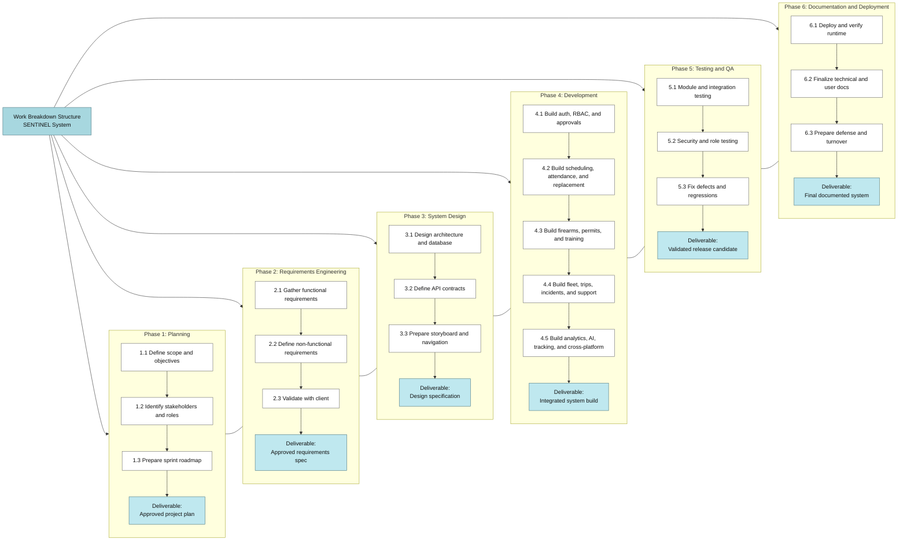
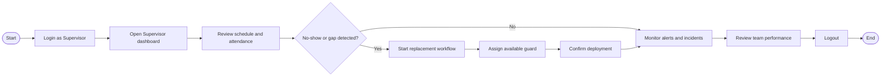

SENTINEL: AN INTEGRATED SECURITY
OPERATIONS MANAGEMENT SYSTEM FOR
DAVAO SECURITY & INVESTIGATION AGENCY,
INC.

A Capstone Project
Proposal Presented to the Faculty of the
Information and Communications Technology
Program STI College Tagum

In Partial Fulfillment
of the Requirements for the Degree
Bachelor of Science in Information Systems

DWIGHT KARL B. GAGA-A
GAD ABRAHAM M. JOSE
APPLE JOHN D. LUMINGKIT
 HECTOR PHILLIP P. LACIERDA
HANZ LOURENZ FRANK J. RIBU

March 2026

---

ENDORSEMENT FORM FOR PROPOSAL DEFENSE

TITLE OF RESEARCH:

SENTINEL: An Integrated Security Operations
Management System

NAME OF PROPONENTS:

Dwight Karl B. Gaga-a
Gad Abraham M. Jose
Apple John D. Lumingkit
Hector Phillip P. Lacierda
Hanz Lourenz Frank J. Ribu

In Partial Fulfilment of the Requirements
for the degree of Bachelor of Science in Information
System
has been examined and is recommended for Outline Defense.

ENDORSED BY:

<Capstone Project Adviser's Given Name MI. Family
Name>
Capstone Project Adviser

APPROVED FOR PROPOSAL DEFENSE:

<Capstone Project Coordinator's Given Name MI. Family Name>
Capstone Project Coordinator

NOTED BY:

<Program Head's Given Name MI. Family Name>
Program Head

<DATE OF PROPOSAL DEFENSE>

---

APPROVAL SHEET

This capstone project proposal titled: <Research Title> prepared and submitted by
<Researcher's  Given  Name  MI.  Family  Name>,  <Researcher's  Given  Name  MI.
Family Name>, <Researcher's Given Name MI. Family Name>, and <Researcher's
Given  Name  MI.  Family  Name>,  in  partial  fulfillment  of  the  requirements  for  the
degree of Bachelor of Science in <Program>, has been examined and is recommended
for acceptance and approval.

<Capstone Project Adviser's Given Name MI. Family Name>
Capstone Project Adviser

Accepted and approved by the Capstone Project Review
Panel in partial fulfillment of the requirements for the degree
of Bachelor of Science in <Program>

<Panelist's Given Name MI. Family Name>  <Panelist's Given Name MI. Family Name>

Panel Member

Panel Member

<Panelist's Given Name MI. Family Name>
Lead Panelist

Noted:

<Capstone Project Coordinator's Given
Name MI. Family Name>
Capstone Project Coordinator

<Program Head's Given Name MI. Family
Name>
Program Head

<Date of Proposal Defense>

---

INTRODUCTION

Project Context

The  private  security  global  industry  is  transitioning  toward  automated,  high-

integrity digital ecosystems to address the discovery lag inherent in human-led monitoring.

Global  research  in  workforce  capacity  indicates  that  manual,  reactive  responses  to

personnel  gaps  significantly  increase  vacancy  time,  which  remains  a  primary  driver  of

security  breaches  in  critical  infrastructure  (Shiyanbola  et  al.,  2023).  This  movement  is

supported  by  modern  performance  management  theories  which  emphasize  that

transparent, data-driven tracking is essential to maintaining accountability and preventing

social  loafing,  a  phenomenon  where  individual  reliability  decreases  in  the  absence  of

structured, real-time monitoring (Aguinis, 2022).

The necessity for these technological advancements is echoed in recent Philippine

legislation through the Private Security Services Industry Act, also known as Republic Act

No. 11917 (2022). This law introduced a regime of professionalized accountability where

agencies face strict liability for administrative negligence. Under the law’s Implementing

Rules and Regulations, agencies can be fined up to P5,000,000 or face license revocation

for  deploying  personnel  with  expired  licenses  or  unauthorized  firearms  (Jur.ph,  2025).

Furthermore, national studies on the effectiveness of Philippine security guards identify

that absenteeism and the abandonment of posts are most prevalent in agencies that lack

advanced patrol monitoring and digital reporting systems (Abad, 2025).

---

In the specific context of the Davao Region, the Davao Security and Investigation

Agency, Inc. operates in a landscape that has prioritized a culture of security to sustain its

position as a leading safe haven in Southeast Asia (PIA, 2025). According to the Davao

Regional  Development  Plan  2023  to  2028,  the  region's  rapid  economic  growth  has

increased  the  demand  for  advanced  technology  and  innovation  to  ensure  peace  and

security in high-traffic logistics and commercial hubs like Tagum City (NEDA XI, 2024).

Recent  local  research  conducted  in  the  Davao  Region  specifically  highlights  that

compensation,  punctuality,  and  alertness  are  the  primary  determinants  of  guard

performance,  yet  many  regional  agencies  still  struggle  with  inattentiveness  and

abandonment of posts due to inconsistent manual oversight (Ondos and Origines, 2025).

For DASIA Tagum, this represents a critical vulnerability where site vacancies may go

undetected for hours, directly compromising the safety of local clients.

SENTINEL is an integrated digital ecosystem designed to resolve these cumulative

vulnerabilities by centralizing personnel profiles, firearm telemetry, and shift logs into a

high-performance  single  source  of  truth.  The  system  works  by  embedding  real-time

compliance checks into the daily operational workflow. Before a guard can be deployed,

the system automatically verifies their license validity and firearm authorization against

central  records.  To  manage  high-concurrency  requests  from  hundreds  of  guards,

SENTINEL utilizes the Rust programming language and the Axum framework, providing

native memory safety and asynchronous performance that prevents the data races typical

of legacy systems (Scofield, 2025). When an operational gap such as a missed check-in is

detected,  the  system  immediately  flags  the  vacancy  and  identifies  the  nearest  qualified

replacement, ensuring that the agency moves from a reactive stance to a proactive, legally

defensible model of security management.

---

Purpose and Description

The primary purpose of this capstone project is to deliver a fully functional, production-

ready  Integrated  Security  Operations  Management  Platform  that  consolidates  guard

personnel management, equipment allocation, vehicle operations, and access control into

a unified system for Davao Security & Investigation Agency, Inc.

SENTINEL is a web-based system that integrates operational data and workflows using

a  Rust/Axum  backend  API,  a  PostgreSQL  relational  database,  and  a  React/TypeScript

frontend  deployed  through  Docker,  with  desktop  and  mobile  wrappers  for  broader

operational access. The system is designed as an integrated operations

platform  that  aligns  with  ERP  and  WFM  principles  by  centralizing  data,  enforcing

consistent workflows, and providing real-time operational visibility.

The  platform  implements  four  core  modules.  Guard  Management  covers  personnel

profiles,  scheduling,  attendance  tracking,  performance  analytics,  and  replacement

coordination  to  ensure  uninterrupted  site  coverage.  Equipment  Management  maintains

firearm  inventory,  allocation  workflows,  permit  records,  and  maintenance  history  to

support regulatory compliance and accountability. Vehicle Operations manages armored

vehicle  assets,  driver  assignments,  and  trip  tracking  to  improve  deployment  oversight.

Access  Control  enforces  role-based  permissions,  authentication,  and  audit  logging  to

ensure that only authorized roles can access sensitive operations and data. The system has

been  validated  through  a  24-day  operational  simulation  covering  24  distinct  business

scenarios and resolving 15 or more production issues. Recent production-hardening updates

also implemented distributed login lockout persistence, refresh-token rotation and revocation,

global and endpoint-level abuse protection, explicit production-origin CORS allow-listing in

the Axum backend, map viewport synchronization safeguards for Leaflet runtime stability, and

cross-platform client security reinforcement, including a first-use Terms of Agreement gate

that blocks access until the user explicitly accepts policy terms on Web, Desktop, and Mobile runtimes. Additional runtime hardening includes wrapper-origin CORS support for

`capacitor://localhost`, `tauri://localhost`, and secure localhost WebView origins to prevent mobile login fetch failures, with these wrapper origins now enforced even when explicit web CORS origin environment variables are configured. Release hardening also added fail-fast environment validation for frontend production packaging (HTTPS production API target plus semantic app version requirement), while the runtime includes an in-app update availability prompt that compares deployed app version metadata against GitHub latest-release tags and guides users to download newer builds.

For browser-based local development against a deployed backend, explicit CORS configuration now also preserves `http://localhost:5173` and `http://127.0.0.1:5173` so preflight checks for authentication and protected API calls do not fail during SOC workflow validation.

To eliminate cross-dashboard communication failures, backend middleware execution now keeps CORS as the outermost layer so even early middleware responses (authorization/rate-limit) still return browser-valid CORS headers, while API rate-limit guards bypass `OPTIONS` preflight probes. On the frontend, protected API calls are now blocked when no token is present, and the live operational map websocket path uses bounded exponential-retry with polling fallback continuity to preserve command-center availability during transient socket disruptions.

Further stabilization now ensures API throttling responses (`429`) also include CORS headers and that rate-limit identity keys can derive from verified bearer-token user IDs when proxy IP headers are unavailable, reducing false-positive throttling collisions in containerized local runs. The global API limiter key also now includes request path segmentation (`api:<requester>:<path>`) to prevent one dashboard module from consuming another module's burst budget during startup. Location fallback behavior was also updated to use CORS-compatible IP providers with short-lived caching so denied GPS sessions do not flood the console with blocked external geolocation requests.

The production-hardening pass now applies dual-dimension abuse protection (per-IP and per-user buckets), structured timeout protection for long-running requests, and standardized backend error payloads that preserve stable client contracts while suppressing raw internal diagnostics from user-facing responses. Backend response hardening also now includes explicit security headers (`X-Content-Type-Options`, `X-Frame-Options`, `Content-Security-Policy`, and production HSTS), expanded health telemetry (`/api/health`, `/api/health/system`) with database/websocket/uptime visibility, and a centralized release metadata endpoint (`GET /api/system/version`) that powers unified update checks across platform runtimes.

Cross-platform release behavior was refined so Web, Desktop, and Mobile clients query the same backend version source before prompting updates. Desktop builds support in-app one-click update and relaunch through the Tauri updater plugin, while mobile and web builds route users to release download channels. Runtime release UX was extended with a version-scoped in-app "What's New" dialog so each deployed version can present condensed release highlights exactly once per client installation.

Frontend presentation consistency was also standardized through a dual-theme SOC design system: light and dark modes now share a centralized semantic token contract for surface, text, status, interaction, and focus states, while shared shell components (navigation, profile controls, notification panel, and authentication views) were refactored to consume tokenized styles rather than scattered hardcoded values. This update preserved existing page structure and workflows while improving readability, interaction predictability, and theme transition stability across desktop and mobile viewports.

A second visual consistency pass was then applied across dashboard modules to remove residual micro-scale mismatches (small-font labels, compact chip paddings, and action-control height drift), producing a more uniform command-surface rhythm while preserving all existing workflows, role-based behavior, and API interactions.

Deployment pipeline hardening also enforces lockfile-based backend image builds (`cargo build --locked`) and a non-root runtime user inside the backend container image, while release automation is now centralized in a tag-driven workflow (`.github/workflows/release.yml`) with pinned `actions/checkout` and recursive submodule checkout for deterministic source resolution. Release preparation now applies a unified semantic version source across web, desktop, and Android wrappers, generates GitHub release notes from `CHANGELOG.md`, injects concise release highlights into frontend build metadata, and emits deterministic artifact names for all platforms. Android release packaging is now signed-only and fails fast when required signing credentials are absent, replacing previous fallback signing behavior.

---

Objectives

General Objective

To design, implement, and validate SENTINEL as a multi-platform Security Operations Center (SOC) platform that unifies personnel deployment, resource control, incident response, and command-level monitoring across Web, Desktop (Tauri), and Mobile (Capacitor Android) runtime targets.

Specific Objectives

1. Implement a complete account and identity lifecycle module for all users.

a. Provide user registration, email verification, resend verification, and secure login.

b. Implement forgot password, reset code verification, password reset, and guard approval gating for controlled account activation.

c. Support profile management, profile photo update/delete, and secure session continuity through refresh-token rotation and logout revocation flows.

2. Implement centralized personnel administration and approval workflows.

a. Manage users by role: superadmin, administrator, supervisor, and guard.

b. Provide pending guard approval queues and approval status updates.

c. Support user update, deactivation/delete, role/status filtering, and guard-specific listings.

3. Implement scheduling, attendance, and workforce continuity automation.

a. Create, update, delete, and list shifts with conflict-aware assignment.

b. Enable guard check-in/check-out with attendance history tracking.

c. Detect no-shows, request replacements, accept replacements, and manage guard availability.

4. Implement firearm inventory, issuance, and custody control.

a. Provide full firearm CRUD with serial/model/caliber/status tracking.

b. Implement firearm issuance, return, active allocations, and overdue allocation monitoring.

c. Maintain firearm maintenance schedules, pending maintenance, and completion records.

5. Implement permit and training compliance management.

a. Create and retrieve guard permits, including expiring and revoked permits.

b. Support auto-expire permit processing for compliance enforcement.

c. Manage training records, guard training history, and expiring training alerts.

6. Implement armored vehicle fleet and trip operations.

a. Provide armored car CRUD, issuance/return, and active allocation monitoring.

b. Manage driver assignment/unassignment and driver-vehicle linkage.

c. Support trip creation, trip status updates, trip completion, and trip detail/history views.

d. Manage vehicle maintenance scheduling, completion, and maintenance records.

7. Implement mission operations and merit-based performance evaluation.

a. Enable mission assignment and mission retrieval for operational deployment.

b. Calculate guard merit scores and provide ranked guard outputs.

c. Support client evaluation submission, guard evaluation retrieval, and overtime candidate identification.

8. Implement support, communication, and notification services.

a. Enable support ticket creation and guard ticket retrieval workflows.

b. Provide user notifications, unread counts, mark-read/mark-all-read, and delete actions.

c. Support alerting for operational events and decision-critical updates.

9. Implement incident management and real-time tracking intelligence.

a. Provide incident creation, active incident retrieval, and incident status updates.

b. Implement guard heartbeat, tracking point capture, and map data endpoints.

c. Provide client site CRUD and shift proximity alert checks.

d. Enable real-time websocket tracking stream for live operational visibility.

e. Provide guard movement-intelligence endpoints for path replay, historical patrol reconstruction, and active guard roster extraction.

f. Detect geofence enter/exit transitions against client-site boundaries and surface leadership alerts for movement anomalies.

g. Provide dedicated geofence management endpoints so each site can maintain configurable radius or polygon zones.

10. Implement analytics, predictive intelligence, and decision support.

a. Provide analytics overview, trends, and guard reliability endpoints.

b. Implement predictive alerts for permit expiry, maintenance risk, no-show patterns, and guard capacity risk.

c. Provide AI (deterministic) services for guard absence risk, replacement suggestions, vehicle maintenance risk, incident classification, and incident summarization.

11. Implement real-time location monitoring and map-based operations.

a. Provide OpenStreetMap-based visualization of guards, routes, and client sites.

b. Implement live tracking updates through websocket streaming.

c. Support map data retrieval and proximity-based operational alerts.

12. Implement governance, security, and auditability mechanisms.

a. Maintain write-request audit logs for critical actions.

b. Support session/token-based authenticated API access, presence/last-seen tracking, and refresh-session revocation controls.

c. Provide health-check endpoints, authentication throttling, and API rate-limiting controls for operational readiness and abuse protection.

d. Provide forensic audit intelligence endpoints for filtered timeline retrieval, per-user activity reconstruction, and anomaly detection (failed bursts, activity spikes, suspicious source-IP patterns).

13. Implement and validate cross-platform runtime delivery.

a. Deliver the web runtime for browser-based command and operational access.

b. Deliver the desktop runtime through Tauri packaging for command-center deployment.

c. Deliver the mobile runtime through Capacitor Android packaging for field operations.

d. Validate cross-platform API connectivity and authentication/session behavior across Web, Desktop, and Android targets.

14. Implement legal and policy compliance enforcement.

a. Require first-use acceptance of Terms of Agreement, Privacy Policy, and Acceptable Use Policy before protected module access.

b. Persist legal acceptance metadata (timestamp, policy version, requester IP, and user agent) in the backend user record.

c. Enforce legal-consent checks in backend authorization middleware while preserving bootstrap-safe paths for consent and logout.
---

Scope and Limitations

Scope

The SENTINEL system is a web-based platform intended to strengthen operational control and compliance for a private security agency. The system is scoped to security agency operations and the regulatory environment set by the Private Security Services Industry Act (Republic Act No. 11917, 2022).

Data

- Personnel profiles, role/approval data, licensing and permit records, training records, schedules, attendance logs, availability status, and performance/merit metrics.
- Firearm inventory, firearm allocations, firearm maintenance records, and firearm permit compliance data.
- Armored vehicle assets, car allocations, driver assignments, trip records, and vehicle maintenance history.
- Missions, incidents, support tickets, notifications, predictive alerts, tracking/map points, and audit/access logs.
- Geofence transition events, site geofence zone definitions (radius/polygon), movement-history path records, and anomaly-evidence metadata used for command investigation and post-incident review.
- Authentication lockout records, refresh-session lifecycle records, and audit source-IP traces for security monitoring and accountability.
- Legal-consent records including acceptance timestamp, policy version, requester IP, and user-agent evidence.

Process

- Account lifecycle workflows including registration, email verification, authentication, password reset, and profile management.
- Approval workflows for newly registered guards before operational access is granted.
- Role-based dashboard workflows for command center, approvals, analytics, calendar operations, and audit-log monitoring.
- Shift scheduling, attendance validation, no-show detection, replacement request/acceptance, and supervisor oversight.
- Firearm issuance/return workflows with permit validation, maintenance scheduling, and custody traceability.
- Vehicle allocation, driver assignment, trip lifecycle management, and preventive/corrective maintenance tracking.
- Incident reporting, support ticket handling, notification delivery, and real-time operations tracking.
- Guard movement reconstruction workflows including active-guard roster monitoring, historical trail replay, and geofence transition escalation.
- Audit forensics workflows including timeline filtering, actor-specific activity reconstruction, anomaly signal review, and operational story sequencing.
- Session hardening workflows including refresh-token rotation, logout revocation, and lockout persistence.
- Legal confirmation workflows including policy review links, mandatory acceptance capture, and protected-route access gating until accepted.

People

- Superadmin, Administrator, Supervisor, and Guard roles with distinct permissions and dashboard views.

Technology

- Web-based application accessible on desktop and mobile browsers.
- Cross-platform runtime deployment for Web, Desktop (Tauri), and Mobile Android (Capacitor).
- React + TypeScript frontend and Rust + Axum backend services.
- Centralized PostgreSQL database with relational integrity, auditability, and role-based data control.
- Dockerized deployment and API-driven architecture with websocket streaming and polling fallback for tracking views.

Limitation of the Study

- The system does not integrate with external payroll, HR, or government licensing systems.
- Dedicated hardware-grade vehicle telematics integration is not yet implemented; current tracking relies on application-provided location updates and available device/network conditions.
- AI/predictive outputs are decision-support recommendations and do not autonomously execute final operational actions.
- Direct integration with third-party hardware ecosystems (CCTV, IoT sensors, access control turnstiles) is not included.
- Offline-first field operation is limited; core workflows depend on network/API availability.
- Native wrapper scope is currently limited to Windows desktop and Android; iOS and macOS deployment targets are not included in the present implementation.
---

Review of Related Literature/Studies/Systems

Related Literature

The Philippine private security sector is currently navigating its most significant legal

transition  in  over  fifty  years.  The  enactment  of  the  Private  Security  Services  Industry  Act

(Republic  Act  No.  11917,  2022)  effectively  repealed  the  outdated  RA  5487,  shifting  the

industry toward a regime of "Professionalized Accountability." According to Jur.ph (2025),

the law’s Implementing Rules and Regulations (IRR) mandate that Private Security Agencies

(PSAs) maintain highly accurate, digitized records of License to Exercise Security Profession

(LESP)  and  firearm  permits.  The  act  introduces  a  "strict  liability"  framework  where

administrative negligence, such as deploying an unlicensed guard, can result in fines ranging

from ₱50,000 to ₱100,000 per violation, or up to ₱5,000,000 for agency-wide license failures.

This  regulatory  pressure  has  necessitated  a  move  toward  Automated  Regulatory

Compliance Tracking (ARCT). Research by Khinvasara, T., Shankar, A., & Wong, C. (2024)

suggests  that  for  organizations  managing  complex,  shifting  rules,  the  use  of  automated

monitoring  is  a  "significant  advancement"  that  eliminates  the  "discovery  lag"  inherent  in

manual  audits.  By  leveraging  system-driven  triggers  for  license  expirations,  PSAs  can

transition from reactive compliance to a proactive stance, ensuring that no personnel or asset

is deployed without valid legal authorization.

Operational continuity in the private security sector is heavily dependent on reliable

guard presence. As identified in the operational risks of DASIA Tagum, "No-Show" incidents

represent a critical vulnerability where manual processes relying on phone calls and delayed

human  intervention  fail  to  address  "discovery  lag."  Research  in  workforce  capacity

---

optimization  emphasizes  that  manual,  reactive  responses  to  workforce  gaps  significantly

increase  "vacancy  time,"  directly  correlating  with  higher  security  breach  probabilities

(Shiyanbola et al., 2023).

Modern  systems  mitigate  this  by  automating  the  identification  and  deployment  of

replacements based on real-time availability, shifting the organizational stance from reactive

crisis  management  to  proactive  risk  mitigation  (Al-Khafajiy  et  al.,  2022).  Furthermore,

advanced algorithms now enable "predictive scheduling," which analyzes historical No-Show

data  to  alert  administrators  of  potential  gaps  before  they  occur,  drastically  reducing  the

operational vacancy time (TrackTik, 2025).

The  transition  from  inconsistent,  manual  tracking  to  a  structured,  data-driven

framework  is  essential  for  maintaining  Distributive  Justice,  the  perceived  fairness  of  how

shifts,  rewards,  and  responsibilities  are  allocated  within  an  organization.  Aguinis  (2022)

posits that the absence of a structured performance management framework leads to "Social

Loafing," a psychological phenomenon where employees decrease effort due to a perceived

lack of individual accountability.

For  security  agencies  like  DASIA  Tagum,  implementing  centralized  performance

metrics such as punctuality and client feedback logs ensures that shift allocation is based on

objective data rather than subjective selection. This transparency not only increases overall

guard reliability but also fosters a culture of accountability, as guards understand that their

performance is directly linked to future opportunities (Tan et al., 2024).

---

The systematic allocation of firearms is a matter of both Chain of Custody (CoC) and

legal necessity under the Private Security Services Industry Act (Republic Act No. 11917,

2022). The law mandates  strict accountability  for firearms,  requiring that  only  authorized,

trained, and compliant guards carry weapons. Manual processes often suffer from "data drift,"

where the status of a weapon and the permit validity of the assigned guard are not reconciled

in  real-time,  leading  to  potential  administrative  negligence.  Centralized  digital  tracking  is

identified as the primary defense against the misallocation of high-risk equipment and is a

prerequisite  for  generating  the  legally  defensible  audit  logs  required  by  the  National

Cybersecurity Plan 2022-2028 (DICT, 2024; PNP-SOSIA, 2022).

The selection of the backend technical stack is a core security decision for mission-

critical systems. Scofield, M. B. (2025) argues that Rust’s "ownership and borrowing" model

provides a fundamental architectural advantage: Memory Safety without a Garbage Collector.

This  ensures  that  SENTINEL  is  natively  resistant  to  buffer  overflows  and  data  races,

vulnerabilities  that  often  plague  systems  handling  high-concurrency  data  like  real-time

firearm tracking.

Complementing  the language is  the  Axum framework, which is  built  on  the Tokio

asynchronous  runtime.  As  highlighted  by  NashTech  (2025),  Axum  is  designed  for  high-

performance  web  services  where  scalability  and  raw  speed  are  non-negotiable.  For

SENTINEL, this means the Attendance Tracking and No-Show Detection modules can handle

hundreds  of  simultaneous  "check-in"  requests  during  shift  rotations  without  performance

degradation. This "asynchronous-first" design allows the system to remain responsive even

when processing complex relational logic across personnel, vehicle, and firearm databases.

---

In  an  Integrated  Operations  Platform,  the  database  must  serve  as  the  immutable

"Single  Source  of  Truth."  PostgreSQL  (2025)  is  recognized  as  the  premier  open-source

RDBMS for enterprise planning due to its strict adherence to ACID (Atomicity, Consistency,

Isolation,  Durability)  properties.  Nguyen,  R.  (2025)  emphasizes  that  PostgreSQL’s

implementation of Foreign Key Constraints and Unique Exclusion Constraints is the primary

defense against "data drift."

In  the  SENTINEL  ecosystem,  these  constraints  ensure  that  a  firearm  or  armored

vehicle cannot be logically "double-booked" or assigned to a guard who does not exist in the

personnel  table.  This  high  level  of  relational  integrity  is  a  prerequisite  for  generating  the

legally defensible Audit Logs required by the National Cybersecurity Plan 2023-2028 (DICT,

2024), ensuring that every asset movement is tied to a verifiable digital identity.

---

Related Studies and/or Systems

Empirical  research  confirms  that  automated  oversight  is  a  primary  driver  of

operational integrity. A study by Atlam, H. F., & Yang, Y. (2025) found that organizations

utilizing unified Access Control and Resource Planning (ERP) systems saw a 27% drop in

unauthorized  access  violations  and  reclaimed  36%  of  staff  time  previously  lost  to  manual

verification. These findings suggest that hardwiring compliance into the system architecture,

rather than treating it as an afterthought,  tightens process  integrity  and  reduces the  risk of

internal data tampering.

Furthermore,  research  by  Shiyanbola,  J.  O.,  et  al.  (2023)  on  "Workforce  Capacity

Optimization"  highlights  a  flaw  in  traditional  security:  "discovery  lag."  This  occurs  when

supervisors only identify a personnel gap after a shift has failed. Their study demonstrates

that real-time, asynchronous detection models allow for a proactive 11.8% improvement in

site coverage reliability. Locally, ResearchGate (2025) cites a study by Respicio (2023) which

found  that  Philippine  security  guards  operating  under  digital  monitoring  exhibited

significantly  higher  levels  of  alertness  and  punctuality  because  the  system  provided  a

transparent,  inescapable  layer  of  accountability  that  manual  logs  could  not  match.  The

functional  blueprint  of  SENTINEL  is  informed  by  the  performance  of  several  industry-

leading platforms such as TrackTik and Guardhouse.

---

TrackTik

Figure 1. TrackTik

TrackTik  (2025)  has  redefined  security  workforce  management  by  moving  beyond

static  scheduling  toward  an  integrated,  AI-driven  operational  model.  According  to  the

Trackforce 2025 Physical Security Operations Benchmark Report, the industry is currently

facing an "AI adoption paradox" where the value of predictive scheduling is recognized, but

cost  remains a barrier for mid-sized firms.  TrackTik’s success  is  anchored in  its  ability to

consolidate alarm monitoring, guard dispatch, and business administration into a single 24/7

resilient  architecture,  which  users  report  has

increased  operational  efficiency  by

approximately  20%.  This  efficiency  is  primarily  attributed  to  the  reduction  of  manual

administrative  burdens  through  automated  compliance  tracking  and  real-time  intelligence

feeds (TrackTik, 2025).

---

Guardhouse

Figure 2. Guardhouse

Guardhouse (2026) addresses the specific administrative "overload" that has become

a  measurable  barrier  to  performance  in  the  mid-2020s.  Research  from  NODE  Magazine

(2026) indicates that security employees often lose an average of 15 hours per week to routine

administrative  tasks,  such  as  re-entering  data  across  fragmented  systems.  Guardhouse

mitigates  this  by  unifying  scheduling,  GPS  tracking,  and  invoicing  into  a  streamlined

workflow, reportedly reducing office-based administrative time by 40–60%. Its "Confidence

in  Compliance"  module  provides  a  specialized  framework  for  daily  license  verification,  a

logic that SENTINEL  adapts  to  specifically meet  the stringent  requirements  of RA 11917

(GetApp, 2026).

---

MySecuritas

Figure 3. MySecuritas

Securitas  "MySecuritas"  (2026)  represents  the  industry’s  shift  toward  "Situational

Understanding"  and  proactive  risk  management.  The  Securitas  2026  Global  Technology

Outlook  Report  identifies  that  the  rapid  advancement  of  generative  AI  for  contextual

understanding  is  now  a  top  priority  for  30%  of  security  decision-makers  (Securitas

Technology, 2025). MySecuritas operationalizes this by providing a unified dashboard that

transforms  disparate  incident  reports  into  actionable  statistics  and  trend  highlights.  This

allows  supervisors  to  identify  risk  patterns  before  they  escalate,  a  core  design  principle

mirrored in SENTINEL’s Performance Analytics Dashboard (Securitas, 2026).

---

Silvertrac Software

Figure 4. Silvertrac Software

Silvertrac Software (2026) is widely utilized for "Proof of Performance" and on-site

accountability,  particularly  in  parking  and  property  management  environments.  While  it

excels in field reporting and checkpoint verification via mobile applications, its architectural

focus remains on incident management and officer accountability (Silvertrac Software, 2026).

Technical evaluations of generic guard management systems suggest a persistent "visibility

gap" in specialized asset tracking; most platforms lack the deep relational logic required for

a Digital Chain of Custody for high-risk assets like firearms and armored car fleets (Hardcat,

2025).  SENTINEL  fills  this  niche  by  integrating  these  high-stakes  logistics,  traditionally

managed  in  siloed  armory  or  fleet  software,  into  the  primary  workforce  management

ecosystem.

---

Across  the  reviewed  literature,  several  consistent  themes  emerge.  Researchers

emphasize the importance of integrating operational data to improve organizational visibility

and decision-making. Studies from both Philippine and international contexts highlight the

limitations of fragmented monitoring tools and manual processes.

Technological trends such as automated scheduling algorithms, attendance tracking,

and  operational  dashboards  are  increasingly  adopted  across  industries.  However,  existing

systems often address only a single domain of operations, such as workforce scheduling or

surveillance monitoring. Global systems like TrackTik and Guardhouse demonstrate that the

industry standard is defined by Real-Time Accountability and Centralized Data Ownership.

However, these systems  often fail to  accommodate the granular administrative nuances of

Philippine law.

The reviewed literature therefore reveals a clear research gap in integrated systems

that  combine  workforce  management,  compliance  monitoring,  and  operational  oversight

within a unified platform tailored to security agencies. The SENTINEL system addresses this

void by combining high-concurrency Rust/Axum architecture with modules specifically for

Philippine-specific  licensing  (RA  11917),  Firearm  Custody,  and  Armored  Car  Fleet

Management,  allowing  local  agencies  to  achieve  multinational  levels  of  visibility  and

compliance.  It  provides  a  centralized  solution  that  integrates  scheduling  automation,

regulatory  compliance  verification,  and  real-time  operational  dashboards  within  a  single

enterprise system.

---

REFERENCES

Abad,  R.  (2025).  How  Effective  Is  Your  Security  Guard?  An  Inquiry  into  the  Philippine

Private

Security

Industry.

Retrieved

from

https://doi.org/10.13140/RG.2.2.30981.41442

Aguinis, H. (2022). Performance Management (5th ed.). SAGE Publications. Retrieved from

https://edge.sagepub.com/aguinispm5e

Al-Khafajiy, M., et al. (2022). Enabling high performance fog computing through fog-2-fog

coordination  model.  Future  Generation  Computer  Systems.  Retrieved  from

https://doi.org/10.1016/j.future.2022.06.012

Atlam,  H.  F.,  &  Yang,  Y.  (2025).  Enhancing  Healthcare  Security:  A  Unified  RBAC  and

ABAC

Risk-Aware

Access

Control

Approach.

Retrieved

from

https://doi.org/10.3390/fi17060262

Department of Information and Communications Technology (DICT). (2024). National

Cybersecurity  Plan  2023-2028:  A  Whole-of-Nation  Roadmap.  Retrieved  from

https://dict.gov.ph/national-cyber-security-plan

GetApp.  (2026).  Guardhouse  2026  Pricing,  Features,  Reviews  &  Alternatives.  Retrieved

from https://www.getapp.com/operations-management-software/a/guardhouse/

Guardhouse.  (2026).  2026  Pricing,  Features,  Reviews  &  Alternatives.  Retrieved  from

https://www.getapp.com/operations-management-software/a/guardhouse/

Hardcat. (2025). Law Enforcement Equipment & Armory Management System: Challenges

in  Managing  Firearms  Securely.  Retrieved  from  https://hardcat.com/police-

equipment-inventory-tracking/

Jur.ph.  (2025).  The  Private  Security  Services  Industry  Act:  Law  Summary  and  IRR.

Retrieved from https://jur.ph/law/summary/the-private-security-services-industry-act

---

Khinvasara,  T.,  Shankar,  A.,  &  Wong,  C.  (2024).  Survey  of  Artificial  Intelligence  for

Automated

Regulatory

Compliance

Tracking.

Retrieved

from

https://doi.org/10.9734/jerr/2024/v26i71217

NashTech.  (2025).  Building  High-Performance  Web  Services  with  Rust  and  Axum.

Retrieved

from  https://blog.nashtechglobal.com/building-high-performance-web-

services-with-rust-and-axum/

NEDA XI. (2024). Davao Regional Development Plan 2023-2028. National Economic and

Development  Authority.  Retrieved  from  https://rdc11.neda.gov.ph/rdc-xi-approves-

davao-regional-development-plan-2023-2028/

Nguyen,  R.  (2025).  PostgreSQL  ACID  In-Depth:  Reliability  and  Consistency  in  Modern

Transactions.  Retrieved  from  https://medium.com/engineering/postgresql-acid-in-

depth

NODE Magazine.  (2026). Why 2026 is the Year Businesses  Must  Finally Address Admin

Overload.  Retrieved  from  https://www.node-magazine.com/thoughtleadership/why-

2026-is-the-year-businesses-must-finally-address-admin-overload

Ondos,  M.  U.,  &  Origines,  D.  V.  (2025).  Android-Based  Guard  Monitoring  and  Site

Surveillance

System.

Retrieved

from

https://www.ojs.udb.ac.id/icohetech/article/view/5657

PIA.  (2025).  Davao  City  Maintains  Top  Safety  Ranking  in  Southeast  Asia.  Philippine

Information  Agency.  Retrieved  from  https://pia.gov.ph/news/davao-city-maintains-

top-safety-ranking-in-southeast-asia/

PostgreSQL  Global  Development  Group.  (2025).  PostgreSQL  17  Documentation:  Data

Integrity

and

ACID

Compliance.

Retrieved

from

https://www.postgresql.org/docs/17/acid.html

PNP-SOSIA.  (2022).  Implementing  Rules  and  Regulations  of  Republic  Act  No.  11917.

---

Retrieved  from  https://www.scribd.com/document/691228276/Approved-IRR-RA-

11917

Republic Act No. 11917. (2022). The Private Security Services Industry Act. Retrieved from

https://elibrary.judiciary.gov.ph/thebookshelf/showdocs/2/95597

Scofield, M. B. (2025). Rust Axum Web Development: Build High-Performance APIs and

Services.  Retrieved  from  https://www.amazon.com/Rust-Axum-Web-Development-

High-Performance/dp/B0CX7N4K6J

Securitas.  (2026).  Control  Security  from  Anywhere  -  MySecuritas  Product  Overview.

Retrieved from https://www.securitas.com/en/security-solutions/mysecuritas/

Securitas  Technology.  (2025).  2026  Global  Technology  Outlook  Report:  The  State  of

Security

Technology.

Retrieved

from

https://www.securitastechnology.com/news/securitas-technology-releases-2026-

global-technology-outlook-report

Shiyanbola,  J.  O.,  et  al.  (2023).  A  Workforce  Capacity  Optimization  Model  for  Lean

Environments. Retrieved from https://www.irejournals.com/paper-details/1704408

Tan, K., et al. (2024). The digital transformation of security and the role of AI. Securitas

White Paper. Retrieved from https://www.securitas.ie/news-insights/whitepapers/the-

digital-transformation-of-security-and-the-role-of-ai/

TrackTik.  (2025).  Top  5  End-to-End  Security  Guard  Management  Software  for  2025.

Retrieved  from  https://www.tracktik.com/resources/blog-articles/top-5-end-to-end-

security-guard-management-software-for-2025/

TrackTik.  (2025).  Physical  Security  Operations  Benchmark  Report  2025.  Retrieved  from

https://www.tracktik.com/wp-content/uploads/2025/10/2025BenchmarkReport-1.pdf

---

CHAPTER 2

METHODOLOGY

The development methodology used for SENTINEL is iterative and Agile-inspired, structured around feature-based increments rather than a single linear build. Each increment combined planning, implementation, integration, and review so that operational modules could be delivered and validated in usable slices. This approach was selected because SENTINEL includes tightly coupled operational domains (personnel, assets, tracking, incidents, and analytics) that require frequent cross-module verification.

Planning activities began with requirements consolidation, role-mapping, and module prioritization. The team translated these into implementation batches covering authentication and approvals, scheduling and attendance, firearms and fleet operations, incident/support workflows, analytics dashboards, tracking, and AI-assisted operational intelligence. Platform targets (web, desktop, and mobile) were included in planning to prevent late-stage portability redesign.

Development was executed through frontend-backend parallel work with recurring integration checkpoints. Frontend components and hooks were built alongside backend handlers, middleware, and service logic, then connected through authenticated API contracts. This feature-based integration pattern reduced interface drift and enabled earlier discovery of role-permission, payload, and workflow defects.

Recent iterations specifically expanded two intelligence-driven capability streams: (1) guard movement intelligence through guard-history/path and active-roster APIs with geofence enter/exit persistence; and (2) forensic audit intelligence through timeline filtering, per-user activity reconstruction, and anomaly grouping endpoints. These increments were further extended with dedicated geofence-management APIs (configurable radius/polygon zones per site) and validated using endpoint-level integration tests that exercised role-based access scenarios across guard, supervisor, and admin roles.

Testing and refinement were continuous throughout implementation. The team performed module-level checks, cross-role scenario tests, API contract verification, and runtime build validation for web, desktop, and Android outputs. Security and reliability refinements (for example lockout persistence, refresh-session revocation, authorization enforcement, and rate-limiting controls) were integrated as iterative hardening tasks. Current validation includes passing Rust integration tests for tracking/audit role gates and geofence CRUD paths, successful backend health checks on localhost, and successful frontend production builds after route-level lazy loading and chunk splitting for the audit dashboard surface. The latest verification pass also confirmed successful full backend test execution (`cargo test`), successful frontend unit tests (`5/5`), and healthy containerized backend/database startup through Docker Compose.

The most recent hardening increment added backend-enforced legal consent compliance. Consent acceptance now calls dedicated API endpoints, persists acceptance evidence in PostgreSQL, propagates consent state through JWT claims, and is enforced by authenticated middleware prior to protected route access. This prevented local-only consent drift and aligned legal gating with server-side authority.

Release-readiness refinement added unified build-time version propagation and release endpoint configuration so packaged desktop/mobile clients can detect newer published releases and notify users with controlled update prompts. The automated release pipeline now builds and publishes versioned web, desktop, and Android artifacts from a single semantic-version source, generates release notes directly from `CHANGELOG.md`, and enforces signed-only Android release packaging for production distribution integrity.

Deployment considerations were addressed through Dockerized service orchestration, PostgreSQL-backed persistence, and release-oriented build scripts for cross-platform distribution. This ensured that the methodology did not end at coding, but covered operational readiness and maintainability for real-world SOC usage.

Figure 4. Scrum Model

Technical Background

Technologies to be Used in the System

SENTINEL is implemented as a web-first integrated security operations platform with desktop and mobile runtime wrappers. Technology selection was based on concrete implementation requirements: role-based dashboards, secure API contracts, high-concurrency backend operations, traceable relational data, real-time tracking, and cross-platform delivery without codebase duplication. The proponents used the following technologies in the current implementation:

1. React + TypeScript: Used to build reusable, role-aware UI components and dashboard modules with strict typing. Compared with plain JavaScript React, TypeScript was selected because it reduces integration defects in API contracts and role-based state handling.

2. Vite: Used for fast local startup and production build pipelines. Compared with older Webpack-heavy defaults, Vite provides faster feedback for feature-by-feature iteration in dashboard-heavy development.

3. Tailwind CSS: Used for utility-driven, responsive interface implementation across command center, operations, and resource modules. Compared with prebuilt component frameworks, Tailwind was selected to maintain tighter control over SOC-specific visual patterns and state-based styling.

4. Leaflet + OpenStreetMap: Used for operational map rendering, live marker visualization, and client-site management. Compared with paid or quota-constrained map platforms, this combination supports implementation flexibility and cost control for tracking-intensive views.

5. Rust + Axum: Used for backend API handlers, middleware, and service orchestration. Compared with dynamically typed backend stacks, Rust was selected for memory safety and predictable runtime behavior, while Axum supports asynchronous request handling and middleware-driven security enforcement.

6. PostgreSQL: Used as the central transactional database for users, approvals, schedules, attendance, firearms, vehicles, incidents, notifications, tracking points, AI outputs, and audit logs. Compared with document-first databases, PostgreSQL was selected because relational constraints and SQL querying are necessary for compliance, reporting, and cross-module consistency.

7. Docker + Docker Compose: Used to standardize local backend/database orchestration and deployment parity. Compared with manual host setup, containerized orchestration reduces environment drift and improves reproducibility.

8. JWT Authentication with access and refresh tokens: Used for role-scoped API access, session continuity, refresh rotation, and logout revocation. Compared with short-lived token-only or purely server-session approaches, the implemented model provides stateless API interoperability with controlled refresh-session governance.

9. WebSocket + polling fallback: Used for real-time tracking snapshots with continuity under unstable transport conditions. Compared with polling-only, websocket streaming reduces latency; compared with websocket-only, polling fallback improves operational resilience.

10. Forensic audit intelligence endpoint design: Used to transform raw audit logs into timeline, user-activity, and anomaly-oriented command data. Compared with flat log listing only, this pattern improves investigation speed and supports command storytelling without changing underlying compliance records.

11. Capacitor: Used to package the web frontend for Android field deployment. Compared with fully separate native Android codebases, Capacitor preserves feature parity with lower maintenance overhead.

12. Tauri: Used to package the same frontend for Windows desktop command-center deployment. Compared with heavier desktop wrappers, Tauri was selected for lighter runtime footprint and stronger security controls.

13. Resend + managed deployment/tooling stack (Railway, GitHub): Resend is used for transactional account workflows (verification and reset flows), while Railway and GitHub pipelines support deployment and release operations. Compared with ad hoc SMTP and manual release processes, this stack improves delivery consistency and operational manageability.

14. GitHub Pages documentation portal + legal-policy artifacts: Documentation delivery now includes dedicated pages for download channels, feature coverage, security controls, and architecture references, plus repository-level legal policy documents (Terms of Agreement, Privacy Policy, Acceptable Use Policy). Compared with scattered notes, this provides a consistent release-ready operator and compliance reference.

Figure 5. Work Breakdown Structure

The Work Breakdown Structure (WBS) will model the project into major deliverables and sub-deliverables for tracking and control.

WBS Diagram (Mermaid Model)

WBS Diagram (Text Model)

1.0 Project Management
1.1 Project initiation and scope definition
1.2 Stakeholder consultation and approvals
1.3 Sprint planning and monitoring

2.0 Requirements Engineering
2.1 Requirements elicitation
2.2 Functional and non-functional analysis
2.3 Requirements validation and sign-off

3.0 System Design
3.1 Architecture and database design
3.2 API and module design
3.3 Storyboard and interface design

4.0 System Development
4.1 Authentication, RBAC, and approval workflows
4.2 Scheduling, attendance, and replacement workflows
4.3 Firearms, permits, and training compliance workflows
4.4 Fleet, trip, incident, and support workflows
4.5 Analytics, AI, map tracking, and cross-platform delivery

5.0 Testing and Quality Assurance
5.1 Module and integration testing
5.2 Security and role-permission testing
5.3 Defect fixing and regression testing

6.0 Documentation and Deployment
6.1 Deployment and runtime validation
6.2 Technical and user documentation
6.3 Defense preparation and final turnover

Gantt Chart of Activities

The project timeline will be organized into phased milestones covering initiation, planning, requirements gathering, sprint-based development, integration, testing, documentation, and defense preparation. Activities will be sequenced chronologically to ensure that each output becomes input for the next development phase.

Figure 6. Gantt Chart of Activities

Gantt Chart of Activities (Mermaid Model)

Gantt Chart of Activities (Planned Timeline)

Month: February
Activity: Project initiation and problem definition

Month: March
Activity: Requirements gathering and validation

Month: April
Activity: System architecture and interface planning

Month: May
Activity: Sprint 1 implementation (authentication, RBAC, and approvals)

Month: June
Activity: Sprint 2 implementation (scheduling, attendance, replacement)

Month: July
Activity: Sprint 3 implementation (firearms, permits, training)

Month: August
Activity: Sprint 4 implementation (fleet, trips, incidents, support)

Month: September
Activity: Sprint 5 implementation (analytics, AI, map tracking, and cross-platform packaging)

Month: October
Activity: Integration testing and bug fixing

Month: November
Activity: User validation, documentation, and refinements

Month: December
Activity: Final review, defense preparation, and turnover

Calendar of Activities

The calendar of activities summarizes the same phased sequence defined in the WBS and Gantt schedule, including objectives, involved personnel, and required resources.

1. February - Project initiation and problem definition.
Purpose: Define project boundaries, objectives, and target operational issues.
Persons involved: Proponents, adviser, client representative.
Resources needed: Consultation sessions, initial proposal documents, reference studies.

2. March - Requirements gathering and validation.
Purpose: Elicit and validate functional and non-functional requirements.
Persons involved: Proponents, operations users, adviser.
Resources needed: Interview guides, requirement templates, process notes.

3. April - System architecture and interface planning.
Purpose: Define architecture, database model, API scope, and storyboard screens.
Persons involved: Proponents and adviser.
Resources needed: ERD tools, wireframe tools, architecture notes.

4. May - Sprint 1: Authentication, RBAC, and approvals.
Purpose: Implement secure account lifecycle, role controls, and approval workflows.
Persons involved: Proponents.
Resources needed: VS Code, Rust toolchain, Node.js, PostgreSQL, Docker.

5. June - Sprint 2: Scheduling, attendance, and replacement.
Purpose: Implement shift management, check-in/check-out, no-show detection, and replacement flows.
Persons involved: Proponents.
Resources needed: API test scripts, schedule datasets, integration logs.

6. July - Sprint 3: Firearms, permits, and training.
Purpose: Implement inventory, allocation, maintenance, permit, and training compliance workflows.
Persons involved: Proponents.
Resources needed: Firearm/permit data templates, compliance validation cases.

7. August - Sprint 4: Fleet, trips, incidents, and support.
Purpose: Implement armored car management, trip lifecycle, incident handling, and ticket workflows.
Persons involved: Proponents.
Resources needed: Fleet/trip datasets, incident scenarios, runtime logs.

8. September - Sprint 5: Analytics, AI, tracking, and cross-platform packaging.
Purpose: Implement dashboards, predictive modules, map tracking, websocket flows, and web/desktop/mobile build alignment.
Persons involved: Proponents.
Resources needed: Analytics test data, AI validation scenarios, platform build toolchains.

9. October - Integration testing and bug fixing.
Purpose: Validate end-to-end modules, role permissions, and real-time flows; resolve regressions.
Persons involved: Proponents, adviser, selected testers.
Resources needed: Test scripts, issue tracker, runtime diagnostics.

10. November - User validation, documentation, and refinements.
Purpose: Validate operational usability, finalize documentation content, and apply approved refinements.
Persons involved: Proponents, adviser, selected client-side validators.
Resources needed: Validation checklists, manuscript drafts, review notes.

11. December - Final review, defense preparation, and turnover.
Purpose: Consolidate final outputs, prepare defense materials, and complete project handover.
Persons involved: Proponents and adviser.
Resources needed: Final manuscript file, presentation slides, appendices.

Resources

Hardware Requirements (Recommended)

Table 1 presents practical hardware requirements for both development and operational deployment of the currently implemented SENTINEL system.

Table 1: Hardware Requirements

Development Workstation
Operating System: Windows 10/11 (64-bit)
Processor: Intel Core i5 (10th gen or newer) or AMD Ryzen 5 (equivalent or newer)
Memory / RAM: 16 GB recommended (8 GB minimum)
Storage: 512 GB SSD recommended (250 GB minimum)
Network: Stable broadband connection for package installation, container pulls, and API testing
Display: 1366x768 minimum; 1920x1080 recommended for dashboard development and testing

Deployment Environment
Application Server: 4 vCPU minimum, 8-16 GB RAM, SSD-backed storage, Docker-capable host
Database Server: PostgreSQL-capable host (co-located or separate) with regular backup storage
Command Center Endpoints: Windows desktop systems capable of running the Tauri desktop build
Field Endpoints: Android smartphones/tablets with GPS and reliable mobile data/Wi-Fi connectivity for guard tracking and attendance workflows

Software Requirements

The software stack is divided into development-time requirements and runtime requirements to reflect actual implementation and deployment behavior.

Development Requirements

1. Visual Studio Code for frontend, backend, and documentation workflow management.

2. Node.js and npm for React/Vite dependency management, development server execution, and production frontend builds.

3. Rust toolchain (rustup, cargo) for building and validating the Axum backend services.

4. Docker Desktop and Docker Compose for local orchestration of backend and PostgreSQL services.

5. PostgreSQL tooling (local or containerized) for schema validation, data checks, and operational query verification.

6. Git and GitHub for version control, branch-based collaboration, and release workflow integration.

7. Markdown/Jekyll-compatible documentation tooling for maintaining GitHub Pages deployment content and release documentation artifacts.

Runtime Requirements

1. Modern web browser (Chromium-based or equivalent) for the web deployment target.

2. Windows desktop operating system for the Tauri-based desktop deployment target.

3. Android operating system for the Capacitor-based mobile deployment target.

4. Network connectivity between client runtimes and backend API services, including websocket access for live tracking views.

5. Stable API reachability for audit-intelligence endpoints (`/api/audit/logs`, `/api/audit/user-activity/:id`, `/api/audit/anomalies`) to support command-level forensic visualization.

Requirements Analysis

The requirements baseline for SENTINEL was defined from actual private-security operational pain points: fragmented coordination, delayed visibility, compliance exposure, and weak traceability of sensitive asset workflows. Based on current implementation, the requirements analysis prioritizes role-governed access, real-time operational awareness, and auditable process execution across personnel, equipment, vehicle, incident, and analytics domains.

As implementation matured, requirements depth was extended from basic monitoring to decision-grade intelligence outputs. This introduced explicit contracts for guard movement reconstruction (active roster, path replay, geofence transitions) and forensic audit interpretation (filtered timeline, actor activity history, anomaly grouping), while preserving backward compatibility with existing dashboard and API behavior.

Compliance requirements were further expanded into enforceable legal-governance controls. Rather than relying on client-local acceptance flags alone, requirements now mandate backend-persisted legal acceptance evidence and middleware-level route gating so protected modules remain inaccessible until legal consent is recorded through authenticated API contracts.

Technology and software selection was treated as a requirements decision, not only an implementation preference. For the frontend layer, React + TypeScript + Vite was selected to satisfy modular dashboard composition, strict role-based rendering, and rapid iteration. Angular was considered because it provides a full framework with built-in dependency injection and strong conventions; however, its heavier project structure was less aligned with the team's component-by-component delivery pace. Vue was considered for its simpler learning curve and progressive adoption model, but the existing codebase and shared component strategy were already established around React patterns. Plain JavaScript React was also considered, but TypeScript was chosen to reduce contract errors in role logic, API payload mapping, and cross-module state handling.

For backend processing, Rust + Axum was selected to meet concurrency, security, and reliability requirements for authentication, approvals, tracking, and analytics endpoints. Node.js + Express was considered because of rapid API prototyping and broad ecosystem support, but the project prioritized compile-time safety and stricter runtime guarantees for security-sensitive operations. Java + Spring Boot was considered for enterprise-grade structure and mature tooling, yet it introduces a larger operational footprint and greater configuration overhead for this capstone scope. Go + Gin/Fiber was also considered for performance and simplicity, but Rust + Axum better matched the team's objective of memory-safe, middleware-centric API enforcement with fine-grained control.

For persistence, PostgreSQL was selected because SENTINEL requires relational integrity across users, approvals, shifts, attendance, firearms, vehicles, incidents, and audit records. MySQL/MariaDB were considered because they are widely used relational systems, but PostgreSQL was preferred for stronger advanced SQL features, robust JSONB support, and flexible indexing for mixed transactional and analytical workloads. MongoDB was considered because of schema flexibility and rapid document modeling; however, SENTINEL's compliance and cross-entity constraints require strong relational guarantees that are more naturally enforced in PostgreSQL.

For mapping and geospatial visualization, OpenStreetMap + Leaflet was selected to satisfy real-time operational map requirements, client-site management, and location marker rendering while retaining implementation control. Google Maps Platform was considered because it provides high-quality basemaps, geocoding, and route services, but usage-based billing and API quota sensitivity are less favorable for continuous monitoring views. Mapbox was considered because it offers strong vector map tooling and customizable styles, yet recurring usage costs and token-governed access create additional operational dependency for long-running dashboards. ArcGIS was considered for enterprise GIS depth, but its platform complexity exceeds current implementation needs. OpenStreetMap + Leaflet was therefore chosen for cost efficiency, integration flexibility, and direct alignment with the implemented web map architecture.

For real-time operational visibility, websocket streaming with polling fallback was selected as a hybrid requirement. Server-Sent Events (SSE) was considered because it simplifies one-way streaming, but websocket transport better supports bidirectional session handling and live snapshot exchange patterns used in tracking views. Polling-only models were considered for implementation simplicity, but they introduce higher latency and unnecessary repeated requests for active command-center monitoring. The implemented websocket-plus-polling model balances responsiveness with continuity when persistent connections are interrupted.

For deployment targets, the system uses a web-first core with Tauri (desktop) and Capacitor (Android) wrappers to meet cross-platform access requirements without maintaining separate business logic per platform. Electron was considered for desktop packaging because of mature tooling, but Tauri was preferred for a lighter runtime footprint and tighter security posture. React Native and fully native Android/desktop tracks were considered for platform-specific delivery, but they would require duplicate UI and integration maintenance. The chosen wrapper strategy preserves feature parity across Web, Desktop, and Android while reducing implementation divergence.

For operational tooling, Docker/Compose, managed runtime deployment, and version-controlled release workflows were selected to satisfy reproducibility and maintainability requirements. Manual host-based installation was considered but increases environment drift and onboarding inconsistency. Alternative orchestration-heavy stacks (for example, immediate Kubernetes adoption) were considered excessive for current scale and capstone constraints. The selected tooling stack provides repeatable setup, traceable change history, and controlled release validation that directly supports the implemented system lifecycle.

Requirements Documentation

The documented requirements below reflect implemented system behavior and verified module coverage.

Functional Requirements

FR-01. The system shall support account registration, verification, approval, authentication, and password-reset workflows for operational users.

FR-02. The system shall enforce role-based access for superadmin, admin, supervisor, and guard, including role-appropriate dashboard and API access.

FR-03. The system shall support guard management workflows including profile governance, shift assignment, attendance capture, no-show detection, and replacement processing.

FR-04. The system shall support firearm lifecycle management including records, issuance/return, permit-state awareness, and maintenance tracking.

FR-05. The system shall support armored vehicle lifecycle management including records, driver assignment, trip operations, and maintenance tracking.

FR-06. The system shall provide real-time tracking capabilities through map data endpoints, heartbeat ingestion, client-site management, and live websocket updates with polling fallback, with tracking-surface access restricted to supervisor and guard roles.

FR-06a. The system shall provide guard-history, guard-path, and active-guard intelligence endpoints to support replay-driven monitoring and command decisions.

FR-06b. The system shall detect and persist geofence enter/exit transitions and expose these alerts in live map snapshots for supervisory awareness.

FR-07. The system shall provide analytics and command-level dashboards for operational summaries, trends, approvals, and decision support.

FR-08. The system shall provide AI-assisted decision-support outputs for absence risk, replacement recommendation, incident classification, incident summarization, and predictive alerts.

FR-09. The system shall provide ticketing and notification workflows to support operational communication and exception handling.

FR-10. The system shall support cross-platform runtime delivery for web, Windows desktop (Tauri), and Android mobile (Capacitor).

FR-11. The system shall provide audit-log visibility for authorized superadmin users, with filterable and paginated audit records.

FR-11a. The system shall provide forensic audit intelligence endpoints for user-activity timelines and anomaly extraction to support investigative workflows.

FR-12. The system shall enforce legal consent acceptance through authenticated backend contracts and deny protected-route access until Terms of Agreement, Privacy Policy, and Acceptable Use Policy acceptance is recorded.

FR-13. The system shall provide a release-oriented documentation portal that includes download channels, security profile, architecture references, and legal-policy links for web, desktop, and Android distribution.

Non-Functional Requirements

NFR-01. Security: The system shall enforce JWT-based authentication, RBAC authorization, approval-gated guard access, audit logging, lockout controls, and rate limiting for abuse resistance.

NFR-02. Performance: The system shall maintain responsive dashboard behavior and near-real-time update delivery via websocket and timed polling refresh cycles.

NFR-03. Usability: The system shall provide role-centered dashboards and modular UI navigation that reduce operator context switching during active operations.

NFR-04. Reliability: The system shall support robust session continuity through refresh-token persistence, rotation, and explicit logout revocation.

NFR-05. Scalability: The system architecture shall remain API-driven and modular so additional modules, integrations, and platform targets can be added without redesigning the full stack.

NFR-06. Compliance Traceability: Legal acceptance and policy governance events shall be persisted with timestamped metadata suitable for operational and compliance review.

Storyboard (Proposed Interface Flow)

The storyboard will present how the software will appear and function once designed and coded. The sequence below defines the expected flow of major screens and user actions.

1. Login and Account Verification Screen

- Users will enter credentials to access the system.
- New accounts will complete email verification.
- Forgot-password users will request and validate reset codes.

2. Role-Based Dashboard Screen

- Superadmin will view command-level system metrics and governance modules.
- Administrators will view operational resources, approvals, and assignments.
- Supervisors will view schedules, attendance, alerts, and replacement actions.
- Guards will view personal schedules, check-in controls, and assigned resources.

3. Personnel and Scheduling Screen

- Authorized users will create, edit, and monitor schedules.
- Attendance status, no-show events, and replacement workflows will be displayed.

4. Asset and Compliance Screen

- Firearm inventory, allocations, permit statuses, and maintenance entries will be managed.
- Fleet records, driver assignments, trip details, and maintenance schedules will be monitored.

5. Incident, Support, and Notification Screen

- Users will submit incidents and support tickets.
- The system will display notification updates, unread counts, and response history.

6. Analytics and Reporting Screen

- Authorized users will view KPI summaries, trends, and reliability metrics.
- Operational and compliance reports will be generated for review and decision support.

7. Tracking and Map Screen

- The system will visualize guard and site data through OpenStreetMap.
- Live updates and proximity alerts will support real-time monitoring activities.

Activity Diagrams (Role-Based)

The following activity diagrams present the expected process flow per user role in the proposed system.

Figure 8. Guard Activity Diagram

Figure 8 illustrates the workflow of a Guard within the proposed system, beginning with account login and credential validation. After successful authentication, the Guard will access the role-based dashboard to view assigned schedules and duty details. When a shift is active, the Guard will perform check-in, execute assigned responsibilities, and complete check-out. If no active shift is detected, the Guard can still review notifications, submit support concerns, and update profile details as needed. The process will end with secure logout, ensuring that daily field operations and account access are properly closed.

Figure 9. Supervisor Activity Diagram

Figure 9 presents the process flow for the Supervisor role, starting from login and access to the supervision dashboard. The Supervisor will review schedules and attendance to detect no-shows or staffing gaps. When operational gaps are identified, the system will guide the Supervisor through replacement assignment and deployment confirmation. If no gap is found, the Supervisor can continue monitoring alerts, incidents, and team performance indicators. The workflow emphasizes timely intervention, operational continuity, and controlled session closure through logout.

Figure 10. Administrator Activity Diagram

Figure 10 outlines the activities of the Administrator, who manages core operational modules after authentication. From the Admin dashboard, the Administrator can process user approvals, manage schedules, and maintain firearm and fleet records. The role also includes reviewing incidents, support tickets, notifications, and analytics outputs for decision support. When an operational issue is detected, corrective actions can be applied and revalidated through the same workflow loop. The sequence ends with logout to preserve account security and traceability.

Figure 11. Superadmin Activity Diagram

Figure 11 describes the Superadmin workflow, which focuses on system-wide governance and strategic control. After login, the Superadmin will review global performance indicators, enforce role and permission policies, and inspect audit logs for security and compliance visibility. If policy or security concerns are detected, governance settings and access controls can be updated and validated across modules before resuming monitoring. If no issue is found, strategic approvals can proceed before session termination. This design supports high-level oversight, accountability, and secure administration across the entire platform.

Development

SENTINEL implementation was executed as a feature-driven integration program in which frontend, backend, database, and platform packaging evolved in coordinated iterations. The web application served as the baseline delivery target, while desktop and mobile wrappers extended the same operational surface to additional runtime environments.

Frontend development focused on role-aware dashboard experiences and modular operational components. React + TypeScript components were organized around command-center views, approvals, scheduling, assets, incidents, analytics, and audit-log workspaces, with shared hooks for API access, polling, and real-time state updates. This structure allowed consistent behavior across superadmin, admin, supervisor, and guard interfaces while preserving role constraints.

A dedicated layout-architecture refinement pass was implemented to standardize dashboard rendering and prevent overlapping scroll regions. The frontend now uses a fixed-shell model (`h-[100dvh]` root, fixed sidebar, `min-h-0` main columns), with only the content panel owning vertical scroll (`overflow-y-auto`). Global document scrolling is locked (`html/body/#root` fixed height with hidden overflow), and atmospheric gradient layers were moved to a fixed decorative background so visual layers no longer interfere with command-panel scrolling.

Production configuration was standardized so all runtimes (web, desktop, and Android) consume a single backend source of truth through `VITE_API_BASE_URL`. Client startup validates this value and rejects malformed, non-HTTPS production URLs and localhost/private-network targets. For production builds where the variable is accidentally omitted, the runtime now applies a controlled fallback to the designated production backend origin to prevent blank-screen boot failures while preserving secure-host validation rules.

Backend development was organized around Axum route handlers, middleware, and service modules. Handlers implemented domain endpoints for authentication, approvals, guard workflows, firearms, armored vehicles, incidents, analytics, notifications, tracking, support tickets, and audit retrieval. Middleware layers enforced authentication, role authorization, audit capture, presence updates, and rate-limiting controls. Recent RBAC hardening tightened matrix enforcement by requiring superadmin for audit-log APIs, restricting tracking APIs/websocket access to supervisor and guard roles, and adding role-scoped incident reads (guards see only self-reported incidents while elevated roles retain full visibility). Service-layer logic encapsulated deterministic AI scoring and recommendation workflows.

Legal-compliance development added a dedicated backend consent module with `POST /api/legal/consent` and `GET /api/legal/consent/status`, startup schema guards for consent columns, and JWT claim propagation for consent state. Auth middleware now evaluates legal-consent state before allowing protected-route execution, with controlled bypass for consent/bootstrap-safe paths.

Integration development connected frontend workflows to secured backend APIs using JWT-authenticated requests, refresh-session handling, and role-scoped endpoint access. Real-time monitoring capabilities were integrated through websocket snapshot streaming and polling fallback, ensuring operational continuity when network conditions vary.

Recent polishing refinements improved runtime stability and accessibility without changing core feature scope: websocket tracking clients now stop reconnecting on authentication-expired close codes and trigger the existing session-expiry flow, mobile floating banners and shell content now respect safe-area offsets to avoid overlap/clipping on small screens, and high-frequency controls (header menu, sidebar close actions, notification dismiss, and map interaction buttons) were adjusted to larger touch targets with explicit keyboard focus visibility. A second-pass audit then hardened subtle interaction gaps by making quick-navigation column density adaptive on mobile, surfacing token-expiry event messages before forced session reset, upgrading notification drawer interactions (Escape/outside close, semantic control labeling, inline failure feedback), and enforcing minimum touch-target sizing across administrative action clusters, section collapse controls, modal consent/update actions, and map zoom controls. The same hardening cycle added startup token-freshness validation with refresh-token recovery before restoring persisted sessions, pre-submit session checks on legal-consent acceptance to prevent stale-token submissions, version-scoped "What's New" release messaging to communicate deployed improvements, and explicit header/account layering priority over map panes so profile controls remain operable while live map widgets are active. Backend hardening in the same cycle tightened production CORS behavior by limiting localhost origin auto-allowances to non-production mode, added legal-consent enforcement to websocket tracking upgrades to prevent consent-bypass data streams, and updated release orchestration to a deterministic tag-driven workflow with unified version propagation and signed-only Android packaging.

The tracking layer now includes movement-intelligence contracts for active guard extraction, guard-history retrieval, and guard-path replay. Map workflows were extended with zoom-to-guard controls, route playback, clustered marker rendering at low zoom levels, and live geofence alert feeds sourced from persisted enter/exit transitions. Dedicated geofence-management endpoints now allow supervisors and above to define per-site radius or polygon zones, enabling configurable boundary logic instead of fixed-radius-only behavior.

Audit governance was similarly expanded from static listing into investigative command visualization. The audit workspace now integrates timeline filters, anomaly indicators, activity heatmaps, and actor-level operational story reconstruction through dedicated backend endpoints. On the frontend, the audit route is now lazy-loaded and bundled into a dedicated chunk to reduce initial payload pressure and improve startup performance for non-audit workflows.

Location workflows were hardened with explicit privacy consent before any heartbeat submission. If consent is not accepted, location tracking remains disabled. After consent, runtime-specific acquisition is applied: browser geolocation for web, Capacitor plugin geolocation for Android, and desktop secure-context geolocation when available; all flows degrade to IP-based fallback when precise coordinates are unavailable. This preserved cross-platform tracking continuity while keeping consent and safety controls explicit.

Cross-platform expansion followed a staged model. The web build remained the canonical UI source; Capacitor packaged this build for Android field use; and Tauri packaged the same build for Windows desktop command-center use. This approach reduced duplication, preserved feature parity, and kept release validation aligned across all supported runtime targets.

Android packaging governance was further hardened by standardizing the production `applicationId` to `com.sentinel.app`, enforcing release-signing credential requirements before release task execution, and deriving Android `versionCode` deterministically from semantic release version values to keep store-facing version progression consistent across automated builds. Supporting namespace consistency checks were also updated by aligning Android test package references to `com.sentinel.app` so wrapper validation reflects the current application identifier.

A strict second-pass security remediation cycle then addressed residual high-risk authentication and transport exposure points. Password-reset codes are now generated at higher entropy (8-digit default), persisted as hashes instead of plaintext, validated with account/IP lockout controls, and redeemed through an atomic update path that prevents token replay races while revoking active refresh sessions after successful reset. Enumeration leakage was reduced by standardizing generic responses for resend-code and reset verification flows. Real-time map socket authentication was migrated from URL query-token transport to websocket subprotocol token transport (`sentinel-tracking-v1`, `bearer.<jwt>`) with controlled compatibility fallback during transition. Backend CORS fallback behavior was tightened to localhost/native-wrapper origins only when explicit origin configuration is absent or invalid.

Release pipeline governance was also hardened by pinning third-party GitHub Actions in `.github/workflows/release.yml` to immutable commit SHAs, reducing mutable-tag supply-chain exposure in CI/CD execution.

Documentation and governance development were also formalized into release workflow outputs. The GitHub Pages documentation site now includes dedicated download, features, security, and architecture pages, while repository-level legal policy files are maintained as versioned artifacts in the active Capstone Main repository. Licensing metadata and repository licenses were shifted to a proprietary All Rights Reserved posture for controlled distribution.

Current validation status for this update cycle includes successful backend compilation and tests (`cargo test`, including tracking/audit integration cases), successful frontend production build (`npm run build --prefix DasiaAIO-Frontend`), and passing frontend unit tests (`npm test --prefix DasiaAIO-Frontend -- --runInBand`, 5/5 tests) after the second-pass security patches. A follow-up frontend verification after the latest layout-architecture pass also completed with a successful production build and no TypeScript diagnostics on updated dashboard shells, sidebar, and shared layout components. Operational runtime checks from the same cycle continue to show healthy backend/database containers and positive `/api/health` responses in local deployment. Verified hardening outcomes now include hashed reset-token persistence, reset replay-race mitigation, websocket token transport migration away from query strings, tightened CORS fallback behavior, immutable action-SHA pinning in release automation, superadmin-only audit-log API enforcement, supervisor/guard-only tracking API enforcement, role-scoped incident visibility, and fixed-shell single-scroll dashboard layout behavior.

Remaining verification risk is concentrated in staged/production smoke testing of websocket subprotocol authentication compatibility behind edge proxies, cross-device visual confirmation of fixed-shell long-form dashboard behavior (especially narrow mobile viewports), post-release channel validation to ensure workflow pin updates and signed Android artifacts behave consistently across all target environments, and additional role-matrix regression checks for newly tightened tracking-route access rules.

Design of Software, System, Product, and/or Processes.

The implemented SENTINEL architecture follows a frontend-backend separation model in which React clients consume secured Axum APIs over HTTP(S), while PostgreSQL serves as the transactional system of record. This separation supports maintainability, independent scaling of service layers, and clear contract boundaries between interface behavior and business logic.

At the presentation layer, role-based UI rendering is applied so each authenticated role receives task-appropriate modules and controls. Dashboard surfaces are modularized into reusable panels and data widgets, enabling command-center composition without duplicating core business logic per role.

At the application layer, backend handlers and middleware process incoming requests through a consistent lifecycle: request reception, token validation, authorization checks, business-rule execution, database transaction/query, and structured response output. Security and governance are integrated into this lifecycle through authorization middleware, centralized write-audit middleware, authorization-failure audit capture for read-denied requests (`401/403`), session controls, and rate-limit enforcement.

Legal-consent enforcement is now an explicit part of the application lifecycle: after token validation, middleware checks consent claim state and blocks protected-module access until server-side consent records exist. This moves legal gating from UI-only behavior to backend-enforced policy control.

At the data layer, PostgreSQL maintains normalized operational entities for users, schedules, attendance, assets, incidents, tickets, notifications, tracking telemetry, AI outputs, and audit records. This schema supports traceability and cross-module analytics while preserving relational consistency for compliance-sensitive workflows.

Tracking persistence now includes geofence transition records linked to client sites and guard identities, plus site geofence configuration records that store radius or polygon zone definitions per client location. Audit persistence includes richer request-origin context (for example user-agent) to improve forensic reconstruction quality.

The data flow is API-centric: user actions from dashboards and module views are submitted as authenticated requests, evaluated by middleware, processed by domain handlers/services, persisted in PostgreSQL, and returned as structured responses to update frontend state. Tracking-specific flows additionally emit websocket snapshot updates so command views reflect location changes with reduced latency.

For command-intelligence workflows, additional API contracts provide derived operational views from persisted records: guard-history/path and active-guard extraction for movement replay, plus anomaly/timeline aggregation for audit investigations.

The real-time architecture combines websocket broadcasting with polling-based refresh. Tracking and client-site updates are published through websocket snapshot streams for low-latency awareness, while polling remains an intentional fallback path to preserve dashboard usability when persistent socket channels are interrupted.

Analytics and command-center surfaces were also aligned to production data contracts by removing simulated/mock fallback datasets from operational dashboards. Performance views now read backend reliability analytics directly, and command-center panels display only persisted API responses with loading/empty/error states.

The AI services layer is integrated as deterministic decision-support logic connected to operational data rather than an isolated experimental component. AI endpoints produce explainable risk and recommendation outputs that supervisors and administrators use within existing workflows for staffing, incident triage, and proactive alerts.

Overall, the resulting system design aligns with current implementation: API-driven, role-governed, auditable, and deployable across web, desktop, and Android runtime environments.
