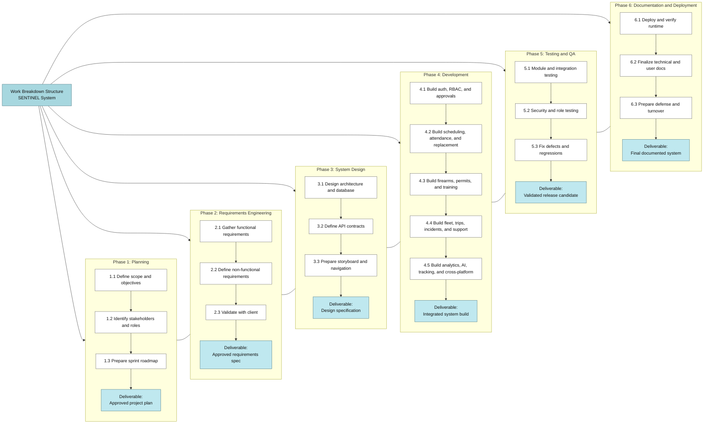
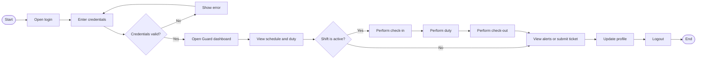
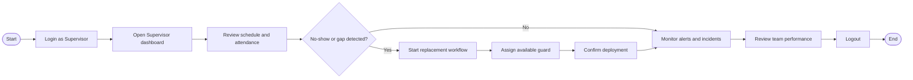
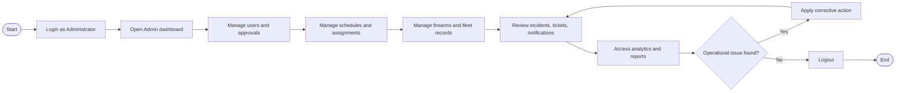

SENTINEL: AN INTEGRATED SECURITY
OPERATIONS MANAGEMENT SYSTEM FOR
DAVAO SECURITY & INVESTIGATION AGENCY,
INC.

A Capstone Project
Proposal Presented to the Faculty of the
Information and Communications Technology
Program STI College Tagum

In Partial Fulfillment
of the Requirements for the Degree
Bachelor of Science in Information Systems

DWIGHT KARL B. GAGA-A
GAD ABRAHAM M. JOSE
APPLE JOHN D. LUMINGKIT
 HECTOR PHILLIP P. LACIERDA
HANZ LOURENZ FRANK J. RIBU

March 2026

---

ENDORSEMENT FORM FOR PROPOSAL DEFENSE

TITLE OF RESEARCH:

SENTINEL: An Integrated Security Operations
Management System

NAME OF PROPONENTS:

Dwight Karl B. Gaga-a
Gad Abraham M. Jose
Apple John D. Lumingkit
Hector Phillip P. Lacierda
Hanz Lourenz Frank J. Ribu

In Partial Fulfilment of the Requirements
for the degree of Bachelor of Science in Information
System
has been examined and is recommended for Outline Defense.

ENDORSED BY:

Capstone Project Adviser Name
Capstone Project Adviser

APPROVED FOR PROPOSAL DEFENSE:

Capstone Project Coordinator Name
Capstone Project Coordinator

NOTED BY:

Program Head Name
Program Head

Date of Proposal Defense

---

APPROVAL SHEET

This capstone project proposal titled: SENTINEL: An Integrated Security Operations Management System prepared and submitted by
Dwight Karl B. Gaga-a, Gad Abraham M. Jose, Apple John D. Lumingkit, Hector Phillip P. Lacierda, and Hanz Lourenz Frank J. Ribu, in partial fulfillment of the requirements for the
degree of Bachelor of Science in Information Systems, has been examined and is recommended
for acceptance and approval.

Capstone Project Adviser Name
Capstone Project Adviser

Accepted and approved by the Capstone Project Review
Panel in partial fulfillment of the requirements for the degree
of Bachelor of Science in Information Systems

Panel Member Name  Panel Member Name

Panel Member

Panel Member

Lead Panelist Name
Lead Panelist

Noted:

Capstone Project Coordinator Name
Capstone Project Coordinator

Program Head Name
Program Head

Date of Proposal Defense

---

INTRODUCTION

Project Context

This section presents the big-picture context of the study by describing who is affected, what operational problem exists, where it occurs, and why the project is necessary for current agency conditions.

The global private security industry is transitioning toward automated, high-integrity digital ecosystems to address the discovery lag inherent in human-led monitoring. Workforce-capacity research shows that manual, reactive responses to personnel gaps increase vacancy time, which remains a major contributor to security breaches in critical infrastructure environments (Shiyanbola et al., 2023). This transition is also supported by modern performance-management theory, which emphasizes transparent, data-driven tracking as a prerequisite for accountability and for reducing social loafing, where individual reliability declines when oversight is weak or delayed (Aguinis, 2022).

The need for these technological controls is reinforced by Philippine legislation through the Private Security Services Industry Act, or Republic Act No. 11917 (2022). The law formalizes a professional accountability regime in which agencies face strict liability for administrative negligence. Under the law's Implementing Rules and Regulations, agencies may be fined up to P5,000,000 or face license revocation for deploying personnel with expired licenses or unauthorized firearms (Jur.ph, 2025). National studies likewise indicate that absenteeism and post abandonment are more prevalent in agencies that still rely on weak patrol monitoring and manual reporting mechanisms (Abad, 2025).

---

In the Davao Region, Davao Security and Investigation Agency, Inc. operates within a policy environment that actively prioritizes public safety to sustain the city's standing as a regional safe haven (PIA, 2025). The Davao Regional Development Plan 2023-2028 further notes that accelerated economic activity has increased demand for technology-enabled peace-and-order operations, particularly in high-traffic logistics and commercial areas such as Tagum City (NEDA XI, 2024). Local evidence also indicates that compensation, punctuality, and alertness are key determinants of guard performance, yet many agencies continue to experience inattentiveness and post abandonment due to inconsistent manual oversight (Ondos and Origines, 2025). For DASIA Tagum, this creates a direct operational vulnerability: coverage gaps can remain undetected long enough to compromise client safety.

SENTINEL is positioned as an integrated digital ecosystem that addresses these cumulative vulnerabilities by consolidating personnel profiles, firearm telemetry, and shift records into a single operational source of truth. It embeds real-time compliance checks directly into daily workflows. Before deployment, the system verifies license validity and firearm authorization against centralized records. To handle high-concurrency request volume across active personnel, SENTINEL uses Rust and Axum, combining memory safety with asynchronous throughput suitable for mission-critical operations (Scofield, 2025). When an operational gap, such as a missed check-in, is detected, the system flags the vacancy and identifies qualified replacements, enabling a shift from reactive response to proactive, legally defensible security operations.

---

Purpose and Description

This section presents the project purpose and implemented system capabilities.

The primary purpose of this capstone project is to design and deliver an integrated security operations management system that improves service reliability, accountability, and decision support for Davao Security and Investigation Agency, Inc. The study addresses fragmented manual oversight by consolidating core operational processes into a role-governed platform.

SENTINEL provides unified support for identity and access governance, workforce operations, asset compliance, incident coordination, and real-time situational awareness. Role-based and policy-based controls restrict sensitive functions to authorized users and preserve traceable records for institutional review.

Operationally, the system supports scheduling, attendance, no-show detection, and replacement handling to sustain deployment continuity. It also manages firearm and vehicle lifecycles, including issuance, return, maintenance, and permit-sensitive checks, to strengthen asset accountability and reduce service disruption.

At the command level, the platform integrates live tracking signals with structured operational records to provide timely visibility of personnel movement, incident status, and site conditions. Geofence monitoring, notifications, and incident workflows support faster coordination across command and field roles.

SENTINEL further includes analytics and deterministic AI decision support for staffing risk, maintenance risk, and incident triage. These outputs are assistive and preserve human authority for final operational decisions.

Security and governance controls are embedded as core functions, including secure session management, legal-policy acceptance gating, audit and forensic logging, rate limiting, and service-health monitoring. Cross-platform delivery across Web, Desktop, and Android maintains consistent behavior and policy enforcement across runtime environments.

---

Objectives

General Objective

To design, implement, and validate SENTINEL as a multi-platform security operations platform that unifies personnel deployment, governance controls, incident response, and command monitoring across web, desktop, and mobile environments.

Specific Objectives

1. Establish a complete and secure account and identity lifecycle for all users.

a. Enable account registration, identity verification, and secure sign-in.

b. Support controlled account activation through recovery, verification, and approval checks.

c. Maintain profile records and secure session continuity through managed renewal and sign-out controls.

2. Operationalize centralized personnel administration and approval governance.

a. Manage personnel by role: superadmin, administrator, supervisor, and guard.

b. Maintain guard approval queues and approval status tracking.

c. Support personnel record maintenance, status management, and role-based listings.

3. Strengthen scheduling, attendance, and workforce continuity processes.

a. Manage shift schedules with conflict-aware assignment.

b. Capture attendance events with traceable history.

c. Detect no-show events, coordinate replacements, and manage guard availability.

4. Enforce firearm inventory, issuance, and custody accountability.

a. Maintain comprehensive firearm records, including identity and status attributes.

b. Record issuance and return activities, active allocations, and overdue custody cases.

c. Track firearm maintenance schedules, pending work, and completion records.

5. Sustain permit and training compliance management.

a. Maintain permit records, including expiring and revoked credentials.

b. Apply automated permit-expiry processing for compliance enforcement.

c. Maintain training histories and alerts for expiring qualifications.

6. Manage armored vehicle fleet and trip operations.

a. Maintain armored vehicle records, allocation, return, and active-use monitoring.

b. Manage driver assignment and driver-vehicle linkage.

c. Document trip lifecycles from assignment to completion with historical traceability.

d. Track vehicle maintenance schedules, completion, and service records.

7. Support mission operations and merit-based performance evaluation.

a. Support mission assignment and mission monitoring for deployment execution.

b. Generate merit scores and ranked guard results for staffing decisions.

c. Capture client evaluations, review guard performance evidence, and identify overtime candidates.

8. Deliver support, communication, and notification services.

a. Provide support ticket submission and role-appropriate case review.

b. Provide user notifications with status tracking and message management controls.

c. Issue timely alerts for operational events and decision-critical updates.

d. Provide a unified role-based action inbox and workflow timeline for prioritized tasks and operational history.

9. Strengthen incident management and real-time movement intelligence.

a. Support incident recording, active incident monitoring, and status progression.

b. Capture guard presence signals, location points, and map-linked operational context.

c. Maintain client-site records and monitor shift proximity conditions.

d. Provide live tracking updates for continuous operational visibility.

e. Support movement analysis through path replay, patrol reconstruction, and active guard roster views.

f. Detect geofence entry and exit events at client-site boundaries and raise anomaly alerts for leadership.

g. Support site-specific geofence configuration using radius or polygon boundaries.

10. Provide analytics, predictive intelligence, and decision support.

a. Present operational overviews, trend indicators, and guard reliability insights.

b. Generate predictive alerts for permit expiry, maintenance risk, no-show patterns, and guard capacity risk.

c. Apply deterministic AI assistance for guard absence risk, replacement suggestions, maintenance risk, incident classification, and incident summarization.

11. Enable real-time location monitoring and map-based operations.

a. Visualize guards, routes, and client sites through map-based operational displays.

b. Provide continuous live-tracking updates for command monitoring.

c. Support map-linked situational review and proximity-based operational alerts.

12. Institutionalize governance, security, and auditability mechanisms.

a. Maintain audit logs for critical operational actions.

b. Enforce authenticated access, presence monitoring, and session revocation controls.

c. Sustain service readiness and abuse protection through health monitoring, authentication throttling, and rate controls.

d. Preserve authorization-failure records, including denied access events, to strengthen forensic accountability.

e. Provide forensic audit intelligence for filtered timelines, per-user activity reconstruction, and anomaly detection.

13. Implement and validate cross-platform runtime delivery.

a. Deliver a web runtime for browser-based command and operational access.

b. Deliver a desktop runtime through Tauri packaging for command-center deployment.

c. Deliver a mobile runtime through Capacitor Android packaging for field operations.

d. Validate consistent platform behavior, connectivity, and session governance across Web, Desktop, and Android targets.

e. Enforce controlled release governance and verified mobile distribution.

14. Enforce legal and policy compliance.

a. Require first-use acceptance of Terms of Agreement, Privacy Policy, and Acceptable Use Policy before protected access.

b. Preserve legal acceptance metadata, including timestamp, policy version, requester IP, and user agent.

c. Enforce legal-consent checks while preserving safe access paths for consent and logout.
---

Scope and Limitations

Scope

The SENTINEL system covers the implemented operational, compliance, and governance requirements of a private security agency within the regulatory context of Republic Act No. 11917 (2022). The scope includes web-first delivery with desktop and Android runtime support, role-governed workflows, and centralized operational records for command and field use.

Data

- Personnel profiles, role and approval data, licensing and permit records, training records, schedules, attendance logs, availability status, and merit indicators.
- Firearm inventory records, allocations, maintenance history, and permit-compliance data.
- Armored vehicle assets, allocations, driver assignments, trip records, and maintenance history.
- Missions, incidents, support tickets, notifications, predictive alerts, location records, and audit logs.
- Geofence events, site geofence definitions, movement-history records, and anomaly evidence for post-incident review.
- Authentication lockout records, session lifecycle records, and audit source-IP traces for security accountability.
- Legal-consent records, including acceptance timestamp, policy version, requester IP, and user-agent evidence.

Process

- Account lifecycle workflows, including registration, verification, authentication, recovery, and profile maintenance.
- Approval workflows for newly registered guards before operational access is granted.
- Role-based dashboards for command monitoring, approvals, analytics, scheduling, and audit review.
- Role-based action-inbox workflows for prioritized tasks, approvals, incidents, shift issues, and workflow history.
- Mission-focused guard workflows for field reporting, attendance actions, instructions review, and map-supported navigation.
- Shift scheduling, attendance validation, no-show detection, replacement coordination, and supervisor oversight.
- Firearm issuance and return workflows with permit validation, maintenance scheduling, and custody traceability.
- Vehicle allocation, driver assignment, trip lifecycle management, and preventive and corrective maintenance tracking.
- Incident reporting, support ticket handling, notification delivery, and live operational monitoring.
- Guard movement reconstruction, including active roster monitoring, historical trail replay, and geofence escalation.
- Audit forensics workflows, including timeline filtering, actor-specific activity reconstruction, anomaly review, and case sequencing.
- Session security workflows, including renewal control, sign-out revocation, and lockout persistence.
- Legal confirmation workflows, including policy review, mandatory acceptance capture, and access gating until accepted.

People

- Superadmin, Administrator, Supervisor, and Guard roles with distinct permissions and dashboard views.

Technology

- Web-based application accessible on desktop and mobile browsers.
- Cross-platform runtime deployment for Web, Desktop (Tauri), and Mobile Android (Capacitor).
- React + TypeScript frontend and Rust + Axum backend services.
- Centralized PostgreSQL database with relational integrity, auditability, and role-based data control.
- Dockerized deployment and service-based architecture with real-time tracking synchronization.

Limitation of the Study

- The implementation does not include direct integration with external payroll, HR, or government licensing systems.
- Location intelligence is derived from application-generated updates; dedicated hardware telematics is outside the study scope.
- AI and predictive outputs are assistive and do not replace human command decisions.
- Direct interoperability with third-party security hardware ecosystems (for example CCTV, IoT sensors, and access-control turnstiles) is excluded.
- Field operations remain dependent on network availability; full offline-first operation is beyond current coverage.
- Native wrapper deployment in this study is limited to Windows desktop and Android; iOS and macOS are excluded.
---

Review of Related Literature/Studies/Systems

This review synthesizes published evidence and related systems to establish the study foundation, with emphasis on recent and relevant sources that directly support the implemented SENTINEL scope.

Related Literature

The Philippine private security sector is currently navigating its most significant legal

transition  in  over  fifty  years.  The  enactment  of  the  Private  Security  Services  Industry  Act

(Republic  Act  No.  11917,  2022)  effectively  repealed  the  outdated  RA  5487,  shifting  the

industry toward a regime of "Professionalized Accountability." According to Jur.ph (2025),

the law's Implementing Rules and Regulations (IRR) mandate that Private Security Agencies

(PSAs) maintain highly accurate, digitized records of License to Exercise Security Profession

(LESP)  and  firearm  permits.  The  act  introduces  a  "strict  liability"  framework  where

administrative negligence, such as deploying an unlicensed guard, can result in fines ranging

from P50,000 to P100,000 per violation, or up to P5,000,000 for agency-wide license failures.

This  regulatory  pressure  has  necessitated  a  move  toward  Automated  Regulatory

Compliance Tracking (ARCT). Research by Khinvasara, T., Shankar, A., & Wong, C. (2024)

suggests  that  for  organizations  managing  complex,  shifting  rules,  the  use  of  automated

monitoring  is  a  "significant  advancement"  that  eliminates  the  "discovery  lag"  inherent  in

manual  audits.  By  leveraging  system-driven  triggers  for  license  expirations,  PSAs  can

transition from reactive compliance to a proactive stance, ensuring that no personnel or asset

is deployed without valid legal authorization.

Operational continuity in the private security sector is heavily dependent on reliable

guard presence. As identified in the operational risks of DASIA Tagum, "No-Show" incidents

represent a critical vulnerability where manual processes relying on phone calls and delayed

human  intervention  fail  to  address  "discovery  lag."  Research  in  workforce  capacity

---

optimization  emphasizes  that  manual,  reactive  responses  to  workforce  gaps  significantly

increase  "vacancy  time,"  directly  correlating  with  higher  security  breach  probabilities

(Shiyanbola et al., 2023).

Modern  systems  mitigate  this  by  automating  the  identification  and  deployment  of

replacements based on real-time availability, shifting the organizational stance from reactive

crisis  management  to  proactive  risk  mitigation  (Al-Khafajiy  et  al.,  2022).  Furthermore,

advanced algorithms now enable "predictive scheduling," which analyzes historical No-Show

data  to  alert  administrators  of  potential  gaps  before  they  occur,  drastically  reducing  the

operational vacancy time (TrackTik, 2025).

The  transition  from  inconsistent,  manual  tracking  to  a  structured,  data-driven

framework  is  essential  for  maintaining  Distributive  Justice,  the  perceived  fairness  of  how

shifts,  rewards,  and  responsibilities  are  allocated  within  an  organization.  Aguinis  (2022)

posits that the absence of a structured performance management framework leads to "Social

Loafing," a psychological phenomenon where employees decrease effort due to a perceived

lack of individual accountability.

For  security  agencies  like  DASIA  Tagum,  implementing  centralized  performance

metrics such as punctuality and client feedback logs ensures that shift allocation is based on

objective data rather than subjective selection. This transparency not only increases overall

guard reliability but also fosters a culture of accountability, as guards understand that their

performance is directly linked to future opportunities (Tan et al., 2024).

---

The systematic allocation of firearms is a matter of both Chain of Custody (CoC) and

legal necessity under the Private Security Services Industry Act (Republic Act No. 11917,

2022). The law mandates  strict accountability  for firearms,  requiring that  only  authorized,

trained, and compliant guards carry weapons. Manual processes often suffer from "data drift,"

where the status of a weapon and the permit validity of the assigned guard are not reconciled

in  real-time,  leading  to  potential  administrative  negligence.  Centralized  digital  tracking  is

identified as the primary defense against the misallocation of high-risk equipment and is a

prerequisite  for  generating  the  legally  defensible  audit  logs  required  by  the  National

Cybersecurity Plan 2022-2028 (DICT, 2024; PNP-SOSIA, 2022).

The selection of the backend technical stack is a core security decision for mission-

critical systems. Scofield, M. B. (2025) argues that Rust's "ownership and borrowing" model

provides a fundamental architectural advantage: Memory Safety without a Garbage Collector.

This  ensures  that  SENTINEL  is  natively  resistant  to  buffer  overflows  and  data  races,

vulnerabilities  that  often  plague  systems  handling  high-concurrency  data  like  real-time

firearm tracking.

Complementing  the language is  the  Axum framework, which is  built  on  the Tokio

asynchronous  runtime.  As  highlighted  by  NashTech  (2025),  Axum  is  designed  for  high-

performance  web  services  where  scalability  and  raw  speed  are  non-negotiable.  For

SENTINEL, this means the Attendance Tracking and No-Show Detection modules can handle

hundreds  of  simultaneous  "check-in"  requests  during  shift  rotations  without  performance

degradation. This "asynchronous-first" design allows the system to remain responsive even

when processing complex relational logic across personnel, vehicle, and firearm databases.

---

In  an  Integrated  Operations  Platform,  the  database  must  serve  as  the  immutable

"Single  Source  of  Truth."  PostgreSQL  (2025)  is  recognized  as  the  premier  open-source

RDBMS for enterprise planning due to its strict adherence to ACID (Atomicity, Consistency,

Isolation,  Durability)  properties.  Nguyen,  R.  (2025)  emphasizes  that  PostgreSQL's

implementation of Foreign Key Constraints and Unique Exclusion Constraints is the primary

defense against "data drift."

In  the  SENTINEL  ecosystem,  these  constraints  ensure  that  a  firearm  or  armored

vehicle cannot be logically "double-booked" or assigned to a guard who does not exist in the

personnel  table.  This  high  level  of  relational  integrity  is  a  prerequisite  for  generating  the

legally defensible Audit Logs required by the National Cybersecurity Plan 2023-2028 (DICT,

2024), ensuring that every asset movement is tied to a verifiable digital identity.

---

Related Studies and/or Systems

Empirical  research  confirms  that  automated  oversight  is  a  primary  driver  of

operational integrity. A study by Atlam, H. F., & Yang, Y. (2025) found that organizations

utilizing unified Access Control and Resource Planning (ERP) systems saw a 27% drop in

unauthorized  access  violations  and  reclaimed  36%  of  staff  time  previously  lost  to  manual

verification. These findings suggest that hardwiring compliance into the system architecture,

rather than treating it as an afterthought,  tightens process  integrity  and  reduces the  risk of

internal data tampering.

Furthermore,  research  by  Shiyanbola,  J.  O.,  et  al.  (2023)  on  "Workforce  Capacity

Optimization"  highlights  a  flaw  in  traditional  security:  "discovery  lag."  This  occurs  when

supervisors only identify a personnel gap after a shift has failed. Their study demonstrates

that real-time, asynchronous detection models allow for a proactive 11.8% improvement in

site coverage reliability. Locally, ResearchGate (2025) cites a study by Respicio (2023) which

found  that  Philippine  security  guards  operating  under  digital  monitoring  exhibited

significantly  higher  levels  of  alertness  and  punctuality  because  the  system  provided  a

transparent,  inescapable  layer  of  accountability  that  manual  logs  could  not  match.  The

functional  blueprint  of  SENTINEL  is  informed  by  the  performance  of  several  industry-

leading platforms such as TrackTik and Guardhouse.

---

TrackTik

Figure 1. TrackTik

TrackTik  (2025)  has  redefined  security  workforce  management  by  moving  beyond

static  scheduling  toward  an  integrated,  AI-driven  operational  model.  According  to  the

Trackforce 2025 Physical Security Operations Benchmark Report, the industry is currently

facing an "AI adoption paradox" where the value of predictive scheduling is recognized, but

cost  remains a barrier for mid-sized firms.  TrackTik's success  is  anchored in  its  ability to

consolidate alarm monitoring, guard dispatch, and business administration into a single 24/7

resilient  architecture,  which  users  report  has

increased  operational  efficiency  by

approximately  20%.  This  efficiency  is  primarily  attributed  to  the  reduction  of  manual

administrative  burdens  through  automated  compliance  tracking  and  real-time  intelligence

---

Guardhouse

Figure 2. Guardhouse

Guardhouse  (2026),  in  contrast,  is  engineered  around  a  model  of  "Administrative

Compression," where the goal is to streamline repetitive workflow to minimize cognitive load

on  supervisors.  NODE  Magazine  (2026)  reports  that  this  platform  architecture  has  been

associated with a 17% reduction in daily administrative overhead for medium-sized security

firms. Its key differentiator lies in role-sensitive interface segmentation, where each user class

(admin, supervisor, guard) is assigned a curated operational dashboard to avoid role confusion

and cross-functional task spillover.

In a legal context, Guardhouse's verification workflows align with the compliance intent

of Republic Act No. 11917 by reducing undocumented assignment overrides and unvalidated

personnel deployment. According to GetApp (2026), agencies using this model reported better

audit-readiness due to centralized event logging and role-bound authorization structures.

---

MySecuritas

Figure 3. MySecuritas

MySecuritas  (2026)  demonstrates  how  integrated  digital  supervision  can  influence

human behavior in security operations. According to Securitas Technology (2025), platforms

with embedded patrol validation and incident transparency contribute to measurable increases

in guard punctuality and post adherence. This aligns with findings from Respicio (2023), cited

via ResearchGate (2025), where guards under digitally monitored deployment showed higher

behavioral discipline due to increased traceability.

From  an  operational  psychology  standpoint,  this  supports  Expectancy  Theory,  where

employees increase effort when they perceive that performance outcomes are visible and fairly

evaluated  (Aguinis,  2022).  For  SENTINEL,  this  principle  validates  the  inclusion  of

attendance-led  merit  scoring  and  alert-based  accountability  as  core  mechanisms  for

maintaining reliable field presence.

---

Silvertrac Software

Figure 4. Silvertrac Software

Silvertrac  Software  (2026)  is  recognized  for  strong  Incident-Centric  Reporting

frameworks,  particularly  in  mobile  guard  workflows  for  patrol  logs,  activity  reports,  and

exception handling. While effective for event documentation, Hardcat (2025) notes that many

incident-first systems underperform in complex asset governance, particularly for weapons and

high-risk equipment requiring strict chain-of-custody controls.

This gap is critical for Philippine PSAs operating under RA 11917, where legal exposure

extends beyond incident response into pre-incident compliance, such as firearm eligibility and

assignment validation. SENTINEL addresses this by integrating firearm permit compliance and

asset allocation controls directly into operational workflows rather than treating them as isolated

back-office processes.

---

The  collective  literature  establishes  a  clear  strategic  pattern:  modern  security

operations require systems that fuse compliance intelligence, workforce continuity, and real-

time decision support. Existing platforms provide valuable modular solutions, but most remain

domain-specific and do not fully align with the legal, operational, and accountability demands

faced by local PSAs under the current Philippine regulatory framework.

Thus,  the  identified  gap  is  not  the  absence  of  digital  tools,  but  the  absence  of  an

integrated, legally synchronized, and operationally predictive system that combines personnel

management, high-risk asset governance, and responsive incident intelligence in one coherent

architecture. SENTINEL is designed to fill this gap by consolidating these capabilities into a

single compliance-aware operational platform tailored to DASIA Tagum's real-world context.

---

REFERENCES

Abad,  R.  (2025).  How  Effective  Is  Your  Security  Guard?  An  Inquiry  into  the  Philippine

Private

Security

Industry.

Retrieved

from

https://doi.org/10.13140/RG.2.2.30981.41442

Aguinis, H. (2022). Performance Management (5th ed.). SAGE Publications. Retrieved from

https://edge.sagepub.com/aguinispm5e

Al-Khafajiy, M., et al. (2022). Enabling high performance fog computing through fog-2-fog

coordination  model.  Future  Generation  Computer  Systems.  Retrieved  from

https://doi.org/10.1016/j.future.2022.06.012

Atlam,  H.  F.,  &  Yang,  Y.  (2025).  Enhancing  Healthcare  Security:  A  Unified  RBAC  and

ABAC

Risk-Aware

Access

Control

Approach.

Retrieved

from

https://doi.org/10.3390/fi17060262

Department of Information and Communications Technology (DICT). (2024). National

Cybersecurity  Plan  2023-2028:  A  Whole-of-Nation  Roadmap.  Retrieved  from

https://dict.gov.ph/national-cyber-security-plan

GetApp.  (2026).  Guardhouse  2026  Pricing,  Features,  Reviews  &  Alternatives.  Retrieved

from https://www.getapp.com/operations-management-software/a/guardhouse/

Guardhouse.  (2026).  2026  Pricing,  Features,  Reviews  &  Alternatives.  Retrieved  from

https://www.getapp.com/operations-management-software/a/guardhouse/

Hardcat. (2025). Law Enforcement Equipment & Armory Management System: Challenges

in  Managing  Firearms  Securely.  Retrieved  from  https://hardcat.com/police-

equipment-inventory-tracking/

Jur.ph.  (2025).  The  Private  Security  Services  Industry  Act:  Law  Summary  and  IRR.

Retrieved from https://jur.ph/law/summary/the-private-security-services-industry-act

---

Khinvasara,  T.,  Shankar,  A.,  &  Wong,  C.  (2024).  Survey  of  Artificial  Intelligence  for

Automated

Regulatory

Compliance

Tracking.

Retrieved

from

https://doi.org/10.9734/jerr/2024/v26i71217

NashTech.  (2025).  Building  High-Performance  Web  Services  with  Rust  and  Axum.

Retrieved

from  https://blog.nashtechglobal.com/building-high-performance-web-

services-with-rust-and-axum/

NEDA XI. (2024). Davao Regional Development Plan 2023-2028. National Economic and

Development  Authority.  Retrieved  from  https://rdc11.neda.gov.ph/rdc-xi-approves-

davao-regional-development-plan-2023-2028/

Nguyen,  R.  (2025).  PostgreSQL  ACID  In-Depth:  Reliability  and  Consistency  in  Modern

Transactions.  Retrieved  from  https://medium.com/engineering/postgresql-acid-in-

depth

NODE Magazine.  (2026). Why 2026 is the Year Businesses  Must  Finally Address Admin

Overload.  Retrieved  from  https://www.node-magazine.com/thoughtleadership/why-

2026-is-the-year-businesses-must-finally-address-admin-overload

Ondos,  M.  U.,  &  Origines,  D.  V.  (2025).  Android-Based  Guard  Monitoring  and  Site

Surveillance

System.

Retrieved

from

https://www.ojs.udb.ac.id/icohetech/article/view/5657

PIA.  (2025).  Davao  City  Maintains  Top  Safety  Ranking  in  Southeast  Asia.  Philippine

Information  Agency.  Retrieved  from  https://pia.gov.ph/news/davao-city-maintains-

top-safety-ranking-in-southeast-asia/

PostgreSQL  Global  Development  Group.  (2025).  PostgreSQL  17  Documentation:  Data

Integrity

and

ACID

Compliance.

Retrieved

from

https://www.postgresql.org/docs/17/acid.html

PNP-SOSIA.  (2022).  Implementing  Rules  and  Regulations  of  Republic  Act  No.  11917.

---

Retrieved  from  https://www.scribd.com/document/691228276/Approved-IRR-RA-

11917

Republic Act No. 11917. (2022). The Private Security Services Industry Act. Retrieved from

https://elibrary.judiciary.gov.ph/thebookshelf/showdocs/2/95597

Scofield, M. B. (2025). Rust Axum Web Development: Build High-Performance APIs and

Services.  Retrieved  from  https://www.amazon.com/Rust-Axum-Web-Development-

High-Performance/dp/B0CX7N4K6J

Securitas.  (2026).  Control  Security  from  Anywhere  -  MySecuritas  Product  Overview.

Retrieved from https://www.securitas.com/en/security-solutions/mysecuritas/

Securitas  Technology.  (2025).  2026  Global  Technology  Outlook  Report:  The  State  of

Security

Technology.

Retrieved

from

https://www.securitastechnology.com/news/securitas-technology-releases-2026-

global-technology-outlook-report

Shiyanbola,  J.  O.,  et  al.  (2023).  A  Workforce  Capacity  Optimization  Model  for  Lean

Environments. Retrieved from https://www.irejournals.com/paper-details/1704408

Tan, K., et al. (2024). The digital transformation of security and the role of AI. Securitas

White Paper. Retrieved from https://www.securitas.ie/news-insights/whitepapers/the-

digital-transformation-of-security-and-the-role-of-ai/

TrackTik.  (2025).  Top  5  End-to-End  Security  Guard  Management  Software  for  2025.

Retrieved  from  https://www.tracktik.com/resources/blog-articles/top-5-end-to-end-

security-guard-management-software-for-2025/

TrackTik.  (2025).  Physical  Security  Operations  Benchmark  Report  2025.  Retrieved  from

https://www.tracktik.com/wp-content/uploads/2025/10/2025BenchmarkReport-1.pdf

---

CHAPTER 2

METHODOLOGY

This study adopted Agile methodology, specifically Scrum, to deliver SENTINEL through incremental and testable capability sets.

Development was organized into successive sprints that covered planning, implementation, integration, review, and refinement. Each sprint used prioritized backlog items tied to operational risk and institutional requirements.

Sprint planning and backlog refinement emphasized high-risk domains, including account governance, workforce continuity, asset compliance, incident coordination, movement monitoring, and decision-support features. Regular integration checkpoints ensured consistency of workflows, system rules, and data behavior.

Validation was embedded throughout the Scrum cycle through scenario-based testing, integration checks, role-permission verification, and cross-platform review. Sprint reviews documented completed increments, while acceptance checks verified that each increment satisfied defined criteria before carry-forward.

Release readiness was evaluated through structured quality checks before each major milestone to support controlled rollout decisions and reduce operational disruption.

Overall, the methodology shows an Agile approach in which reliability, accountability, security, and usability were developed together with functional scope.

Figure 4. Scrum Model

Technical Background

Technologies to be Used in the System

SENTINEL is an integrated security operations platform delivered across web, desktop, and mobile environments. Technology selection was guided by the need for secure workflows, reliable records, real-time situational awareness, and cross-platform consistency. The following technologies were used in the implemented system:

1. React + TypeScript: Used to implement reusable, role-aware interface components and dashboard modules. Type safety improves consistency in data handling and interface behavior.

	Reusable inbox and workflow-timeline patterns are applied across guard, supervisor, administrator, and superadmin views to preserve consistency and reduce duplicated logic.

2. Vite: Used for development startup and production build generation to support rapid iteration.

3. Tailwind CSS: Used for responsive, utility-based styling across command, operations, and resource modules.

4. Leaflet + OpenStreetMap: Used for map rendering, live marker visualization, and client-site geospatial views.

5. Rust + Axum: Used for backend services, middleware, and orchestration to support secure and reliable asynchronous processing.

6. PostgreSQL: Used as the centralized transactional database for personnel, operations, asset, incident, movement, analytics, and audit records.

7. Docker + Docker Compose: Used to standardize service orchestration and reduce environment inconsistency across development and deployment contexts.

8. Secure token-based authentication: Used to enforce protected access and stable session management across user roles.

9. Real-time tracking transport: Used to maintain live operational updates, with continuity measures for unstable connectivity.

10. Forensic audit intelligence services: Used to transform audit records into timeline and anomaly views for investigative review.

11. Capacitor: Used to package the web frontend for Android field deployment.

12. Tauri: Used to package the web frontend for Windows desktop command-center deployment.

13. Resend with managed delivery tooling: Used for account-related messaging and controlled deployment workflows.

14. Web-based documentation portal: Used to publish release references, architecture summaries, and legal policy documents.

15. Android release signing tooling: Used to generate, encode, and manage the release keystore required for signed APK and AAB distribution, supporting controlled and verifiable release governance for the Android deployment target.

Figure 5. Work Breakdown Structure

The Work Breakdown Structure (WBS) organizes the project into major deliverables and sub-deliverables to support schedule control, responsibility assignment, and progress monitoring.

WBS Diagram (Mermaid Model)

WBS Diagram (Text Model)

1.0 Project Management
1.1 Project initiation and scope definition
1.2 Stakeholder consultation and approvals
1.3 Sprint planning and monitoring

2.0 Requirements Engineering
2.1 Requirements elicitation
2.2 Functional and non-functional analysis
2.3 Requirements validation and sign-off

3.0 System Design
3.1 Architecture and database design
3.2 API and module design
3.3 Storyboard and interface design

4.0 System Development
4.1 Authentication, RBAC, and approval workflows
4.2 Scheduling, attendance, and replacement workflows
4.3 Firearms, permits, and training compliance workflows
4.4 Fleet, trip, incident, and support workflows
4.5 Analytics, AI, map tracking, and cross-platform delivery

5.0 Testing and Quality Assurance
5.1 Module and integration testing
5.2 Security and role-permission testing
5.3 Defect fixing and regression testing

6.0 Documentation and Deployment
6.1 Deployment and runtime validation
6.2 Technical and user documentation
6.3 Defense preparation and final turnover

Gantt Chart of Activities

The project timeline is organized into phased milestones covering initiation, planning, requirements consolidation, Agile sprint development, integration, testing, documentation, and defense preparation. Activities are sequenced so that each completed output serves as an input to the next phase.

Figure 6. Gantt Chart of Activities

Gantt Chart of Activities (Mermaid Model)

Gantt Chart of Activities (Planned Timeline)

Month: February
Activity: Project initiation and problem definition

Month: March
Activity: Requirements gathering and validation

Month: April
Activity: System architecture and interface planning

Month: May
Activity: Sprint 1 implementation (authentication, RBAC, and approvals)

Month: June
Activity: Sprint 2 implementation (scheduling, attendance, replacement)

Month: July
Activity: Sprint 3 implementation (firearms, permits, training)

Month: August
Activity: Sprint 4 implementation (fleet, trips, incidents, support)

Month: September
Activity: Sprint 5 implementation (analytics, AI, map tracking, and cross-platform packaging)

Month: October
Activity: Integration testing and bug fixing

Month: November
Activity: User validation, documentation, and refinements

Month: December
Activity: Final review, defense preparation, and turnover

Calendar of Activities

The calendar of activities operationalizes the WBS and Gantt sequence by specifying each period's objective, personnel involvement, and resource requirements.

1. February - Project initiation and problem definition.
Purpose: Define project boundaries, objectives, and target operational issues.
Persons involved: Proponents, adviser, client representative.
Resources needed: Consultation sessions, initial proposal documents, reference studies.

2. March - Requirements gathering and validation.
Purpose: Elicit and validate functional and non-functional requirements.
Persons involved: Proponents, operations users, adviser.
Resources needed: Interview guides, requirement templates, process notes.

3. April - System architecture and interface planning.
Purpose: Define system architecture, data model, and storyboard screens.
Persons involved: Proponents and adviser.
Resources needed: ERD tools, wireframe tools, architecture notes.

4. May - Sprint 1: Authentication, role governance, and approvals.
Purpose: Implement secure account lifecycle, access governance, and approval workflows.
Persons involved: Proponents.
Resources needed: VS Code, Rust toolchain, Node.js, PostgreSQL, Docker.

5. June - Sprint 2: Scheduling, attendance, and replacement.
Purpose: Implement shift management, attendance recording, no-show detection, and replacement workflows.
Persons involved: Proponents.
Resources needed: API test scripts, schedule datasets, integration logs.

6. July - Sprint 3: Firearms, permits, and training.
Purpose: Implement inventory, allocation, maintenance, permit, and training compliance workflows.
Persons involved: Proponents.
Resources needed: Firearm/permit data templates, compliance validation cases.

7. August - Sprint 4: Fleet, trips, incidents, and support.
Purpose: Implement armored car management, trip lifecycle, incident handling, and ticket workflows.
Persons involved: Proponents.
Resources needed: Fleet/trip datasets, incident scenarios, runtime logs.

8. September - Sprint 5: Analytics, AI, tracking, and cross-platform packaging.
Purpose: Implement dashboards, predictive modules, map tracking, real-time monitoring, and cross-platform build alignment.
Persons involved: Proponents.
Resources needed: Analytics test data, AI validation scenarios, platform build toolchains.

9. October - Integration testing and bug fixing.
Purpose: Validate end-to-end modules, role permissions, and real-time flows; resolve regressions.
Persons involved: Proponents, adviser, selected testers.
Resources needed: Test scripts, issue tracker, runtime diagnostics.

10. November - User validation, documentation, and refinements.
Purpose: Validate operational usability, finalize documentation content, and apply approved refinements.
Persons involved: Proponents, adviser, selected client-side validators.
Resources needed: Validation checklists, manuscript drafts, review notes.

11. December - Final review, defense preparation, and turnover.
Purpose: Consolidate final outputs, prepare defense materials, and complete project handover.
Persons involved: Proponents and adviser.
Resources needed: Final manuscript file, presentation slides, appendices.

Resources

Hardware Requirements (Recommended)

Table 1 presents the recommended hardware requirements for development and operational deployment of the implemented SENTINEL system.

Table 1: Hardware Requirements

Development Workstation
Operating System: Windows 10/11 (64-bit)
Processor: Intel Core i5 (10th gen or newer) or AMD Ryzen 5 (equivalent or newer)
Memory / RAM: 16 GB recommended (8 GB minimum)
Storage: 512 GB SSD recommended (250 GB minimum)
Network: Stable broadband connection for package installation, container pulls, and API testing
Display: 1366x768 minimum; 1920x1080 recommended for dashboard development and testing

Deployment Environment
Application Server: 4 vCPU minimum, 8-16 GB RAM, SSD-backed storage, Docker-capable host
Database Server: PostgreSQL-capable host (co-located or separate) with regular backup storage
Command Center Endpoints: Windows desktop systems capable of running the Tauri desktop build
Field Endpoints: Android smartphones/tablets with GPS and reliable mobile data/Wi-Fi connectivity for guard tracking and attendance workflows

Software Requirements

The software stack is grouped into development-time and runtime requirements to reflect implementation and deployment conditions.

Development Requirements

1. Visual Studio Code for frontend, backend, and documentation workflow management.

2. Node.js and npm for React/Vite dependency management, development server execution, and production frontend builds.

3. Rust toolchain (rustup, cargo) for building and validating the Axum backend services.

4. Docker Desktop and Docker Compose for local orchestration of backend and PostgreSQL services.

5. PostgreSQL tooling (local or containerized) for schema validation, data checks, and operational query verification.

6. Git and GitHub for version control, branch-based collaboration, and release workflow integration.

7. Markdown/Jekyll-compatible documentation tooling for maintaining GitHub Pages deployment content and release documentation artifacts.

8. Playwright for browser-based smoke and role-navigation validation, including verification that Inbox navigation and role-specific dashboard entry points render correctly across supported operational roles.

9. Android keystore management tooling (PowerShell-based) for generating, encoding, and securely distributing Android release signing credentials required for the Capacitor mobile deployment target.

Runtime Requirements

1. Modern web browser (Chromium-based or equivalent) for the web deployment target.

2. Windows desktop operating system for the Tauri-based desktop deployment target.

3. Android operating system for the Capacitor-based mobile deployment target.

4. Network connectivity between client runtimes and backend API services, including websocket access for live tracking views.

5. Stable connectivity to the system's audit and forensic services to support command-level investigation and operational review.

Requirements Analysis

Requirement analysis in this study used an operational risk lens to determine who is affected, which activities are vulnerable, and where existing procedures create delays, compliance gaps, or weak accountability.

The requirements baseline was derived from observed agency needs: role-governed access, workforce continuity, asset custody control, incident coordination, real-time monitoring, and command-level decision support. Emphasis was placed on requirements that strengthen traceability and reduce delayed intervention in field operations.

Beyond basic data recording, the analysis includes intelligence-oriented requirements such as movement-history reconstruction, geofence transition awareness, and forensic audit interpretation. These requirements support proactive supervision and evidence-based review.

Usability requirements focus on reducing decision friction by consolidating urgent tasks and workflow context in role-specific command surfaces. Compliance requirements similarly treat policy acceptance as an enforceable access condition, with recorded legal metadata for institutional accountability.

Security and continuity requirements include authenticated access, authorization control, session integrity, abuse protection, and traceable denial events. Real-time monitoring requirements prioritize resilient field visibility under variable network conditions.

Cross-platform requirements require behavior parity across Web, Desktop, and Android environments, while release and maintainability requirements prioritize controlled distribution and verifiable deployment integrity.

Requirements Documentation

This section documents the implemented functional and non-functional requirements that define the current behavior of the system.

The requirements listed below are aligned with verified module coverage and storyboard-based interface flow expectations.

Functional Requirements

FR-01. The system shall support account registration, verification, approval, authentication, and password-reset workflows for operational users.

FR-02. The system shall enforce role-based access for superadmin, admin, supervisor, and guard, including role-appropriate dashboard and API access.

FR-03. The system shall support guard management workflows including profile governance, shift assignment, attendance capture, no-show detection, and replacement processing.

FR-04. The system shall support firearm lifecycle management including records, issuance/return, permit-state awareness, and maintenance tracking.

FR-05. The system shall support armored vehicle lifecycle management including records, driver assignment, trip operations, and maintenance tracking.

FR-06. The system shall provide real-time tracking through live location updates, attendance signaling, and site-aware monitoring, with access limited to authorized supervisory and guard roles.

FR-06a. The system shall provide movement-history and active-deployment insights to support replay-based monitoring and command decisions.

FR-06b. The system shall detect and persist geofence enter/exit transitions and expose these alerts in live map snapshots for supervisory awareness.

FR-07. The system shall provide analytics and command-level dashboards for operational summaries, trends, approvals, and decision support.

FR-07a. The system shall provide a role-centric Inbox dashboard entry that surfaces prioritized action items and workflow timelines using shared UI contracts and role-specific data mappings.

FR-08. The system shall provide AI-assisted decision-support outputs for absence risk, replacement recommendation, incident classification, incident summarization, and predictive alerts.

FR-09. The system shall provide ticketing and notification workflows to support operational communication and exception handling.

FR-10. The system shall support cross-platform runtime delivery for web, Windows desktop (Tauri), and Android mobile (Capacitor).

FR-11. The system shall provide audit-log visibility for authorized superadmin users, with filterable and paginated audit records.

FR-11a. The system shall provide forensic audit intelligence for user-activity timelines and anomaly identification to support investigative workflows.

FR-12. The system shall require recorded acceptance of Terms of Agreement, Privacy Policy, and Acceptable Use Policy before users can access restricted operational functions.

FR-13. The system shall provide a release-oriented documentation portal that includes download channels, security profile, architecture references, and legal-policy links for web, desktop, and Android distribution.

Non-Functional Requirements

NFR-01. Security: The system shall enforce strong authentication, role-based authorization, approval-gated access, auditable security events, account-protection controls, and abuse resistance measures.

NFR-02. Performance: The system shall maintain responsive dashboards and timely operational updates suitable for near-real-time supervisory decision-making.

NFR-03. Usability: The system shall provide role-centered dashboards and modular UI navigation that reduce operator context switching during active operations.

NFR-03a. Workflow Focus: The system shall minimize dashboard navigation friction by placing urgent operational work and timeline context behind a single Inbox entry for each supported role.

NFR-04. Reliability: The system shall maintain robust session continuity, secure session renewal, and explicit session termination to protect ongoing operations.

NFR-05. Scalability: The system architecture shall remain API-driven and modular so additional modules, integrations, and platform targets can be added without redesigning the full stack.

NFR-06. Compliance Traceability: Legal acceptance and policy governance events shall be persisted with timestamped metadata suitable for operational and compliance review.

Storyboard (Proposed Interface Flow)

The storyboard describes the user-facing flow of major screens and role actions in the implemented system.

1. Login and Account Verification Screen

- Users will enter credentials to access the system.
- New accounts will complete email verification.
- Forgot-password users will request and validate reset codes.

2. Role-Based Dashboard Screen

- Superadmin will view command-level system metrics and governance modules.
- Administrators will view operational resources, approvals, and assignments.
- Supervisors will view schedules, attendance, alerts, and replacement actions.
- Guards will view personal schedules, check-in controls, and assigned resources.
- Each role will access an Inbox entry that summarizes urgent actions and recent workflow status before the user drills into specialized modules.

3. Personnel and Scheduling Screen

- Authorized users will create, edit, and monitor schedules.
- Attendance status, no-show events, and replacement workflows will be displayed.

4. Asset and Compliance Screen

- Firearm inventory, allocations, permit statuses, and maintenance entries will be managed.
- Fleet records, driver assignments, trip details, and maintenance schedules will be monitored.

5. Incident, Support, and Notification Screen

- Users will submit incidents and support tickets.
- The system will display notification updates, unread counts, and response history.

6. Analytics and Reporting Screen

- Authorized users will view KPI summaries, trends, and reliability metrics.
- Operational and compliance reports will be generated for review and decision support.

7. Tracking and Map Screen

- The system will visualize guard and site data through OpenStreetMap.
- Live updates and proximity alerts will support real-time monitoring activities.

Activity Diagrams (Role-Based)

The following activity diagrams present the process flow for each user role in the proposed system.

Figure 8. Guard Activity Diagram

Figure 8 illustrates the Guard workflow from authentication to shift execution and secure logout. After login, the guard reviews assigned duty details, performs check-in and check-out when a shift is active, and may review alerts, submit support tickets, and update profile information as needed.

Figure 9. Supervisor Activity Diagram

Figure 9 presents the Supervisor workflow, beginning with dashboard access and continuing through attendance review, gap detection, and replacement coordination. When no immediate staffing issue exists, the supervisor proceeds with alert, incident, and team monitoring tasks before secure session closure.

Figure 10. Administrator Activity Diagram

Figure 10 outlines the Administrator workflow for approvals, scheduling, asset records, incident and support review, and analytics-assisted monitoring. The process includes a corrective-action loop for detected issues and concludes with secure logout for traceable session closure.

Figure 11. Superadmin Activity Diagram

Figure 11 describes the Superadmin workflow for system-wide governance. After authentication, the superadmin reviews global indicators, role-permission policies, and audit records. When policy or security concerns are identified, governance updates are applied and validated before monitoring resumes.

Development

SENTINEL was developed through iterative Agile delivery in which user workflows, governance controls, and operational data services progressed in parallel.

Development outputs were organized around core agency functions: identity governance, workforce continuity, asset and compliance management, incident and support coordination, live tracking, and analytics-assisted decision support.

At the interface level, development emphasized role-appropriate command views and consolidated action context to reduce navigation overhead during active operations. At the service level, development implemented consistent protection logic for authentication, authorization, legal-consent enforcement, auditability, and resilience controls.

Real-time features integrated field telemetry, geofence signaling, and movement-history capabilities for both immediate supervision and post-incident reconstruction. Incident and support workflows were aligned with notifications and timeline context to improve communication quality and response follow-through.

Decision-support services provide risk-oriented insights while preserving human authority for final operational decisions. Cross-platform delivery preserved workflow and policy consistency across Web, Desktop, and Android targets.

Security hardening consolidation removed direct token-retrieval calls from twenty-three frontend modules, centralizing authentication header construction through a single utility function to eliminate authorization drift across dashboard components. This architectural constraint reduces the attack surface for credential exposure and simplifies future session-management changes to a single maintenance point.

Iterative interface refinement addressed responsive layout gaps, touch-target sizing, and high-contrast mode compatibility across the guard workspace and command-center dashboard. Compliance with WCAG 2.5.5 (Minimum Target Size) and WCAG 1.4.3 (Contrast Minimum) standards was applied where violations were identified. Semantic design token usage was expanded to replace raw color class references in alert banners, improving forced-colors mode support and visual maintainability. Unicode corruption artifacts affecting control labels were corrected to preserve display integrity.

The Android mobile deployment target received a dedicated release-signing initialization, including keystore generation tooling and version-control safeguards to prevent accidental exposure of signing material in the repository.

Recent hardening work improved release reliability by aligning Android signing secret names with workflow contract requirements and upgrading release-pipeline dependency actions to Node24-capable versions. This reduced CI fragility for tagged and dispatch-based release runs and addressed prior signing-gate failures caused by missing or mismatched secret configuration.

The AI incident-classification module was strengthened from rigid keyword-only behavior to provider-configurable large-language-model classification with deterministic keyword fallback. Groq-compatible defaults were integrated for low-friction deployment, and confidence reporting was changed from decorative constants to signal-derived scoring based on textual evidence density and severity alignment.

Field-continuity behavior was expanded through offline action queuing for safety-critical guard workflows, specifically check-in, check-out, and schedule request submission. When connectivity degrades, these actions are buffered and synchronized when network conditions recover, reducing operational loss in low-signal environments.

Canonical role-governance cleanup removed legacy `'user'` aliases from guard role filters in backend query paths, establishing a stricter role model and reducing long-term authorization ambiguity.

Overall, development outcomes indicate a maintainable and governance-aligned platform for private security operations.

Design of Software, System, Product, and/or Processes.

The SENTINEL design follows a layered architecture that separates user interaction, operational processing, and institutional records. This separation supports maintainability, scalability, and clear accountability boundaries.

The interaction layer applies role-scoped command interfaces so each user group receives context-appropriate controls. Reusable design patterns support interface consistency and reduce training overhead.

The process layer standardizes protected actions through a consistent sequence: identity verification, authorization checking, policy-state validation, operational rule execution, and traceable output generation. This sequence reinforces safety, compliance, and accountability for high-impact workflows.

Legal and policy governance are embedded in access control by requiring recorded policy acceptance before protected module use. At the data layer, structured records preserve traceability across workforce operations, asset custody, mobility, incidents, support activities, analytics, and governance events.

The real-time subsystem is designed for continuity under variable network conditions through low-latency updates and fallback behavior. Geofence transitions and movement-history views support both active supervision and post-event reconstruction.

Decision-support capabilities are assistive. Analytics and deterministic AI outputs provide risk indicators and recommendations, while final operational authority remains with human decision-makers.

Cross-platform design maintains behavior parity across Web, Desktop, and Android runtimes so users operate under consistent workflow and governance assumptions.

Security design principles are reinforced through centralized authentication header management, ensuring that token handling is isolated to a single utility layer. This reduces the surface area for credential exposure and makes session-management changes predictable and auditable.

Release-process design includes explicit signing-contract enforcement for Android artifacts. Build execution now validates signing material presence before release assembly and uses standardized secret names across scripts and pipeline stages to prevent divergent configuration states.

AI design now follows a hybrid strategy: model-driven classification for semantic incident interpretation and deterministic fallback scoring for continuity under provider unavailability. Confidence outputs are computed from observed language signals rather than static labels, improving interpretability and operational trust.

Interface design decisions incorporate explicit compliance with WCAG 2.5.5 (Minimum Target Size) and WCAG 1.4.3 (Contrast Minimum) standards. Touch targets for critical interactive controls, including location tracking toggles and primary action buttons, meet the minimum 44-CSS-pixel guideline for reliable field operation on mobile devices. Support for Windows Forced Colors and High Contrast accessibility modes is embedded in active control styling to accommodate diverse accessibility requirements across command-center and field deployments.

Overall, the design reflects a role-governed and auditable system aligned with current private security management requirements.
