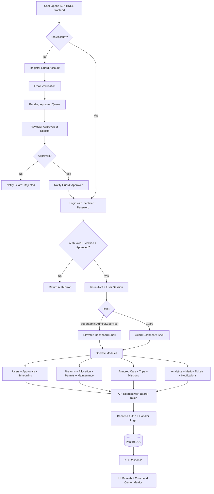
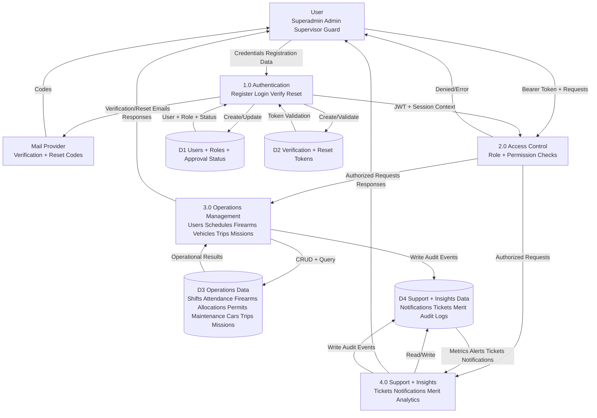
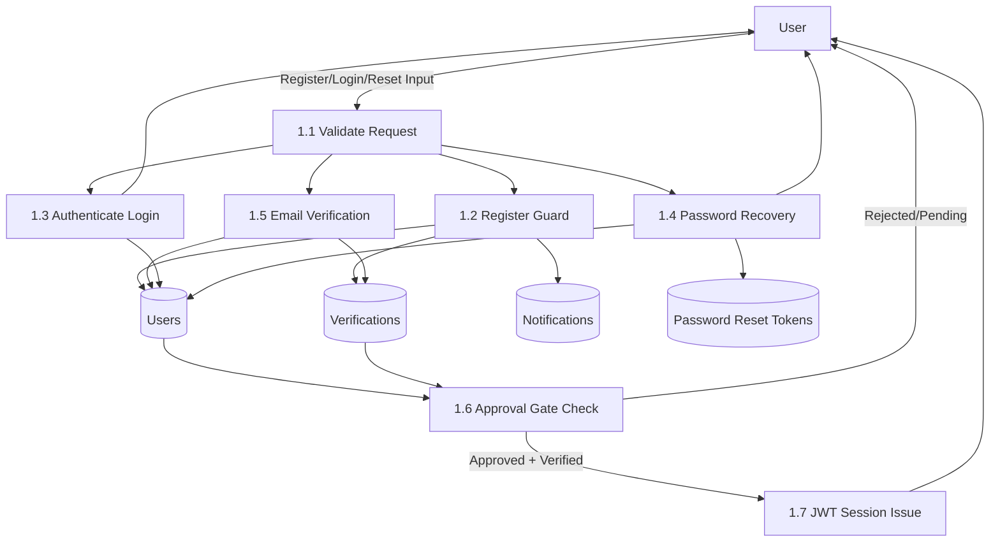
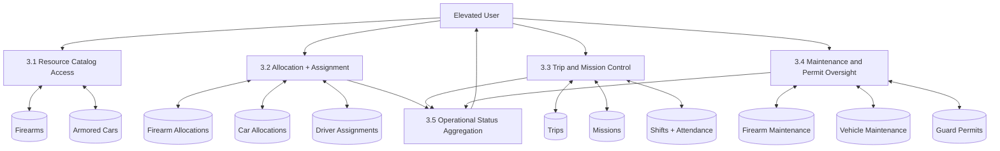
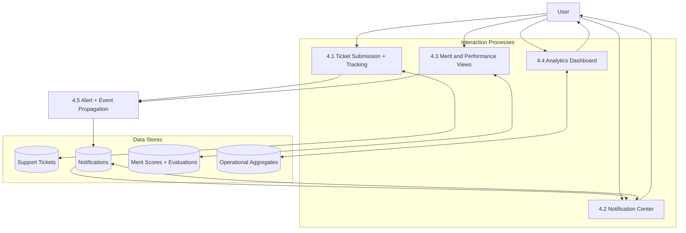
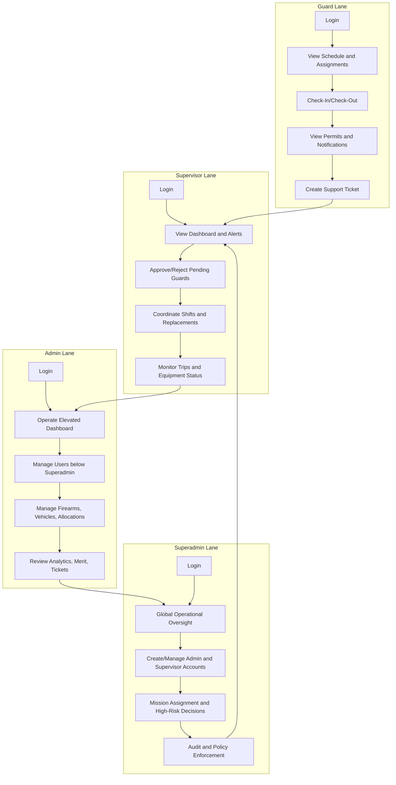

# SENTINEL System Diagrams

This file contains reusable Mermaid diagrams for SENTINEL:
- Process Flow Diagram
- Activity Diagram
- Data Flow Diagram (Level 1)

## 1. Process Flow Diagram



## 2. Activity Diagram


## 3. Data Flow Diagram (Level 1)



## 4. Data Flow Diagram (Level 2)

### 4.1 Auth and Account Lifecycle (Level 2)



### 4.2 Operations Core (Firearms, Vehicles, Trips, Missions)



### 4.3 Support, Notification, Merit, Analytics



## 5. Role-Based Swimlane Activity Diagram



## 6. PNG Export-Ready Outputs

Use Mermaid CLI to export PNG files from this document.

```powershell
cd "d:\Dwight\Capstone Main"
npx -y @mermaid-js/mermaid-cli -w 2480 -H 3508 -i SYSTEM_FLOW_DIAGRAMS.md -o SYSTEM_FLOW_DIAGRAMS.png
```

Note: Mermaid CLI keeps tight content bounds, so each image may still be smaller than full A4 canvas.
To force exact A4 page size for each PNG, pad the exports with this command:

```powershell
cd "d:\Dwight\Capstone Main"
Add-Type -AssemblyName System.Drawing
$targetW = 2480
$targetH = 3508
Get-ChildItem SYSTEM_FLOW_DIAGRAMS-*.png | ForEach-Object {
    $srcPath = $_.FullName
    $img = [System.Drawing.Image]::FromFile($srcPath)
    $bmp = New-Object System.Drawing.Bitmap($targetW, $targetH)
    $g = [System.Drawing.Graphics]::FromImage($bmp)
    $g.Clear([System.Drawing.Color]::White)
    $x = [int](($targetW - $img.Width) / 2)
    $y = [int](($targetH - $img.Height) / 2)
    $g.DrawImage($img, $x, $y, $img.Width, $img.Height)
    $img.Dispose(); $g.Dispose()
    $tmp = "$srcPath.a4.tmp.png"
    $bmp.Save($tmp, [System.Drawing.Imaging.ImageFormat]::Png)
    $bmp.Dispose()
    Move-Item -Force $tmp $srcPath
}
```

If your Mermaid CLI version does not support multi-diagram markdown input, export each diagram by placing each code block in its own `.mmd` file and run:

```powershell
npx -y @mermaid-js/mermaid-cli -i process-flow.mmd -o process-flow.png
npx -y @mermaid-js/mermaid-cli -i activity-flow.mmd -o activity-flow.png
npx -y @mermaid-js/mermaid-cli -i dfd-level1.mmd -o dfd-level1.png
npx -y @mermaid-js/mermaid-cli -i dfd-level2-auth.mmd -o dfd-level2-auth.png
npx -y @mermaid-js/mermaid-cli -i dfd-level2-ops.mmd -o dfd-level2-ops.png
npx -y @mermaid-js/mermaid-cli -i dfd-level2-support.mmd -o dfd-level2-support.png
npx -y @mermaid-js/mermaid-cli -i swimlane-roles.mmd -o swimlane-roles.png
```
