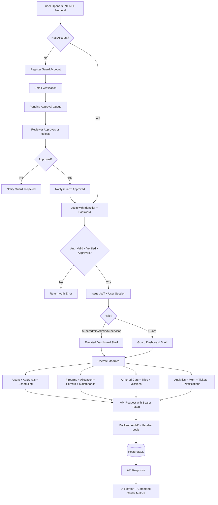
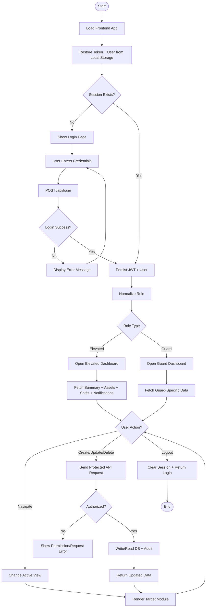
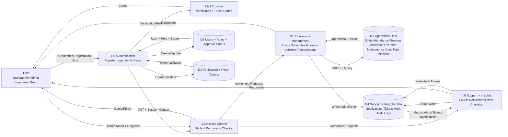

# SENTINEL System Diagrams

This file contains reusable Mermaid diagrams for SENTINEL:
- Process Flow Diagram
- Activity Diagram
- Data Flow Diagram (Level 1)

## 1. Process Flow Diagram

## 2. Activity Diagram

## 3. Data Flow Diagram (Level 1)

