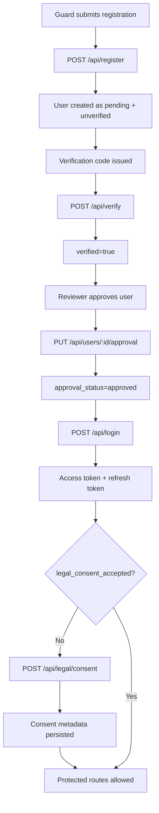
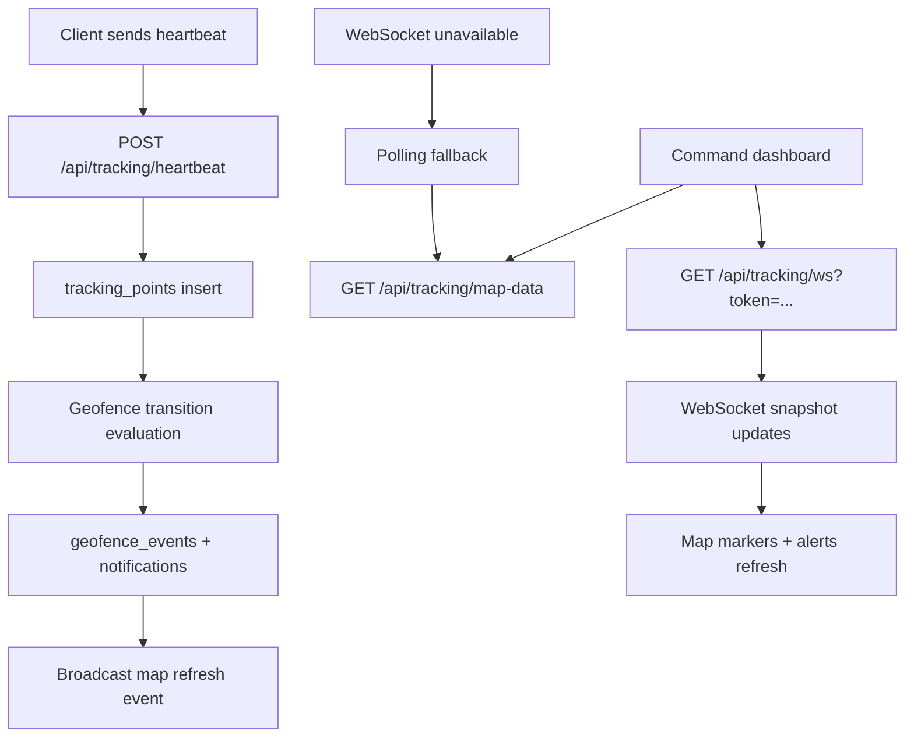
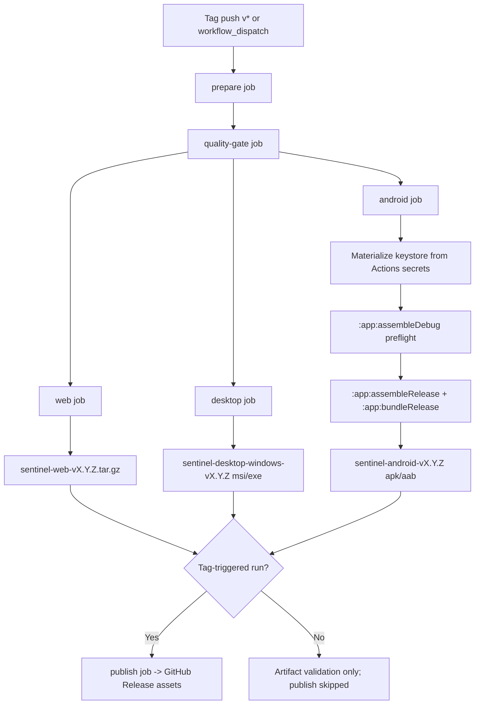

# SYSTEM FLOW DIAGRAMS

Updated: 2026-04-03

## 1. Authentication, Approval, and Legal Consent Flow

## 2. Protected API Request Lifecycle

```mermaid
flowchart LR
    A[Frontend request with Bearer token] --> B[CORS layer]
    B --> C[Request timeout middleware]
    C --> D[Global API rate limiter]
    D --> E[AuthZ middleware]
    E --> F[Legal consent enforcement]
    F --> G[Handler execution]
    G --> H[(PostgreSQL)]
    H --> I[Structured JSON response]
    I --> J[Frontend state update]
```

## 3. Tracking and Command Map Data Flow

## 4. Cross-Platform Release Pipeline Flow

## 5. Validation Signals for These Flows

- Frontend tests/build pass (`npm test`, `npm run build` in `DasiaAIO-Frontend`).
- Backend tests/runtime pass (`cargo test`, `docker compose up -d`, `/api/health`).
- Live manual GitHub Actions run `23929317544` completed `prepare`, `quality-gate`, `web`, `desktop`, and `android` successfully.
- Android validation in that run included keystore materialization plus signed APK/AAB artifact generation; publish remained skipped because the run was not tag-driven.
