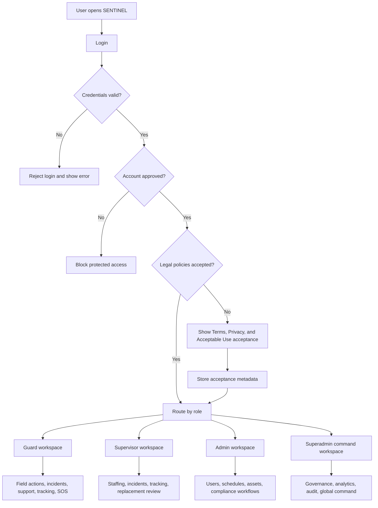
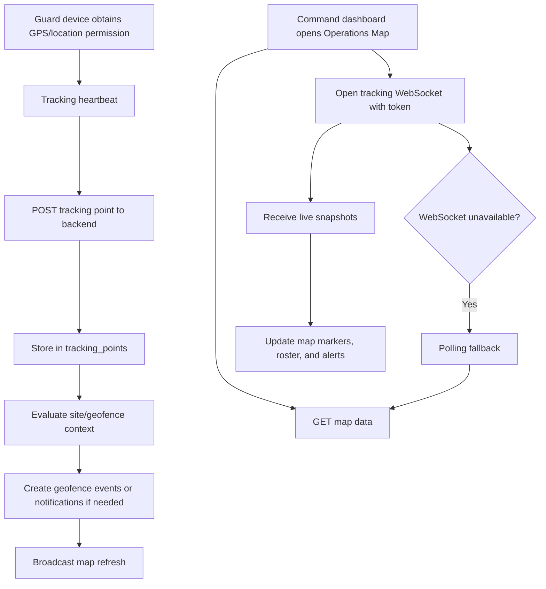
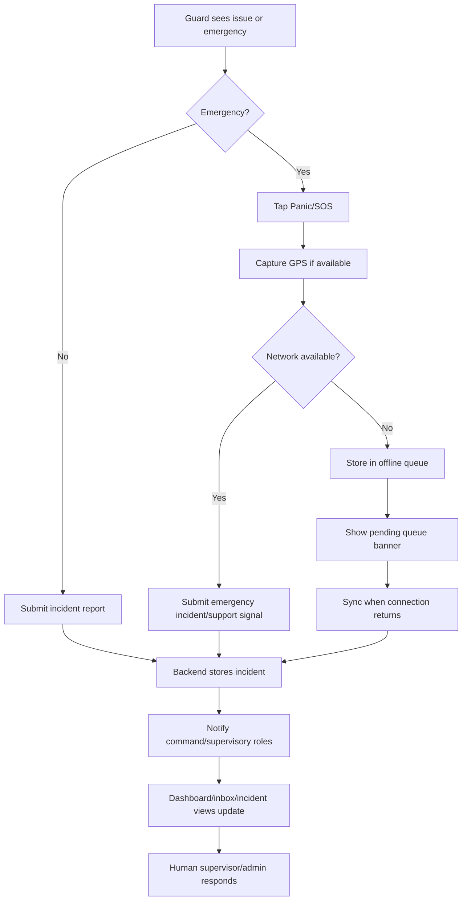
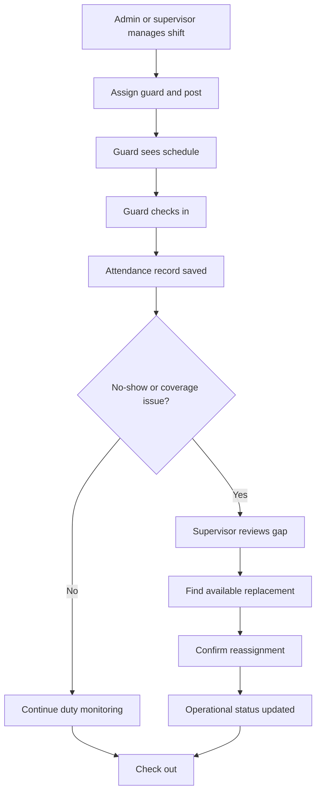
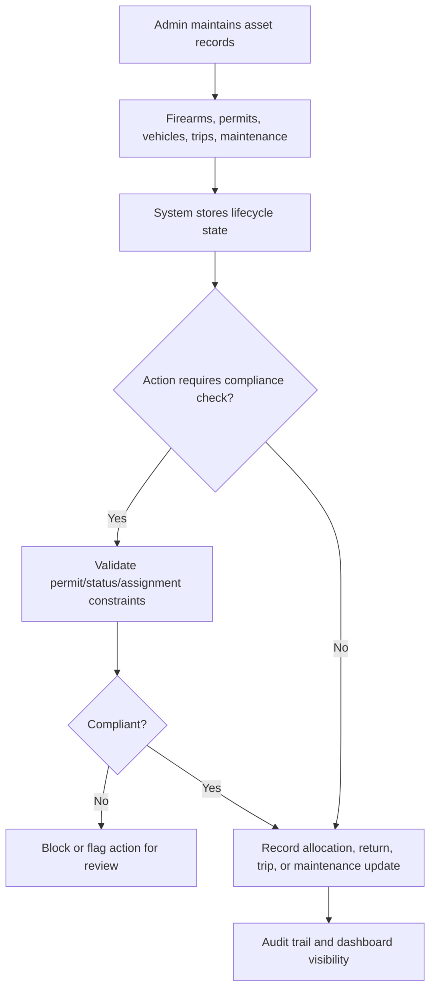
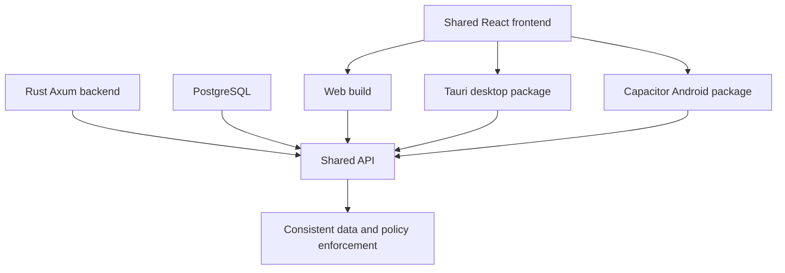

# SENTINEL Capstone Defense Study Guide

Last updated: 2026-05-20

This guide is built from the current manuscript, repository architecture notes, system flow diagrams, and readiness evidence. Use it as your main review document before the capstone defense.

## 1. What To Read First

Read in this order. Do not try to memorize every implementation file first; memorize the story, then the proof.

| Priority | Read This | Why It Matters In Defense |
|---|---|---|
| 1 | `SENTINEL - Group 8.pdf` or `SENTINEL - Group 8.md` | Main panel-facing document. Focus on Project Context, Purpose, Objectives, Scope, Requirements Analysis, and Design. |
| 2 | This study guide | Your condensed defense script, system flow, and Q&A bank. |
| 3 | `docs/plan/capstone-readiness-20260502/DEFENSE_PACK.md` | Demo order and quick proof answers. |
| 4 | `docs/plan/capstone-readiness-20260502/evidence/latest-readiness-report.md` | Shows the readiness gate passed: frontend build, backend checks/tests, API health, login, MDR ops health, tracking map data, and tracking smoke. |
| 5 | `SYSTEM_FLOW_DIAGRAMS.md` | Clean explanation of authentication, protected API request, live tracking, and release flow. |
| 6 | `architecture.md` | Technical backup for frontend, backend, database, security, dashboard, data flow, and release architecture. |
| 7 | `COPILOT.md` | Route/API/table reference if the panel asks technical details. |
| 8 | `docs/capstone/DEVELOPMENT_MODULE_DESCRIPTIONS_UPDATED.md` | Module-by-module description for screenshots and storyboard discussion. |

### Manuscript Sections To Master

| Section | What You Must Be Able To Explain |
|---|---|
| Project Context | Why private security operations need digital oversight, real-time monitoring, compliance traceability, and faster response to guard gaps. |
| Purpose and Description | SENTINEL is a role-governed security operations and decision-support platform for DASIA. |
| Objectives | The objectives group into identity/access, personnel, scheduling, assets, incidents/tracking, analytics, governance, and cross-platform delivery. |
| Scope and Limitations | Web, Windows desktop, Android, PostgreSQL, live tracking, audit, AI assistance, but no payroll, government licensing database, CCTV/IoT, iOS, or full external hardware integration. |
| Requirements Analysis | Existing process is manual/fragmented; proposed process centralizes operations, compliance, incident handling, live monitoring, auditability, and decision support. |
| Design and Development | Role activity diagrams, modules, screenshots, and implementation story. |

## 2. One-Minute Project Pitch

SENTINEL is an integrated, role-governed security operations platform for Davao Security and Investigation Agency, Inc. It replaces fragmented manual coordination with a centralized system for personnel records, approvals, schedules, attendance, incidents, firearms, armored vehicles, trips, live tracking, audit logs, and decision support. The system is built with a React and TypeScript frontend, a Rust and Axum backend, and a PostgreSQL database. It runs across web, Windows desktop through Tauri, and Android through Capacitor.

The main value of SENTINEL is operational continuity and accountability. Guards can see assignments, check in and out, report incidents, access emergency contacts, and use panic escalation. Supervisors and command roles can monitor attendance, live movement, incidents, resources, and compliance-sensitive workflows. Superadmin users can review global operational status, audit logs, approvals, and governance controls. The system is designed so that critical decisions remain human-controlled while dashboards, alerts, tracking, and AI-assisted outputs improve visibility and response time.

## 3. Defense Thesis In One Sentence

SENTINEL improves private security operations by centralizing role-based workflows, live field visibility, asset compliance, incident response, and auditability into one multi-platform system that is more traceable and responsive than manual or fragmented processes.

## 4. Problem Statement You Should Explain

The old process has four major weaknesses:

| Problem | Practical Effect | SENTINEL Response |
|---|---|---|
| Manual scheduling and attendance monitoring | Guard vacancies or no-shows may be discovered late. | Centralized shifts, attendance, no-show awareness, and replacement coordination. |
| Fragmented asset and permit records | Firearm, permit, vehicle, and trip compliance can be hard to trace. | Centralized asset lifecycle and permit-sensitive records. |
| Delayed incident and field visibility | Supervisors may not know where issues are happening in time. | Incident workflows, notifications, live tracking, geofence monitoring, and command dashboards. |
| Weak auditability | Decisions and operational changes are hard to reconstruct. | Audit logs, forensic visibility, role-based access, and policy-gated workflows. |

## 5. Main Users And Their Responsibilities

| Role | Main Purpose | Main Features |
|---|---|---|
| Guard | Field execution and emergency reporting | View schedule, check in/out, tracking status, incidents, support, emergency contacts, panic escalation, selected offline queue. |
| Supervisor | Field coordination and staffing continuity | Monitor schedules, attendance, no-shows, replacements, incidents, live tracking, geofence outcomes, support workload. |
| Admin | Daily operational management | Manage users, approvals, schedules, firearms, permits, vehicles, trips, notifications, support, and operational records. |
| Superadmin | System-wide governance and command oversight | Global KPIs, command dashboard, approvals, audit and forensic review, role governance, analytics, feedback review, release/readiness evidence. |

Important: There is no generic `user` role in the current system. The four valid roles are `guard`, `supervisor`, `admin`, and `superadmin`.

## 6. Complete System Flow

### 6.1 High-Level System Flow

### 6.2 Technical Request Flow

```mermaid
flowchart LR
    A[React UI or hook] --> B[Authenticated API request]
    B --> C[CORS, timeout, rate limit]
    C --> D[JWT auth and role authorization]
    D --> E[Legal consent and policy checks]
    E --> F[Axum handler]
    F --> G[Service/domain logic]
    G --> H[SQLx query to PostgreSQL]
    H --> I[JSON response]
    I --> J[Frontend state update]
    J --> K[Dashboard or module re-render]
```

### 6.3 Live Tracking Flow

### 6.4 Incident And Emergency Flow

### 6.5 Scheduling And Workforce Continuity Flow

### 6.6 Asset And Compliance Flow

### 6.7 Release And Platform Flow

## 7. Technical Architecture You Should Be Ready To Explain

| Layer | Technology | Why It Was Chosen |
|---|---|---|
| Frontend | React 18, TypeScript, Vite, Tailwind CSS | Modular dashboards, role-based rendering, fast development, type safety for API payloads and UI state. |
| Backend | Rust, Axum, Tokio, SQLx | Memory safety, async performance, strong compile-time checks, middleware-centric API control. |
| Database | PostgreSQL | Relational integrity for users, roles, shifts, incidents, firearms, vehicles, trips, audit logs, and tracking points. |
| Desktop | Tauri | Lighter desktop packaging than Electron and better security posture for a shared web frontend. |
| Android | Capacitor | Reuses the web frontend while enabling Android packaging and field access. |
| Maps | Leaflet and OpenStreetMap/Carto tiles | Cost-efficient operational mapping without dependence on paid map quotas for continuous monitoring. |
| Real-time | WebSocket plus polling fallback | Faster live updates when available, but resilient when persistent connections fail. |
| AI support | Backend AI/predictive services with deterministic fallback | Assistive outputs for risk, replacement, maintenance, classification, and summary, without removing human authority. |

## 8. Main Database Domains

You do not need to recite every table, but know the domains:

| Domain | Example Tables / Records | Defense Explanation |
|---|---|---|
| Identity and access | users, roles, permissions, approvals, verification, reset tokens | Controls who can enter and what they can do. |
| Scheduling and attendance | shifts, attendance, guard availability, replacement records | Supports workforce continuity. |
| Tracking and geofence | tracking_points, geofence_events, client sites | Supports live map visibility and movement reconstruction. |
| Incidents and support | incidents, support tickets, notifications, inbox events | Supports reporting, escalation, and coordination. |
| Assets and compliance | firearms, firearm_allocations, permits, armored cars, trips, maintenance | Supports accountability over controlled equipment and fleet operations. |
| Analytics and AI | predictions, summaries, classification outputs | Supports command decisions, but remains advisory. |
| Governance | audit_logs, forensic events, consent metadata, health records | Supports review, compliance, and accountability. |

## 9. Demo Script For Defense

Use this order if the panel asks you to demonstrate the system.

| Step | What To Show | What To Say |
|---|---|---|
| 1 | Login screen | "Access is protected and role-governed. Users are routed based on approved role." |
| 2 | Superadmin dashboard | "This is the command-level view for global operational visibility, approvals, audit, analytics, and governance." |
| 3 | Operations Map | "The map combines live tracking, roster visibility, and fallback data refresh for situational awareness." |
| 4 | Admin or supervisor workflow | "Command roles manage schedules, staffing, approvals, incidents, and assets based on role permissions." |
| 5 | Guard mobile view | "The guard interface focuses on field actions: schedule, check-in/out, tracking, incident/support, emergency contacts, and SOS." |
| 6 | Panic/offline behavior | "Critical guard actions are designed to remain visible even when connectivity is unstable; selected actions can queue offline." |
| 7 | Firearm/vehicle/trip/permit modules | "These modules strengthen traceability for controlled assets and deployment-sensitive records." |
| 8 | Audit/readiness evidence | "The system is supported by automated readiness evidence, build checks, backend tests, API health, and platform packaging proof." |

## 10. Evidence You Can Mention

| Evidence | What It Proves |
|---|---|
| `latest-readiness-report.md` | Full readiness mode passed with 8/8 checks: frontend build, backend cargo check/test, API health, login, MDR ops health, tracking map data, and tracking smoke. |
| `phase5-platform-a11y-summary-20260502.md` | Desktop build/package passed, Android build/sync passed, and critical guard touch targets passed size checks. |
| `DasiaAIO-Frontend/output/playwright/capstone-stabilization-sprint/report.json` | Guard mobile live tracking/SOS/offline path and superadmin Operations Map path were smoke-tested. |
| `OBJECTIVE_COMPLIANCE_MATRIX.md` | Maps manuscript objectives to implementation surfaces and required validation. |
| `DEFECT_REGISTER.md` | Shows defects are tracked rather than hidden. |
| `RELEASE_OPS_HARDENING_REPORT.md` | Documents release and operational hardening evidence. |

Phrase to use:

> "We do not only claim that the system works. We maintain objective-mapped readiness evidence, including build checks, backend checks/tests, API health, login verification, tracking map data, platform build paths, and role-based smoke reports."

## 11. Possible Panel Questions And Prepared Answers

### A. Project Understanding

| Question | Strong Answer |
|---|---|
| What is SENTINEL? | SENTINEL is a role-governed security operations platform for DASIA. It centralizes personnel, schedules, attendance, incidents, tracking, assets, approvals, audit logs, and decision-support workflows across web, desktop, and Android. |
| What problem does it solve? | It solves fragmented manual coordination, delayed guard visibility, weak asset traceability, and limited auditability in private security operations. |
| Why is this important? | Security agencies handle people, posts, firearms, vehicles, incidents, and compliance-sensitive decisions. Delayed information can create operational gaps and accountability risks. |
| Who are the users? | Four roles: guard, supervisor, admin, and superadmin. Each has a different dashboard and permission scope. |
| What is the main contribution of your study? | The contribution is an integrated, multi-platform, role-governed operations system that connects field actions, command monitoring, compliance records, auditability, and decision support in one workflow. |
| How is it different from a normal admin dashboard? | It is not only record management. It includes guard field workflows, live tracking, emergency escalation, scheduling continuity, asset compliance, audit logs, and cross-platform runtime delivery. |

### B. Scope And Limitations

| Question | Strong Answer |
|---|---|
| What is included in your scope? | Role-based access, personnel administration, approvals, schedules, attendance, guard field actions, emergency support, incidents, live tracking, map views, firearms, permits, armored vehicles, trips, maintenance, analytics, audit, and cross-platform delivery. |
| What is not included? | External payroll/HR integration, government licensing database integration, CCTV/IoT/access-control hardware integration, iOS deployment, and fully independent pages for every backend-supported capability. |
| Why are some workflows still in shared panels or tabs? | The capstone prioritized operational coverage and role-based access. Some workflows are consolidated in shared command surfaces to preserve usability and avoid unnecessary page fragmentation. |
| Is the AI fully autonomous? | No. AI and predictive outputs are assistive only. Human users remain responsible for final decisions. |
| Can it replace supervisors? | No. SENTINEL supports supervisors by improving visibility, traceability, and decision context. It does not replace human judgment. |

### C. Methodology And Requirements

| Question | Strong Answer |
|---|---|
| What development approach did you use? | Iterative Agile delivery. Features were implemented and refined through planning, implementation, integration, validation, packaging, review, and refinement. |
| How did you identify requirements? | Requirements were derived from private security operational pain points: fragmented coordination, delayed visibility, compliance exposure, and weak traceability. |
| Why role-based requirements? | Because guards, supervisors, admins, and superadmins do different work and should not see or modify the same operational data. |
| What are your main functional requirements? | Authentication and approval, personnel management, scheduling and attendance, live tracking, incident handling, asset compliance, support/notifications, analytics, audit, and cross-platform access. |
| What are your main non-functional requirements? | Security, performance, usability, reliability, scalability, compliance traceability, accessibility, and maintainability. |

### D. Architecture And Technology Choices

| Question | Strong Answer |
|---|---|
| Why React and TypeScript? | React supports modular dashboard composition, while TypeScript reduces mistakes in role logic, API payloads, and cross-module state handling. |
| Why Rust and Axum? | Rust provides memory safety and strong compile-time guarantees. Axum supports async API design and middleware-based authentication, authorization, audit, and tracking controls. |
| Why PostgreSQL? | The system needs relational integrity across users, roles, shifts, incidents, firearms, vehicles, trips, audit logs, and tracking records. PostgreSQL fits those relationships better than a document-only database. |
| Why Tauri for desktop? | Tauri lets the team package the same frontend as a desktop app with a lighter footprint and better security posture than Electron. |
| Why Capacitor for Android? | Capacitor allows reuse of the web frontend while packaging a mobile runtime for guard field operations. |
| Why Leaflet/OpenStreetMap instead of Google Maps? | Continuous monitoring can be cost-sensitive. Leaflet and OpenStreetMap provide flexible mapping without usage-based billing dependence. |
| Why WebSocket plus polling fallback? | WebSocket improves live updates, while polling fallback keeps the map usable if persistent connections are interrupted. |

### E. Security And Governance

| Question | Strong Answer |
|---|---|
| How do you secure login? | The backend validates credentials, issues JWT tokens, and protects routes through middleware. Sensitive actions are role- and permission-gated. |
| How do you prevent unauthorized users? | Access is approval-governed and role-based. Protected routes validate tokens and permissions before handlers execute. |
| What is legal-policy gating? | Users must accept policy documents before protected access. Metadata such as timestamp and related request context can be stored for accountability. |
| How do you handle auditability? | Write operations and sensitive workflows are recorded through audit mechanisms so actions can be reviewed later. |
| What if a guard tries to access admin functions? | Role/permission checks block unauthorized access. The UI also only exposes role-appropriate navigation, but backend authorization remains the important enforcement layer. |
| How do you protect against abuse? | The system includes authentication, authorization, rate limiting on sensitive endpoints, audit logging, session controls, and production CORS controls. |

### F. Live Tracking And Privacy

| Question | Strong Answer |
|---|---|
| How does live tracking work? | Guard devices send tracking heartbeats. The backend stores tracking points, evaluates geofence context, and exposes map data through WebSocket snapshots with polling fallback. |
| What if the guard has no internet? | Some critical field actions, such as SOS-related behavior, can queue offline. Live tracking still depends on device/network availability and sync resumes when connectivity returns. |
| What if GPS is inaccurate? | GPS accuracy is a known limitation. SENTINEL uses app-generated location updates for operational awareness, but location data should be interpreted with device and network conditions in mind. |
| Is tracking a privacy risk? | Tracking is handled as a role-governed operational feature. It is tied to authorized workflows, legal/policy acceptance, and auditability. It should be used for duty-related monitoring, not unrestricted personal surveillance. |
| Can supervisors see everyone? | Visibility is role-governed. Command roles see operational data appropriate to their authority; guards are focused on their own assigned workflows. |

### G. Guard Experience

| Question | Strong Answer |
|---|---|
| Why focus heavily on guards? | Guards are the field users and the largest operational risk point. If they cannot use the system quickly under pressure, the system fails its purpose. |
| What can a guard do? | Review schedule, check in/out, view assigned resources, submit incident/support workflows, use live tracking, access emergency contacts, and trigger panic escalation. |
| Why include offline queue behavior? | Field users may experience unstable connectivity. Selected critical actions should not simply disappear when the device is offline. |
| How does the panic button help? | It gives guards a fast emergency escalation path with location context when available and queue behavior under poor connectivity. |

### H. Assets, Firearms, And Compliance

| Question | Strong Answer |
|---|---|
| How does SENTINEL help with firearms? | It maintains firearm records, allocation history, custody state, maintenance records, and permit-sensitive checks. |
| Why are firearms important in the system? | Firearms are controlled assets. Their issuance, return, permit status, and maintenance history must be traceable for safety and compliance. |
| What about armored vehicles? | SENTINEL manages armored vehicle records, driver assignments, trip lifecycle records, allocations, and maintenance visibility. |
| How does this reduce risk? | It centralizes asset state and creates traceable records, making it easier to detect overdue custody, expired permits, or maintenance needs. |

### I. Incident, Support, And Notifications

| Question | Strong Answer |
|---|---|
| How are incidents handled? | Guards or command users submit incident records. The backend stores them, and dashboards/inbox/notification surfaces expose them for review and response. |
| What is the difference between incident and support? | Incidents are operational/security events. Support tickets are assistance or issue reports that may be technical or operational. |
| How are urgent events prioritized? | Critical events can surface through dashboards, inbox/timeline workflows, notifications, and command monitoring views. |

### J. Analytics And AI

| Question | Strong Answer |
|---|---|
| What AI features are included? | Guard absence risk, replacement suggestions, maintenance risk, incident classification, and incident summarization. |
| Are AI decisions final? | No. The AI is assistive. Human users make final operational decisions. |
| What happens if the AI service fails? | The design includes deterministic fallback behavior where continuity is required, so the system does not depend entirely on AI availability. |
| Why include AI at all? | To help command roles notice patterns and prioritize decisions faster, especially around staffing, incidents, and maintenance. |

### K. Validation And Readiness

| Question | Strong Answer |
|---|---|
| How do you prove the system works? | The repo includes objective-mapped evidence, readiness reports, build/test outputs, platform packaging proof, and role-based smoke reports. |
| What was the latest readiness result? | The latest readiness report shows full mode passed with 8/8 checks, including frontend build, backend cargo check/test, API health, login, MDR ops health, tracking map data, and tracking smoke. |
| Was Android validated? | The Android path includes web build and Capacitor sync evidence, plus Android-webview-style smoke capture for guard-critical UI. |
| Was desktop validated? | The desktop path includes Tauri build/package evidence for MSI and NSIS installer outputs. |
| Are there still risks? | Yes. Remaining risks include environment configuration, network/GPS reliability, integration with external systems, and continued UX refinement. These are documented as limitations or follow-up work. |

### L. Deployment And Maintenance

| Question | Strong Answer |
|---|---|
| How is the system deployed? | The backend and frontend can run through managed services such as Railway, while desktop and Android packages are built through Tauri and Capacitor release paths. |
| Do all platforms share the same data? | Yes. Web, desktop, and Android clients target the same backend API and PostgreSQL database. |
| How are releases governed? | The release workflow has quality gates, web build, desktop build, Android build, and publish steps. Android signed releases require keystore secrets. |
| How do you recover if there is a database issue? | The project documentation includes backup and readiness evidence. In production, backup and restore procedures should be part of operational deployment. |

### M. Difficult Questions

| Question | Strong Answer |
|---|---|
| Is this too broad for a capstone? | The scope is broad, but it is organized by operational domains and role workflows. The defense should focus on integrated workflow coverage, not claiming every module is a separate finished enterprise product. |
| What is incomplete? | External integrations such as payroll, government licensing databases, CCTV/IoT, iOS support, and some fully independent management surfaces are outside current scope. |
| Why not just use an existing HR or security guard app? | SENTINEL is tailored to the agency workflow: guard field actions, live tracking, firearm/vehicle/trip accountability, role-governed command dashboards, and capstone-specific evidence of implementation. |
| How do you know users will accept it? | The system reduces manual friction and focuses on role-specific work. However, full institutional adoption would still require training, pilot deployment, feedback collection, and policy rollout. |
| What would you improve next? | Stabilization and validation first: stronger live tracking evidence, role-by-role browser QA, production configuration hardening, push notifications, and continued UI/UX refinement. |
| What is your strongest feature? | The strongest feature is the connected operational flow: guard field actions feed command visibility through live tracking, incidents, notifications, audit records, and role-based dashboards. |
| What is your weakest area? | External integration and production-scale field validation. The system is implemented and evidence-backed, but real agency rollout would need longer pilot testing and integrations. |
| If GPS fails, does the system fail? | No. GPS-dependent features lose precision, but the rest of the operational platform remains usable. Location accuracy is a limitation, not the entire system. |
| If the AI gives a wrong recommendation, who is liable? | The system treats AI as assistive only. Human decision-makers remain responsible for final operational decisions. |

## 12. Short Answers To Memorize

| Topic | Memorized Answer |
|---|---|
| Project purpose | "To centralize security operations into a role-governed, auditable, multi-platform system for workforce continuity, asset accountability, incident coordination, and live monitoring." |
| Main problem | "Manual and fragmented workflows delay visibility, weaken compliance traceability, and make operational gaps harder to detect." |
| Main users | "Guard, supervisor, admin, and superadmin." |
| Stack | "React, TypeScript, Vite, Tailwind frontend; Rust, Axum, SQLx backend; PostgreSQL database; Tauri desktop; Capacitor Android." |
| Main security controls | "JWT authentication, role-based authorization, approval-gated access, legal-policy acceptance, audit logging, rate limiting, and session controls." |
| Live tracking | "Guard devices send location heartbeats; the backend stores tracking points and updates command maps through WebSocket snapshots with polling fallback." |
| AI boundary | "AI is advisory, not autonomous. Human users keep final authority." |
| Limitations | "No payroll, HR, government licensing, CCTV/IoT, iOS, or full external hardware integrations in this study." |
| Proof it works | "Readiness evidence shows builds, backend checks/tests, API health, login, tracking map data, platform builds, and role smoke tests." |

## 13. Recommended Defense Flow For Speaking

1. Start with the problem.
   - "Security operations are time-sensitive, but manual monitoring creates delays in attendance visibility, incident response, asset traceability, and accountability."

2. Introduce SENTINEL.
   - "SENTINEL is our integrated security operations platform for DASIA."

3. Explain the users.
   - "The system is role-governed: guard, supervisor, admin, and superadmin."

4. Explain the main workflows.
   - "Guards perform field actions; supervisors monitor and coordinate; admins manage records and resources; superadmins govern the whole system."

5. Explain the architecture.
   - "React frontend, Rust/Axum backend, PostgreSQL database, with web, desktop, and Android delivery."

6. Explain the controls.
   - "Authentication, authorization, approval, legal acceptance, audit logs, and rate controls protect the system."

7. Explain proof.
   - "We validate through readiness reports, build checks, API health, role smoke tests, tracking evidence, and platform packaging evidence."

8. Explain limitations honestly.
   - "External systems and hardware integrations are outside current scope. AI remains advisory. GPS and network reliability affect live tracking accuracy."

9. Close with value.
   - "SENTINEL makes security operations more visible, traceable, and responsive."

## 14. Things You Should Not Say

| Avoid Saying | Say This Instead |
|---|---|
| "The AI decides who to assign." | "The AI assists with recommendations; humans decide." |
| "Tracking is always accurate." | "Tracking depends on GPS, device permission, and network conditions." |
| "Everything is fully production-ready." | "The project has readiness evidence and platform builds, but real deployment still requires environment hardening and pilot validation." |
| "It replaces security personnel." | "It supports security personnel with better visibility and accountability." |
| "It connects to government databases." | "That is outside the current scope; permit records are managed within the system." |
| "It supports all platforms." | "The current native targets are Web, Windows desktop, and Android." |

## 15. Final Review Checklist

Before defense, make sure you can answer each item without reading:

- What SENTINEL means as a system.
- Why DASIA needs it.
- Who the four roles are.
- What each role can do.
- How login and approval work.
- How legal-policy acceptance works.
- How guard check-in/check-out works.
- How live tracking works.
- How incident and panic escalation work.
- How firearms, permits, vehicles, trips, and maintenance are tracked.
- How audit logs support accountability.
- Why React, Rust/Axum, PostgreSQL, Tauri, and Capacitor were chosen.
- What your limitations are.
- What evidence proves the system works.
- What you would improve next.

## 16. Best Final Defense Statement

SENTINEL is not just a record-keeping system. It is a role-governed operational platform designed to help a security agency maintain visibility, continuity, accountability, and faster response across command and field workflows. Its value is in connecting guard actions, supervisor monitoring, administrative control, asset compliance, live tracking, incident response, auditability, and multi-platform access into one coherent system.
